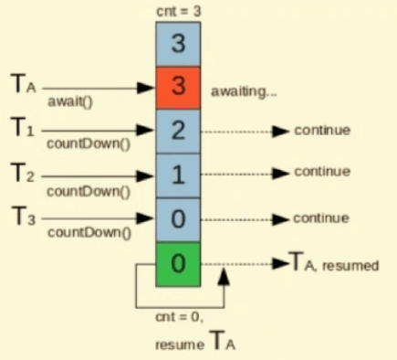
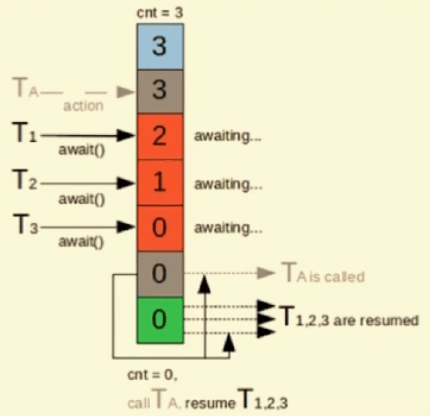

## 并发工具类

同步器作用主要是协助线程同步, 底层实现都是 AQS

- 闭锁 CountDownLatch 
- 栅栏 CyclicBarrier
- 信号量 Semaphore
- 交换器 Exchanger

### 1. CountDownlatch

让主线程等待一组事件发生后继续执行, 事件指的是 CountDownlatch()里的countDown() 方法

#### 使用

1. 当一个或多个线程调用`await`方法时，调用线程会被阻塞。
2. 其它线程调用`countDown`方法会将计数器减1(调用countDown方法的线程不会阻塞)
3. 当计数器的值变为零时，因调用await方法被阻塞的线程会被唤醒，继续执行

#### 原理图




###### 代码

**巧记:** 秦国灭六国, 统一华夏

###### 枚举

```java
public enum CountryEnum {
    ONE(1, "齐"),TWO(2, "楚"),THREE(3, "燕"),FOUR(4, "赵"),FIVW(5, "韩"),SIX(6, "魏");

    private Integer retCode;    // 国家序号
    private String retMessage;  // 国家名字

    public Integer getRetCode() {
        return retCode;
    }

    public String getRetMessage() {
        return retMessage;
    }

    CountryEnum(Integer retCode, String retMessage) {
        this.retCode = retCode;
        this.retMessage = retMessage;
    }

    // 根据序号获得国家名字
    public static String getCountryName(int index) {
        CountryEnum[] values = CountryEnum.values();
        for (CountryEnum ele : values) {
            if (index == ele.getRetCode())
                return ele.getRetMessage();
        }
        return null;
    }
}
```

###### 代码

```java
public class CountDownLatchDemo {
    public static void main(String[] args) throws InterruptedException {
        // 创建锁
        CountDownLatch latch = new CountDownLatch(6);
        // 创建任务
        Task task = new Task(latch);
        for (int i = 6; i > 0; i--)
            new Thread(task, CountryEnum.getCountryName(i)).start();

        latch.await();
        System.out.println("秦国, 统一华夏!!");
    }

    static class Task implements Runnable {
        private CountDownLatch countDownLatch;

        public Task(CountDownLatch countDownLatch) {
            this.countDownLatch = countDownLatch;
        }

        @Override
        public void run() {
            System.out.println(Thread.currentThread().getName() + "/t 国, 被灭~~");
            // 减一
            countDownLatch.countDown();
        }
    }
}
```

###### 结果

```java
魏	 国, 被灭~~
韩	 国, 被灭~~
赵	 国, 被灭~~
燕	 国, 被灭~~
齐	 国, 被灭~~
楚	 国, 被灭~~
秦国, 统一华夏!!
```

### 2. CyclicBarrier

阻塞当前线程,等待其他线程

#### 使用

- 等待其它线程,且会阻塞自己当前线程,所有线程必须同时到达栅栏位置后,才能继续执行;
- 所有线程到达栅栏处,可以触发执行另外一个预先设置的线程
- axait() 方法

#### 原理图



**巧记:** 集齐7颗龙珠就能召唤神龙

###### 代码

```java
public class CyclicBarrierDemo {
    public static void main(String[] args) {
        // 减到 0后才会执行
        CyclicBarrier cyclicBarrier = new CyclicBarrier(7, () -> {
            System.out.println("龙珠已经收集齐, 召唤神龙!!");
        });

        for (int i = 1; i <= 7; i++) {
            int finalI = i;
            new Thread(() -> {
                System.out.println(Thread.currentThread().getName() + "/t 收集到第 " + finalI + "颗龙珠~~");
                try {
                    // 先到的被阻塞, 每调用一次 await(), 计数器就会减一
                    cyclicBarrier.await();
                } catch (Exception e) {
                }
                System.out.println(Thread.currentThread().getName() + "/t召唤完神龙, 第" + finalI + "颗龙珠洒向大地!");
            }, String.valueOf(i)).start();
        }
    }
}
```

###### 结果

```
1	 收集到第 1颗龙珠~~
2	 收集到第 2颗龙珠~~
3	 收集到第 3颗龙珠~~
4	 收集到第 4颗龙珠~~
5	 收集到第 5颗龙珠~~
6	 收集到第 6颗龙珠~~
7	 收集到第 7颗龙珠~~
龙珠已经收集齐, 召唤神龙!!
7	召唤完神龙, 第7颗龙珠洒向大地!
1	召唤完神龙, 第1颗龙珠洒向大地!
2	召唤完神龙, 第2颗龙珠洒向大地!
3	召唤完神龙, 第3颗龙珠洒向大地!
4	召唤完神龙, 第4颗龙珠洒向大地!
5	召唤完神龙, 第5颗龙珠洒向大地!
6	召唤完神龙, 第6颗龙珠洒向大地!
```

### 3. Semaphore

信号量主要用于两个目的，一个是用于多个共享资源的互斥使用，另一个用于并发线程数的控制。

也就是控制某个资源可被同时访问的线程个数

#### 原理图


**巧记:** 7台车抢 3个停车位

###### 代码

```java
public class SemaphoreDemo {
    public static void main(String[] args) {
        Semaphore semaphore = new Semaphore(3); // 模拟三个停车位, 只能三个车同时停

        // 7个线程模拟 7部车
        for (int i = 1; i <= 7; i++) {
            int finalI = i;
            new Thread(() -> {
                try {
                    // 获取资源
                    semaphore.acquire();
                    System.out.println(Thread.currentThread().getName() + "/t抢到停车位");
                    Thread.sleep(3000);
                    System.out.println(Thread.currentThread().getName() + "/t停车三秒后离开车位");
                } catch (Exception e) {
                } finally {
                    // 最后释放资源后, 其他线程可以再获得
                    semaphore.release();
                }
            }, String.valueOf(i)).start();
        }
    }
}
```

###### 结果

```
1	抢到停车位
2	抢到停车位
3	抢到停车位
2	停车三秒后离开车位
4	抢到停车位
1	停车三秒后离开车位
5	抢到停车位
3	停车三秒后离开车位
6	抢到停车位
4	停车三秒后离开车位
7	抢到停车位
5	停车三秒后离开车位
6	停车三秒后离开车位
```

##### 补

Semaphore 有两种模式，公平模式和非公平模式。

- **公平模式：** 调用 acquire的顺序就是获取许可证的顺序，遵循FIFO；
- **非公平模式：** 抢占式的。

###### 构造方法

```java
public Semaphore(int permits, boolean fair) {
    sync = fair ? new FairSync(permits) : new NonfairSync(permits);
}
```

### 4. Exchanger

两个线程到达同步点后, 相互交互数据

#### 使用

1. 主要用于线程之间, 数据交换. 提供一个同步点, 在这个同步点, 两个线程, 可以相互交换数据. 
2. Exchanger会产生一个同步点, 一个线程先到达同步点, 就会被阻塞, 直到另外一个线程也进入到同步点为止.
3. 当两个都到达同步点之后, 就交换数据

#### 原理图


###### 代码

```java
public class ExchangerDemo {

    public static void main(String[] args) {
        ExecutorService service = Executors.newFixedThreadPool(2);

        Exchanger<String> exchanger = new Exchanger();
        // 女生线程
        service.execute(() -> {
            try {
                // 男生对女生说的话
                String grilTalk = exchanger.exchange("我也喜欢你...");
                System.out.println("女生说: " + grilTalk);
            } catch (Exception e) {
            }
        });

        // 男生线程
        service.execute(() -> {
            try {
                System.out.println("女生慢慢的从教室里面走出来......");
                // 寂静了三秒
                TimeUnit.SECONDS.sleep(3);
                // 女生对男生说的话
                String boyTalk = exchanger.exchange("我其实暗恋你很久了...");
                System.out.println("男生说: " + boyTalk);
            } catch (Exception e) {
            }
        });

        service.shutdown();
    }
}
```

###### 结果

```java
// 男生, 女生说的话互换
女生慢慢的从教室里面走出来......
女生说: 我其实暗恋你很久了...
男生说: 我也喜欢你...
```

### 总结

- **CountDownLatch:** 秦国灭六国, 统一华夏
- **CyclicBarrier:**  集齐7颗龙珠就能召唤神龙
- **Semaphore:** 6台车抢3个停车位
- **Exchanger:** 进行交换资源