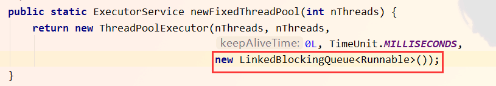
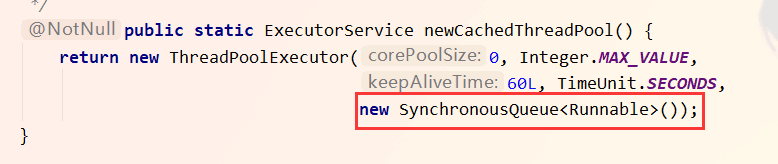
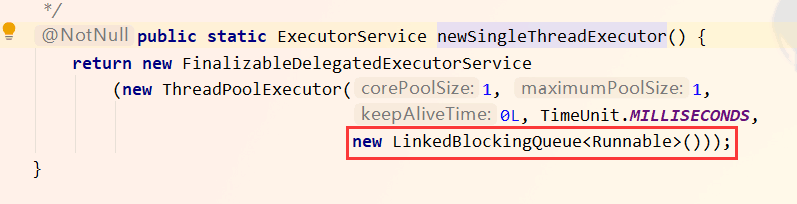
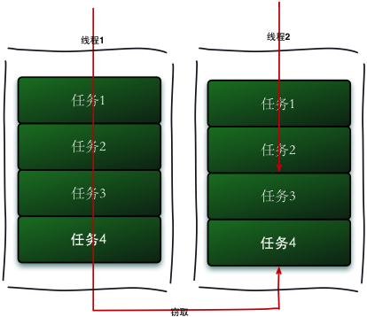
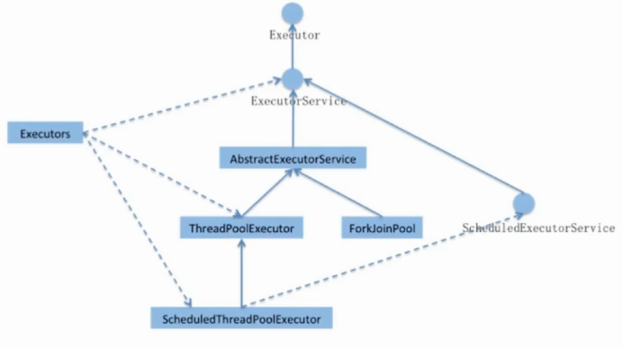
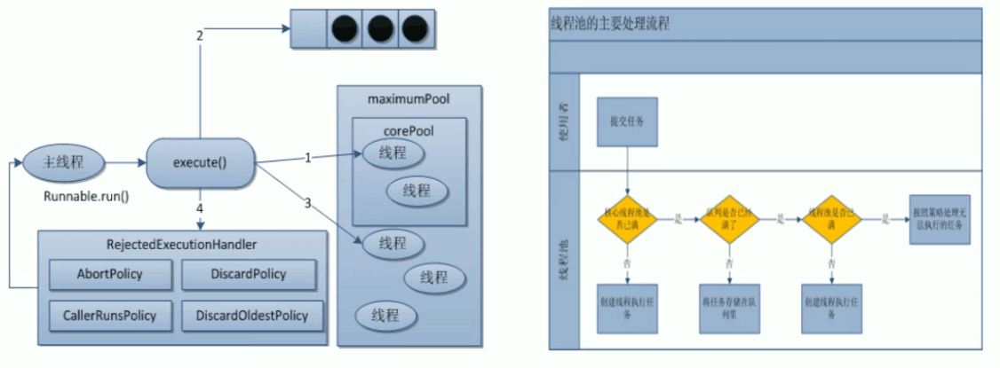
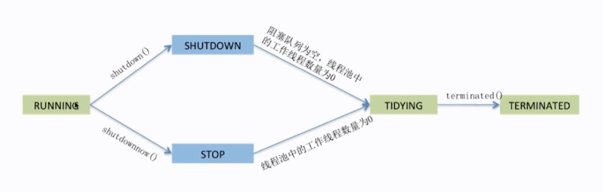
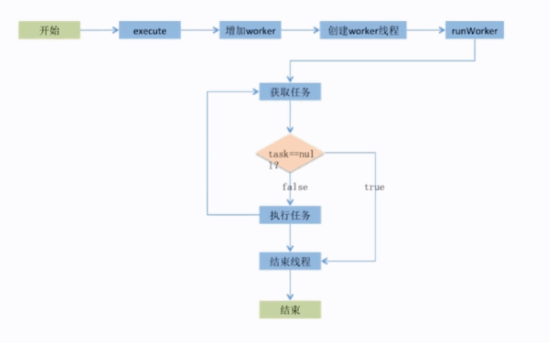

# Java线程池

## 一. 概述

​	在 Web开发中, 服务器要接收并处理业务请求. 所以会为一个任务分配一个线程进行处理. 如果并发请求的数量非常多. 但每个线程执行的时间很短. 这样就会频繁的创建和销毁线程. 如此一来, 会大大降低系统的效率. 可能出现服务器在为每个创建新线程和销毁线程上花费的时间和消耗的系统资源比实际处理用户请求的时间和资源更多. 有没有一种方法可以重复利用线程去完成新的任务呢? 

​	可以, 使用线程池. 线程池做的工作主要是**控制运行的线程的数量**，处理过程中**将任务放入队列**，然后在线程创建后启动这些任务，如果线程数量超过了最大数量超出数量的线程排队等候，等其它线程执行完毕，再从队列中取出任务来执行。

### 为什么使用线程池

线程复用: 控制最大并发数;管理线程。

1. **降低资源消耗。**通过重复利用已创建的线程降低线程创建和销毁造成的消耗。
2. **提高响应速度。**当任务到达时，任务可以不需要的等到线程创建就能立即执行。
3. **提高线程的可管理性。**线程是稀缺资源，如果无限制的创建，不仅会消耗系统资源，还会降低系统的稳定性，使用线程池可以进行统一的分配，调优和监控. 

## 二. Executors 创建线程池

### 创建方式

利用Executors创建不同的线程池满足不同应用场景的需求.

开发者一般都会利用通用的 Executors 提供的通用线程池去创建不同配置的线程池. 满足上述的问题并解决不同应用场景的需求. Executors提供了五种不同的创建配置: 

 1. `newFixedThreadPool(int nThreads)`: 指定工作线程数量的线程池

      > 每当有一个任务去创建一个工作线程. 如果工作线程数量达到线程池初始的最大数. 则将提交的任务存入到池队列中. 如果有工作线程退出, 将会有新的工作线程被创建, 以补足 unThread的数目. 

      特点: 

      - 创建一个定长线程池，可控制线程最大并发数，超出的线程会在队列中等待。
      - newFixedThreadPool创建的线程池 corePoolSize和 maximumPoolSize值是相等的, **它使用的LinkedBlockingQueue**

      

 2. `newCachedThreadPool()`: 处理大量短时间工作任务的线程池

      1. 试图缓存线程并重用,当无缓存线程可用时,就会创建新的工作线程;
      2. 如果线程闲置的时间超过阈值,则会被终止并移出缓存;
      3. 系统长时间闲置的时候,不会消耗什么资源

      - 创建一个可可缓存线程池，如果线程池长度超过处理需要，可灵活回收空困线程，若无可回收，則新建线程。
      - newCachedThreadPool将corePoolSize设置为0，将`maximumPoolSize` 设置为I`nteger.MAX_ VALUE`, **使用的SynchronousQueue,**也就是说来了任多就创建线程运行当线程空闲超过60秒是, 就销毁线程

      

  3. `newSingleThreadExecutor()`创建唯一的工作者线程来执行任务,如果线程异常结束,会有另一个线程取代它

      > 进而保证任务能顺利的执行. 最大的特点是可保证顺序的执行各个任务. 并且在任意给定的时间, 不会有多个线程是活动的. 

      特点: 

      - 创建**一个单线程化的线程池**，它只会用唯一的工作线程来执行任务，保证所有任务按照指定顺序执行。
      - newSingleThreadExecutor将corePoolSize和maximumPoolSize都设置为1,**它使用的LinkedBlockingQueue**

      

  4. `newSingleThreadScheduledExecutor()`与`newScheduledThreadPool(int corePoolSize)`定时或者周期性的工作调度,两者的区别在于单一工作线程还是多个线程

  5. `newWorkStealingPool()`: 内部会构建 ForkJoinPool ,利用 working-stealing算法,并行地处理任务,不保证处理顺序

      > JDK8才引入的创建线程池的方法. 

##### 表格

|                函数                |              作用              |
| :--------------------------------: | :----------------------------: |
|  newFixedThreadPool(int nThreads)  |    指定工作线程数量的线程池    |
|       newCachedThreadPool()        | 处理大量短时间工作任务的线程池 |
|     newSingleThreadExecutor()      | 创建唯一的工作者线程来执行任务 |
| newSingleThreadScheduledExecutor() |    定时或者周期性的工作调度    |
|       newWorkStealingPool()        | 并行地处理任务,不保证处理顺序  |


### 线程池的基本使用

```java
public class MyThreasPoolDemo {

    public static void main(String[] args) {
        // 一池处理五个线程
        ExecutorService threadPool = Executors.newFixedThreadPool(5);

        // 一池处理一个线程
        // ExecutorService threadPool = Executors.newSingleThreadExecutor();

        // 一池处理 N个线程
        // ExecutorService threadPool = Executors.newCachedThreadPool();


        try {
            // 模拟十个用户, 来办理业务, 每个用户就是一个来自外部的请求线程
            for (int i = 0; i < 10; i++) {
                threadPool.execute(() -> {
                    System.out.println(Thread.currentThread().getName() + "/t 办理业务");
                });
            }
        } finally {
            // 关闭线程池
            threadPool.shutdown();
        }
    }
}
```

### 补充: Fork/Join框架

​	Fork / Join框架是 Java 7提供的**一个用于并行执行任务的框架**，是**一个把大任务分割成若干个小任务，最终汇总每个小任务结果后得到大任务结果的框架**. 是 ExecutorsService接口的一种具体的实现. 目的是更好的利用多处理器带来的好处. 为那些能够递归的, 拆解成子任务的工作类型量身设计的.**其目的在于利用所有可用的运算能力来提升你的应用的性能.** 

#### 1. 理解

我们再通过 Fork 和 Join 这两个单词来理解下 Fork/Join 框架，Fork  就是把一个大任务切分为若干子任务并行的执行，Join 就是合并这些子任务的执行结果，最后得到这个大任务的结果。比如计算  1+2 + ... + 10000，可以分割成 10 个子任务，每个子任务分别对 1000 个数进行求和，最终汇总这 10  个子任务的结果。Fork/Join 的运行流程图如下：


#### 2. 工作窃取算法

工作窃取（work-stealing）算法是指某个线程从其他队列里窃取任务来执行。工作窃取的运行流程图如下：



#### 那么为什么需要使用工作窃取算法呢？

假如我们需要做一个比较大的任务，**我们可以把这个任务分割为若干互不依赖的子任务，为了减少线程间的竞争，于是把这些子任务分别放到不同的队列里，并为每个队列创建一个单独的线程来执行队列里的任务，线程和队列一一对应，**比如  A 线程负责处理 A  队列里的任务。但是有的线程会先把自己队列里的任务干完，而其他线程对应的队列里还有任务等待处理。干完活的线程与其等着，不如去帮其他线程干活，于是它就去其他线程的队列里窃取一个任务来执行。而在这时它们会访问同一个队列，**所以为了减少窃取任务线程和被窃取任务线程之间的竞争，通常会使用双端队列，被窃取任务线程永远从双端队列的头部拿任务执行，而窃取任务的线程永远从双端队列的尾部拿任务执行。**

工作窃取算法的优点是充分利用线程进行并行计算，并减少了线程间的竞争，其缺点是在某些情况下还是存在竞争，比如双端队列里只有一个任务时。并且消耗了更多的系统资源，比如创建多个线程和多个双端队列。

#### 3. 设计框架

* **第一步:** 分割任务。

  > 首先我们需要有一个 fork 类来把大任务分割成子任务，有可能子任务还是很大，所以还需要不停的分割，直到分割出的子任务足够小。

* **第二步:** 执行任务并合并结果。

  > 分割的子任务分别放在双端队列里，然后几个启动线程分别从双端队列里获取任务执行。子任务执行完的结果都统一放在一个队列里，启动一个线程从队列里拿数据，然后合并这些数据。

**参考:** [聊聊并发（八）——Fork/Join 框架介绍](https://www.infoq.cn/article/fork-join-introduction)


## 三. Executor 体系结构

### 1. 结构图



### 2. 理解

Executor框架是一个根据一组执行策略调用调度, 执行和控制的异步任务的框架. 目的是提供一种将任务提交与任务如何运行分离开的机制. 

#### 1. J.U.C的三个Executor接口

* **Executor:** 运行新任务的简单接口, 将任务提交和任务执行细节解耦

  >对于不同的 execute的实现
  >
  >1. 创建一个新线程并立即启动, 也可能是使用已有的工作线程来运行传入的任务
  >2. 根据设置线程池的容量或者阻塞队列的容量来决定是否要将传入的线程放入阻塞队列中
  >3. 拒绝接收传入的线程. 
  >
  >```java
  >Thread t = new Thread();
  >t.start();	// 启动线程的方式
  >executor.execute(t);	// 使用 executor来启动线程并执行任务的方式
  >```

* **ExecutorService:** 具备管理执行器和任务生命周期的方法,提交任务机制更完善

  > 扩展了 Executor的接口, 如返回 Future, 不是 void的 submit方法

* **ScheduledExecutorService:** 支持Future和定期执行任务

  > 扩展了 ExecutorService. 

#### 2. 实现方法

Java的标准库提供了上述三种接口的基础实现, 如: `ThreadPoolExecutor, ScheduledThreadPoolExecutor`. 这些线程池的设计特点在于其高度的可调节性和灵活性. 已尽量满足复杂多变的实际应用场景. 

Executors则从简化使用的角度为码农们提供了各种方便的静态工厂的方法


## 四. ThreadPoolExecutor

Executors中的三个方法, 都是调用了 `ThreadPoolExecutor`

### 参数解读

###### 源码

```java
public ThreadPoolExecutor(int corePoolSize,
                          int maximumPoolSize,
                          long keepAliveTime,
                          TimeUnit unit,
                          BlockingQueue<Runnable> workQueue,
                          ThreadFactory threadFactory,
                          RejectedExecutionHandler handler) {
    if (corePoolSize < 0 ||
        maximumPoolSize <= 0 ||
        maximumPoolSize < corePoolSize ||
        keepAliveTime < 0)
        throw new IllegalArgumentException();
    if (workQueue == null || threadFactory == null || handler == null)
        throw new NullPointerException();
    this.acc = System.getSecurityManager() == null ?
        null :
    AccessController.getContext();
    this.corePoolSize = corePoolSize;
    this.maximumPoolSize = maximumPoolSize;
    this.workQueue = workQueue;
    this.keepAliveTime = unit.toNanos(keepAliveTime);
    this.threadFactory = threadFactory;
    this.handler = handler;
}
```

#### 参数详解

1. **corePoolSize:** 线程池中的常驻核心线程数

   > 在创建了线程池后，当有请求任务来之后，就会安排池中的线程去执行请求任务
   >
   > 近似理解为今日当值线程

2. **maximumPoolSize:**  线程池能够容纳同时执行的最大线程数，此值必须大于等于1

   > 线程不够用时,能够创建的最大线程数

3. **keepAliveTime:** 多余的空闲线程的存活时间。

   > 当前线程池数量超过corePoolSize时，当空闲时间达到keepAliveTime值时，多余空闲线程会被销毁直到只剩下corePoolsize个线程为止

4. **unit:** keepAliveTime的 单位。

5. **workQueue:** 任务等待队列，被提交但尚未被执行的任务。

   > 当任务提交时, 如果线程池中的线程数目达到 corePoolSize后，把该任务封装成一个 work对象.放入到等待队列中. 由于存在许多种类的队列. 而使用不同的队列. 就会有不同的排队机制. 

6. **threadFactory: ** 创建新线程, 默认使用 Executors.defaultThreadFactory() 

   > 会使新创建的线程具有 相同的优先级, 并且是非守护线程, 同时也设置了线程的名称. 
   >
   > 表示生成线程池中工作线程的线程工厂，用于创建线程一般用默认的(AbortPolicy)

7. **handler:** 拒绝策略，表示当队列满了并且工作线程大于等于线程池的最大线程数

   > 阻塞队列满了, 也没有空闲的线程. 如果继续提交任务. 就需要采取一种策略处理. 等待队列也已经排满了，再也塞不下新任务了同时，线程池中的max线程也达到了，无法继续为新任务服务。这时候我们就需要拒绝策略机制合理的处理这个问题。

##### 四种拒绝策略

- **AbortPolicy(默认):**直接抛出 `RejectedExecutionException` 异常阻止系统正常运行。
- **CallerRunsPolicy: ** "调用者运行"一种调节机制，该策略既不会抛弃任务，也不会抛出异常, 而是将某些任务退回到调用者,从而降低新任务的流量
- **DiscardOldestPolicy:** 抛弃队列中等待最久的任务，然后把当前任务加入队列中尝试再次提交
- **DiscardPolicy:** 直接丢弃任务，不予任何处理也不抛出异常。如果允许任务丢失，这是最好白
- 实现 RejectedExecutionHandler接口的自定义 handler

### 线程池使用过程

###### 图解



###### 步骤

1. 在创建了线程池后，等待提交过来的任务请求。

2. 当调用 execute()方法添加一个请求任务时，线程池会做如下判断:
   * 如果正在运行的线程数量小于corePoolSize,那么马上创建线程运行这个任务;

   * 如果正在运行的线程数量大于或等于corePoolSize, 那么将这个任务放入队列;

     * 如果这时候队列满了且正在运行的线程数量还小于maximumPoolSize,那么还是要创建非核心线程立刻运行这个任务;

     * 如果队列满了且正在运行的线程数量大于或等于maximumPoolSize, 那么线程池会启动饱和拒绝策略来执行

3. 当一个线程完成任务时，它会从队列中取下一个任务来执行。

4. 当一个线程无事可做超过一定的时间(keepAliveTime) 时，线程池会判断: 

   * 如果当前运行的线程数大于corePoolSize,那么这个线程就被停掉。所以线程池的所有任务完成后它最终会收缩到corePoolSize的大小

### 手动创建线程池

```java
public class MyThreasPoolDemo {
    public static void main(String[] args) {
        // 配置 7大参数 
        ExecutorService threadPool = new ThreadPoolExecutor(
            2,
            5,
            1L,
            TimeUnit.SECONDS,
            new LinkedBlockingQueue<>(3),
            Executors.defaultThreadFactory(),
            new ThreadPoolExecutor.DiscardOldestPolicy());

        try {
            // 模拟十个用户, 来办理业务, 每个用户就是一个来自外部的请求线程
            for (int i = 0; i < 20; i++) {
                threadPool.execute(() -> {
                    System.out.println(Thread.currentThread().getName() + "/t 办理业务");
                });
            }
        } catch (Exception e) {
            e.printStackTrace();
        } finally {
            // 关闭线程池
            threadPool.shutdown();
        }
    }
}
```


## 五. 线程池的状态

* RUNNING :能接受新提交的任务,并且也能处理阻塞队列中的任务

* SHUTDOWN :不再接受新提交的任务,但可以处理存量任务

  > 可以继续处理阻塞队列中以保存的任务. 在线程池处于 Running状态时, 调用 shutdown方法, 会使线程池进入到这个状态里面, 

* STOP: 不再接受新提交的任务,也不处理存量任务

  >也不处理队列中的任务.会中断正在处理业务的线程. 在线程池处于 RUNNING 或者SHUTDOWN状态时, 调用 shutdownNow() 方法, 会使线程池进入到这个状态. 

* TIDYING :所有的任务都已终止

  > 正在进行最后的打扫工作. 

* TERMINATED: terminated() 方法执行完后进入该状态

  >什么都没有做, 只是作为一个标识.

#### 线程池状态转换图



#### 工作线程的生命周期



## 六. 注意

### 在工作供事如何使用线程池的?

**阿里巴巴规范:**

* 线程资源必须通过线程池提供，不允许在应用中自行显式创建线程。

  > 说明: 使用线程池的好处是减少在创建和销毁线程上所消耗的时间以及系统资源的开销,解决资源不足的问题。如果不使用线程池，有可能造成系统创建大量同类线程而导致消耗完内存或者“过度切换"的问题。

* 线程池不允许使用Executors去创建，而是通过ThreadPoolExecutor的方式，这样的处理方式让写的同学更加明确线程池的运行规则，规避资源耗尽的风险。

  > 说明: Executors 返回的线程池对象的弊端如下:
  >
  > 1. FixedThreadPool 和SingleThreadPool:允许的请求队列长度为Integer .MAX _VALUE，可能会堆积大量的请求，从而导致OOM。
  > 2. CachedThreadPool和 ScheduledThreadPool:允许的创建线程数量为Integer.MAx. _VALUE， 可能会创建大量的线程，从而导致OOM


### 你在工作中是如何使用线程池的，是否自定义过线程池使用

* **CPU密集型:** `线程数 = CPU核数+1个线程`

  > CPU密集的意思是该任务需要大量的运算，而没有阻塞，CPU一直全速运行。CPU密集任多只有在真正的多核CPU上オ可能得到加速(通过多践程)，**CPU密集型任努配置尽可能少的线程数量

* **I/O密集型** : 

  * `线程数 = CPU核数 * (1 + 平均等待时间/平均工作时间)`
  *  CPU核数 * 2

  > I0密集型，即该任务需要大量的I/O 操作，**即大量的阻塞**。在单线程上运行 IO密集型的任务会导致浪费大量的CPU运算能力浪费在等待。所以在 IO密集型任务中使用多线程可以大大的加速程序运行，即使在单核CPU上，**这种加速主要就是利用了被浪费掉的阻塞时间。**故需要多配置尽可能多的线程数