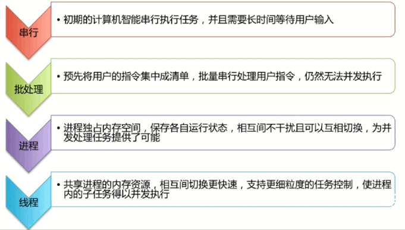
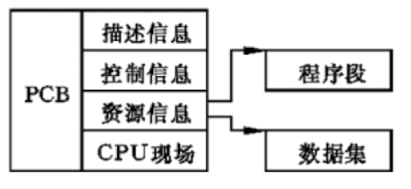
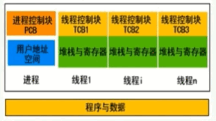
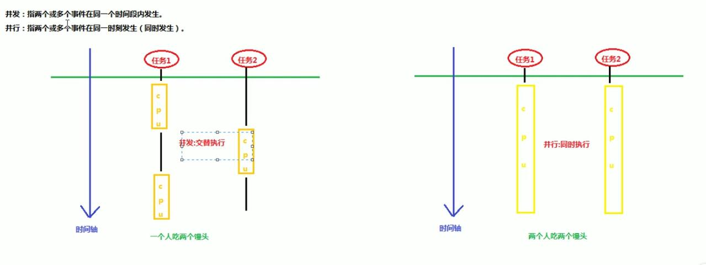

## 进程与线程

### 进程和线程的由来

##### 图示

计算机的发展过程

#### 1. 串行

​	计算机的出现是为了解决复杂的计算问题的, 最初的时候, 计算机只能接受一些特定的指令. 用户输入一个指令.计算机就做一个操作.当用户在思考或者输入数据时, 计算机就在等待,显然这样效率是很低下的, 因为很多时候计算机处于等待用户输入的状态

#### 2. 批处理

​	而后来, 为了提升计算机执行效率, 当时做的改良是把一切操作的指令, 预先写下来, 形成一个清单, 然后一次性交给计算机，计算机不断的读取指令进行相应的操作. 就这样, 批处理操作系统诞生了. 用户将需要执行的多个程序, 写在磁盘上, 然后交由计算机去读取, 并逐个的执行这些程序.并将输出结果写到另外一个磁盘上. 

**问题:** 然而接下来的发展中，批操作系统遇到了问题. 当有两个任务A和B，A在执行到一半的过程中, 需要读取大量的数据输入, 即所谓的IO操作. 而此时CPU只能静静的等待A去读取完数据才能执行. 这样就白白浪费了 CPU资源. 人们于是想. 能否在任务A读取数据的过程中. 让任务B去执行. 当任务A读取完数据之后,让任务B暂停，然后让任务A继续执行. 

* 但是这样就有一个问题, 原来每次都是一个程序在计算机里运行.也就是说内存始终只有一个程序的运行数据. 而如果想要让任务A执行IO操作的时候, 让任务b去抢占CPU去执行, 必然内存中要装入多个程序.那么如何处理呢?

* 多个程序使用的数据如何辨别,并且当一个程序运行暂停后，后面又是如何恢复到他之前执行的状态？此时进程应运而生.

#### 3. 进程

​	用一个进程来对应一个程序, 每个进程对应一定的内存地址空间，并且只能使用他自己的内存空间. 各个进程间互不干扰. 并且进程保存了程序每个时刻的运行状态. 这样就为进程切换提供了可能, 当进程暂停时 ，它会保存当前进程的状态, 比如进程的标识，进程的使用资源等, 再一次等到 IO设备完成作业输出结果后. 再重新切换回来时. 便根据之前保存的状态进行恢复, 然后继续执行. 进程让操作系统的并发成为了可能.

虽然并发从宏观上看.有多个任务在执行, 但是事实上，对于单核CPU的机器来讲, 任意一个具体的时刻, 只有一个任务在占用CPU资源. 

而单核的情况下, 让用户看起来像同一时刻并发执行多个任务的原因, 是因为 CPU分配给单任务执行的时间片很短，任务切换的频次高.造成所有任务都在执行的假象.在出现了进程之后. 操作系统的性能得到了大幅的提升. 自然进程的出现，解决了操作系统并发的问题.

**问题:** 但是随着电脑的普及，人们逐渐对实时性有了要求,因为一个进程在一段时间内只做一件事情. 如果一个进程有多个子任务. 只能逐个的去执行这些子任务, 而往往子任务之间往往不存在数据上的依赖. 是可以并发执行的. 既然CPU能够按照时间片的方式去轮流切换进程, 能不能子任务打个标签, 让 CPU按照更细的时间片去执行子任务.答案是肯定的.

##### 线程

由于子任务共享进程的内存资源，因此隶属于同一个进程的子任务间的切换是不需要切换页录入以新的地址空间的(这里没听清). 这样就为子任务之间的更快的切换提供了可能. 此时人们就发明了线程. 让线程去执行一个子任务. 这样, 一个进程就包括了多个线程. 每个线程负责一个独立的子任务, 达到提升实时性的效果. 

> 进程让操作系统的并发性成为可能，而随着进一步细分，线程让进程的内部并发成为了可能

### 进程和线程的区别

**进程是资源分配的最小单位，线程是CPU调度的最小单位.**

* 所有与进程相关的资源, 都被记录在 PCB上, 以表示该进程拥有这些资源.或者正在使用他们

* 进程是抢占处理机的调度单位, 线程属于某个进程共享其资源.

  > 进程拥有一个完整的虚拟地址空间, 当进程发生调度时, 不同的进程拥有不同的虚拟地址空间，而同一进程内的不同线程, 共享同一地址空间
  >
  > 与进程相对应. 线程与资源分配无关, 他属于某一个进程, 并与进程里的其他线程共享进程资源

* 线程只有堆栈寄存器, 程序计数器和TCB组成

  > 寄存器可被用来存储线程内的局部变量. 但不能存储其他线程的相关变量. 通常一个进程当中可以包含若干个线程. 他们可以利用进程中所拥有的资源

#### 总结

* 线程不能看做独立应用,而进程可看做独立应用

  > 操作系统并没有将线程看作独立的应用来实现进程的调度和管理以及资源的分配. 

* 进程有独立的地址空间,相互不影响,线程只是进程的不同执行路径

  > 一个进程崩溃, 在保护模式下, 不会对其他进程造成影响. 某个线程挂了之后, 所在的进程也会挂掉. 

* 线程没有独立的地址空间,多进程的程序比多线程程序健壮

  >线程有自己的堆栈和局部变量. 但线程之间没有独立的地址空间，就像我们上面所说的，一个线程挂掉了就等于整个进程挂掉了，所以多进程的程序要比多线程的程序健壮. 

* 进程的切换比线程的切换开销大

  >对于某些要求同时进行并且要共享某些变量的并发操作. 只能用线程, 不能用进程. 每个独立的线程有一个程序运行入口. 顺序执行序列和程序的出口，但是线程不能够独立执行, 必须依存于某个应用程序中. 有应用程序提供对多个线程执行控制. 

### Java中进程和线程的关系

* 线程不能看做独立应用,而进程可看做独立应用

  >Java作为与平台无关的编程语言. 必然会对操作系统提供的功能进行进一步的封装. 与平台无关的编程接口供程序员使用. 进程和线程作为操作系统核心概念的一部分. 无疑也是如此. 

* 进程有独立的地址空间,相互不影响,线程只是进程的不同执行路径

  > 每运行一个Java程序, 会产生一个Java进程. 每个Java进程可能会包括一个或者多个线程. 

* 线程没有独立的地址空间,多进程的程序比多线程程序健壮

  > 每一个JVM实例对应一个堆. 每一个线程都有一个自己私有的栈, 

* 进程的切换比线程的切换开销大

  >进程类似于投资者, 他们手握资源. 而真正拿资源去干活的是线程. 即自己的程序中如果没有创建线程, 只会创建一个线程. 通常称为主线程. 因此在进行UI编程时, 要将耗时的操作放在子线程中执行, 以免阻塞主线程, 影响用户的体验

#### 注意

* 当 Java程序启动时, 主线程立刻运行, 主线程的重要性体现在两个方面.它是产生其他子线程的线程，他需要最后完成执行.  

* 一个程序是一个可执行的文件, 一个进程是程序中执行的实例

* JVM实例在创建的时候会创建很多的线程. 比如垃圾收集器的线程, 

## 并发与并行

#### 两者的区别

- **并发:** 指两个或多个时间在同一时间发生(同时发生)

  > 在电脑中就是有多个 CPU去执行多个任务, 两个人吃两个馒头

- **并行: ** 指两个或多个事件在同一个时间段内部执行

  > 一个CPU 高频切换执行不同的任务, 一个人吃两个饿馒头(没有办法一起吃)

