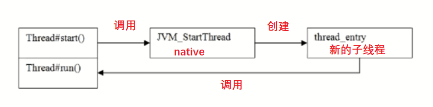
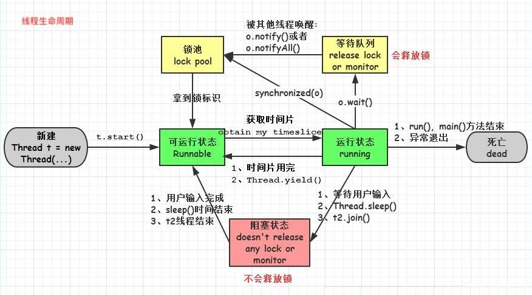

## Thread中的 start和 run方法的区别

- 调用start()方法会创建一个新的子线程并启动

- run()方法只是Thread的一个普通方法的调用

  > 还是在主线程中执行, 两者不存在任何可比性

#### 图示



###### 代码

```java
public class ThreadTest {
    private static void attack() {
        System.out.println("Fight");
        System.out.println("Current Thread is : " + Thread.currentThread().getName());
    }

    public static void main(String[] args){
        // 创建一个子线程
        Thread t = new Thread(){
            public void run(){
                attack();
            }
        };
        System.out.println("current main thread is : " + Thread.currentThread().getName());
        System.out.println("==================================");
        t.run();
        System.out.println("==================================");
        t.start();
    }
}
```

###### 结果

```
current main thread is : main
==================================
Fight
Current Thread is : main
==================================
Fight
Current Thread is : Thread-0
```


## Thread和 Runnable是什么关系

### 关系

- Thread是实现了 Runnable接口的类,使得 run支持多线程

  > 通过start方法给runnable赋值上了多线程的特性. 

- 因类的单一继承原则 ,推荐多使用 Runnable接口

  > 为了提升系统的可扩展性, 使业务类实现 Runnable接口, 将业务逻辑封装在 run()中, 便于以后给普通类附上多线程的特性. 

###### 源码分析

```java
// Runnable仅仅是一个接口, 里面只有 run方法
@FunctionalInterface
public interface Runnable {
    public abstract void run();
}

// Thread继承了 Runnable
public class Thread implements Runnable {

    // Runnable实例
    private Runnable target;
    
    // 构造方法, 传入Runnable
    public Thread(Runnable target) {
        // 将 参数 target赋值给成员变量 target
        init(null, target, "Thread-" + nextThreadNum(), 0);
    }

    // 线程启动时(通过start())会自动调用run()方法
    // 重写了 Runnable中的 run()方法, 并且调用了一个 Runnable实例的run()方法
    // 1.通过继承 Thread创建线程, 需要重写 run() 方法, 否则 target为空, 什么都没有执行
    // 2.通过传入参数 Runnable创建线程, 给 target赋值, 执行 target中的run()
    @Override
    public void run() {
        if (target != null) {
            target.run();
        }
    }
}
```


### 两种方式创建多线程

###### 代码一

```java
// 继承 Thread
class MyThread extends Thread {
    private String name;
    public MyThread(String name){
        this.name = name;
    }
    // 重写 run方法, 如果不重写, 程序也不会报错, target = null, run()中没有代码执行.
    @Override
    public void run(){
        for(int i = 0 ; i < 10 ; i ++){
            System.out.println("Thread start : " + this.name + ",i= " + i);
        }
    }
}

public class ThreadDemo {
    public static void main(String[] args) {
        MyThread mt1 = new MyThread("Thread1");
        MyThread mt2 = new MyThread("Thread2");
        MyThread mt3 = new MyThread("Thread3");
        mt1.start();
        mt2.start();
        mt3.start();
    }
}
```

###### 代码二

```java
class MyRunnable implements Runnable {
    private String name;

    public MyRunnable(String name) {
        this.name = name;
    }
	
    // 实现 run()方法, 必须进行实现, 否则程序会报错
    @Override
    public void run() {
        for (int i = 0; i < 10; i++) {
            System.out.println("Thread start : " + this.name + ",i= " + i);
        }
    }
}

public class RunnableDemo {
    public static void main(String[] args) throws InterruptedException {
        MyRunnable mr1 = new MyRunnable("Runnable1");
        MyRunnable mr2 = new MyRunnable("Runnable2");
        MyRunnable mr3 = new MyRunnable("Runnable3");
        // 将 Runnable传入 Thread中, 此时 thread中的run()方法,会调用 target.run()
        Thread t1 = new Thread(mr1);
        Thread t2 = new Thread(mr2);
        Thread t3 = new Thread(mr3);
        t1.start();
        t2.start();
        t3.start();
    }
}
```

#### 注意

* 创建线程最终调用的是run(), 所以需要在 run() 中实现所需要的业务代码

* 实现run() 由两种方式, 一是直接重写, 二是实现Runnable, 让 Thread继承,调用


## 如何给run() 方法传参

### 实现的方式主要有三种

- 构造函数传参

  ```java
  class MyRunnable implements Runnable {
      private String name;
  
      public MyRunnable(String name) {
          this.name = name;
      }
  
      @Override
      public void run() {
          for (int i = 0; i < 10; i++) {
              System.out.println("Thread start : " + this.name + ",i= " + i);
          }
      }
  }
  ```

- 成员变量传参

  > 通过 set()方法进行赋值

- 回调函数传参


## 如何实现处理线程的返回值

有的程序的执行是依赖于子任务的返回值进行, 当子任务交给子线程去完成的时候. 是需要获取到他们的返回值的.

### 1. 主线程等待法

```java
public class CycleWait implements Runnable{
    private String value;
    public void run() {
        try {
            Thread.currentThread().sleep(5000);
        } catch (InterruptedException e) {
            e.printStackTrace();
        }
        value = "we have data now";
    }

    public static void main(String[] args) throws InterruptedException {
        CycleWait cw = new CycleWait();
        Thread t = new Thread(cw);
        t.start();
        while (cw.value == null){
            Thread.currentThread().sleep(100);
        }
        System.out.println("value : " + cw.value);
    }
}
```

###### 结果

```
value : we have data now
```

**缺点**

1.  需要处理自己循环等待的逻辑, 当需要等待的变量一多, 代码便会显得异常臃肿
2.  循环多久是不确定的, 不能实现精准的控制. 

### 2. 使用 Thread类的 join()阻塞当前线程以等待子线程处理完毕

###### 代码

```java
public class CycleWait implements Runnable{
    private String value;
    public void run() {
        try {
            Thread.currentThread().sleep(5000);
        } catch (InterruptedException e) {
            e.printStackTrace();
        }
        value = "we have data now";
    }

    public static void main(String[] args) throws InterruptedException {
        CycleWait cw = new CycleWait();
        Thread t = new Thread(cw);
        t.start();
        t.join();
        System.out.println("value : " + cw.value);
    }
}

```

**特点:** 更加精准的控制. 实现起来更简单. 缺点是粒度不够细

### 3. 通过 Callable接口实现, 通过 FutureTask 或者线程池获取

在JDK5之前, 线程是没有返回值的. 常常为了有返回值颇费周折. 或者想别的不是多线程的方法绕过. 之后有了有可返回值的任务. 即实现了 Callable接口的任务. 执行了 Callable任务之后会获取一个 Future的对象. 在该对象上调用get()就可以获得 Callable任务返回的 Object.

#### 方式一

###### 代码

```java
public class FutureTaskDemo {
    public static void main(String[] args) throws Exception{
        
        FutureTask<String> task = new FutureTask<>(new MyCallable());
        
        /*
        	class FutureTask implements RunnableFuture
        	interface RunnableFuture extends Runnable, Future
        */
        new Thread(task).start();
        if(!task.isDone()){
            System.out.println("task has not finished, please wait!");
        }
        System.out.println("task return: " + task.get());
    }
}

class MyCallable implements Callable<String> {
    @Override
    public String call() throws Exception {
        String value = "test";
        System.out.println("Ready to work");
        Thread.currentThread().sleep(5000);
        System.out.println("task done");
        return value;
    }
}
```

###### 结果

```java
task has not finished, please wait!
Ready to work
// 5秒后
task done
task return: test
```

#### 方式二

```java
public class ThreadPoolDemo {
    public static void main(String[] args) {
        // 创建线程池
        ExecutorService newCachedThreadPool = Executors.newCachedThreadPool();
        
        Future<String> future = newCachedThreadPool.submit(new MyCallable());
        if(!future.isDone()){
            System.out.println("task has not finished, please wait!");
        }
        try {
            System.out.println(future.get());
        } catch (Exception e) {
            e.printStackTrace();
        } finally {
            newCachedThreadPool.shutdown();
        }
    }
}
```

使用线程池可以多个提交实现类 Callable的类. 让线程池并发的处理结果, 方便对这些实现类 Callable的类做统一管理. 


## 线程的状态

#### 1. 新建(New): 创建后尚未启动的线程

新创建了线程对象, 但是还没有调用start(), 该线程处于 new的状态

#### 2. 运行(Runnable): 包含Running和Ready

​	处于此状态的线程可能正在执行, 也可能等待着CPU为他分配时间, 比如线程对象创建后, 主线程调用该对象的start(), 线程就处于Runnable状态了. 该状态分为两个子状态, 处于Running状态的线程, 位于可运行线程中. 等待被线程调度选中. 获取CPU的执行权, 属于Ready的线程位于线程池中. 等待被线程调度选中. 获取CPU的执行权. 而处于Ready状态的线程在获得CPU时间后, 就为 Running状态的线程. 

#### 3. 无限期等待(Waiting):不会被分配CPU执行时间, 需要显示被唤醒

处于这一状态的线程, 不会被分配CPU执行时间, 他们要等待被其他线程显示的唤醒.以下的方法会让线程陷入无限期的等待.

```
没有设置 Timeout参数的 Object.wait()方法
没有设置 Timeout参数的 Object.join()方法
LockSupport.park()方法
```

#### 4. 限期等待(Timed Waiting): 在一定时间后会由系统自动唤醒

处于这一状态的线程, 也不会被分配CPU执行时间, 不过无需等待被其他线程显示的唤醒.在一定时间后, 会由系统自动唤醒. 以下的方法会让线程陷入限期等待.

```
Thread.sleep()方法
设置了 Timeout参数的 Object.wait()方法
设置了 Timeout参数的 Object.join()方法
LockSupport.parkNanos()方法
LockSupport.parkUnitl()方法
```

#### 5. 阻塞(Blocked):等待获取排他锁

线程被阻塞了, 阻塞状态与等待状态的区别是阻塞状态在等待着获取到一个排他锁. 这个事件将在一个线程放弃这个锁的时候发生. 而等待状态则是在等待一段时间或者在有唤醒工作的时候发生. 在程序等待进入同步区域的时候, 线程将进入 Blocked状态. 

比如当进入 syncronized修饰的方法或者代码块, 即获取锁去执行的时候, 其他想进入此方法或者代码块的线程就要等着. 他们的状态便是 Blocked

#### 6. 结束(Terminated): 已终止线程的状态, 线程已经结束执行

当线程的run() 方法完成时, 或者主线程的main() 方法完成时. 我们就认为他结束了. 线程一旦终止, 就不能在复生.在终止的线程上调用 start(), 会抛出异常.

```java
public class ThreadTest {
    private static void attack() {
        System.out.println("Fight");
        System.out.println("Current Thread is : " + Thread.currentThread().getName());
    }
    public static void main(String[] args) throws InterruptedException {
        Thread t = new Thread(){
            public void run(){
                attack();
            }
        };
        t.start();
        t.join();
        t.start();
    }
}
```

###### 结果

```
Fight
Current Thread is : Thread-0
Exception in thread "main" java.lang.IllegalThreadStateException
```

## 线程的状态及转化

