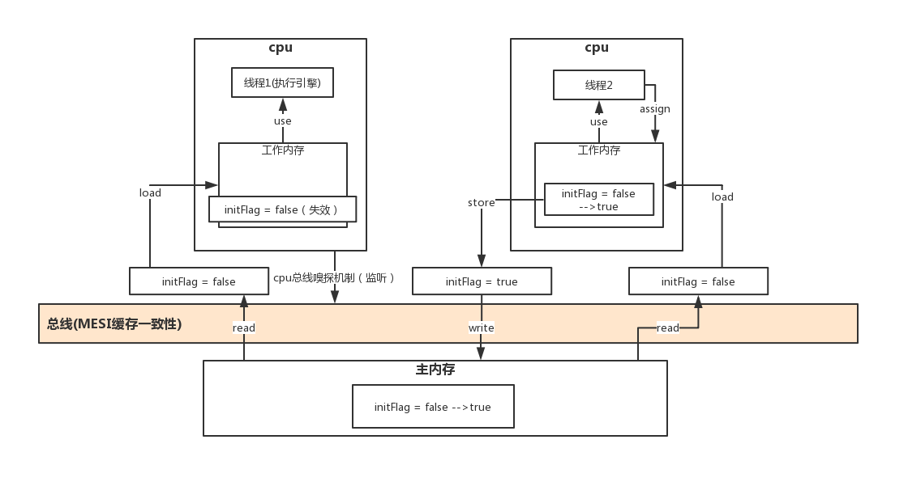

## 现代计算机的物理内存模型

#### 预备知识

1. 现在计算机最少的都是应该是两核心了，当然我们也经常在买个人电脑的时候听过四核四线程、四核八线程等，可以说现在个人电脑标配都是四核心了，为了方便下图只是列举了2个核心。

2. 现代计算机的内存在逻辑上还是一块。有人可能问不对啊，我电脑就插了两块内存，但是操作系统会把两块内存的地址统一抽象，比如每一块的内存是2048MB地址是000000000000-011111111111MB，两块就是0000000000000-0111111111111MB，操作系统会统一编址。所以整体上看还是一块内存。

3. 因为CPU的操作速度太快，如果让CPU直接操作内存，那么久是对CPU资源的一种巨大浪费，为了解决这个问题现在计算机都给CPU加上缓存，比如一级缓存，二级缓存，甚至三级缓存。缓存速度比内存快，但是是还是赶不上CPU的数据级别，所以在缓存和CPU之间又有了 register, register的存储速度比缓存就快了好多了。

   > **存储速度上有如下关系:** register > 一级缓存 > 二级缓存 > ... > n级缓存 > 内存
   >  **容量上一般有如下关系:** 内存 > n级缓存 > ... > 二级缓存 > 一级缓存 > register

#### 图示


#### 原理

之所以可以用缓存和register来缓解CPU和内存之间巨大的速度差别是基于如下原理：

**CPU访问过的内存地址，很有可能在短时间内会被再次访问。**

所以，比如CPU访问了地址为0x001fffff的内存地址，如果没有缓存和register，那么CPU再下次访问这个内存地址的时候就还要去内存读，但是如果有缓存，缓存会把CPU访问过的数据先存储起来，等CPU待会再找地址为0x001fffff的内存地址时候，发现其在缓存中就存在了，那么好了，这就不用在访问内存了。速度自然就提升了


## Java内存模型 JMM

### 1. 预备

Java为了实现其跨平台的特性，使用了一种虚拟机技术，java程序运行在这虚拟机上，那么不管你是windows系统，linux系统，unix系统，只要我 Java虚拟机屏蔽一切操作系统带来的差异，向 Java程序提供专用的、各系统无差别的虚拟机，那么 Java程序员就不需要关心底层到底是什么操作系统了。

**例子:** 对于 int类型的变量其取值范围永远是 `-2^31 - 1 ~ 2^31`，即4个字节。但是对C/C++,这个操作系统的int可能是4字节，那个可能是8字节。C++程序员跨平台写代码，痛苦异常。

这个给我们编程带来极大方便的虚拟机就是大名鼎鼎的 JVM(Java Virtual Machine)。**既然是虚拟机那么就需要模拟真正物理机的所有设备，像CPU，网络，存储等。** 和我们程序员最密切的就是 JVM的存储，JMM定义了 JVM在计算机内存(RAM)中的工作方式。JVM是整个计算机虚拟模型，所以JMM是隶属于JVM的。

因 Java内存模型是在具体的物理内存模型的基础上实现的，并且为了运行效率，Java也支持指令重排序。所以java并发编程也有“原子性”、“有序性”、“可见性”三个问题。

### 2. JMM理解

JMM(Java内存模型 Java Memory Model,简称 JMM)本身是一种**抽象的概念并不真实存在**，它描述的是一组规则或规范，通过这组规范定义了程序中各个变量(包括实例字段，静态字段和构成数组对象的元素)的访问方式。

#### 1. 规则

1. Java内存模型中规定所有变量都存储在主内存

   > 主内存是共享内存区域，所有线程都可以访问

2. 线程对变量的操作(读取赋值等)必须在工作内存中进行.

   > 操作步骤: 
   >
   > 1. 首先要将变量从主内存拷贝的自己的工作内存空间
   > 2. 然后对变量进行操作
   > 3. 操作完成后再将变量写回主内存
   >
   > 线程操作数据, 不能直接操作主内存中的变量. 工作内存中存储着主内存中的变量副本拷贝
   >

###### 如图


#### 2. 主内存与工作内存说明

##### 主内存

* 主要存储的是Java实例对象，所有线程创建的实例对象都存放在主内存中，不管该实例对象是成员变量还是方法中的本地变量(也称局部变量), 当然也包括了共享的类信息、常量、静态变量。

* 由于是共享数据区域，多条线程对同一个变量进行访问可能会发现线程安全问题。

##### 工作内存

JVM运行程序的实体是线程，而每个线程创建时 JVM都会为其创建一个工作内存(有些地方称为栈空间)，用于存储线程私有的数据. 

- 存储当前方法的所有本地变量信息**,本地变量对其他线程不可见.** 包括字节码行号指示器、Native方法信息. 
- **工作内存是每个线程的私有数据区域**, 其他线程不可见.因此不同的线程向无法访问对方的工作内存，线程间的通信(传值)必须通过主内存来完成
- 由于属于线程私有数据区域,不存在线程安全问题

#### 3. 主内存与工作内存的数据存储类型以及操作方式归纳

- 方法里的基本数据类型本地变量将直接存储在工作内存的栈帧结构中
- 引用类型的本地变量:引用存储在工作内存中,实例存储在主内存中
- 成员变量、static变量、 类信息均会被存储在主内存中
- 主内存共享的方式是线程各拷贝一份数据到工作内存,操作完成后刷新回主内存

#### 4. JMM与 Java内存区域的区别

JMM与 Java内存区域划分是不同的概念层次. 

- JMM描述的是一组规则，通过这组规则控制程序中各个变量在共享数据区域和私有数据区域的访问方式，JMM是围绕原子性，有序性、可见性展开的

- **相似点:** 存在共享区域和私有区域

  > 在 JMM中主内存属于共享数据区域，从某个程度上讲应该包括了堆和方法区，而工作内存数据线程私有数据区域，从某个程度上讲则应该包括程序计数器、虚拟机栈以及本地方法栈。


### 3. JMM原子操作

- lock (锁定) :将主内存变量加锁，标识为线程独占状态
- read (读取) :从主内存读取数据
- load (载入) :将主内存读取到的数据写入工作内存
- use (使用) :从工作内存读取数据来计算
- assign (赋值) :  将计算好的值重新赋值到工作内存中
- store (存储) :将工作内存数据写入主内存
- write (写入) :将store过去的变量值赋值给主内存中的变量
- unlock (解锁) :将主内存变量解锁,解锁后其他线程可以锁定该变量

##### 图解



JMM缓存不一致问题

#### 总线加锁(性能太低)

cpu从主内存读取数据到高速缓存，会在总线对这个数据加锁，这样其它cpu没法去读或写这个数据，直到这个cpu使用完数据释放锁之后其它cpu才能读取该数据

#### MESI缓存一致性协议

多个cpu从主内存读取同一个数据到各自的高速缓存，当其中某个cpu修改了缓存里的数据，该数据会马上同步回主内存，其它cpu通过**总线嗅探机制**可以感知到数据的变化从而将自己缓存里的数据失效


### 3. Java内存模型带来的问题

#### 1. 可见性问题

如果存在两个线程同时对一个主内存中的实例对象的变量进行操作就有可能诱发线程安全问题。

如下图，主内存中存在一个共享变量x，现在有A和B两条线程分别对该变量 x = 1进行操作，A/B线程各自的工作内存中存在共享变量副本x。假设现在A线程想要修改x的值为2，而B线程却想要读取x的值，那么B线程读取到的值是A线程更新后的值2还是更新前的值1呢？


**答案: 不确定，** 即B线程有可能读取到A线程更新前的值1，也有可能读取到A线程更新后的值2

1. 这是因为工作内存是每个线程私有的数据区域，而线程A变量x时，首先是将变量从主内存拷贝到A线程的工作内存中，然后对变量进行操作，操作完成后再将变量x写回主内，
2. 而对于B线程的也是类似的，这样就有可能造成主内存与工作内存间数据存在一致性问题，
3. 假如A线程修改完后正在将数据写回主内存，而B线程此时正在读取主内存，即将 x = 1拷贝到自己的工作内存中，这样B线程读取到的值就是x=1，
4. 但如果A线程已将 x = 2写回主内存后，B线程才开始读取的话，那么此时B线程读取到的就是 x = 2，
5. 但到底是哪种情况先发生呢？这是不确定的，这也就是所谓的线程安全问题。 

**解决:** 要解决共享对象可见性这个问题，我们可以使用volatile关键字或者是加锁

#### 2. 可见性问题 — 竞争现象

线程 A和线程 B共享一个对象 obj。

1. 假设线程 A从主存读取 obj.count变量到自己的CPU缓存，同时，线程B也读取了 obj.count变量到它的CPU缓存，并且这两个线程都对 obj.count做了加1操作。
2. 此时，obj.count加 1操作被执行了两次，不过都在不同的 CPU缓存中。
3. 如果这两个加1操作是串行执行的，那么 obj.count变量便会在原始值上加2，最终主存中的 obj.count的值会是3。
4. 然而下图中两个加 1操作是并行的，不管是线程 A还是线程 B先 flush计算结果到主存，最终主存中的obj.count只会增加 1次变成 2，尽管一共有两次加1操作。


**解决:** 使用 synchronized代码块

#### 3. 并发下重排序带来的问题

多线程环境中线程交替执行,由于编译器优化重排的存在，**两个线程中使用的变量能否保证一致性是无法确定的,结果无法预测**

例子

###### 线程T1执行：

```java
a = 1; 
boolean b = true;
```

###### 线程T2执行：

```java
if (b){
    int c = a;
    System.out.println(c);
}
```

**问题:** 假如某个并发时刻，T2检测到b变量已经是true值了，并且变量都对T2可见。c 赋值得到的一定是 1吗？

答案: 不一定

**原因:** 重排序问题的存在，在多线程环境下，会造成问题。

1. 只有 T1一个线程, 如果 a和 b变量的赋值被重排序了, b先于 a发生，这个重排序对 T1线程本身不存在什么问题

2. 但是在 T2这个线程看来，这个执行就有问题了

   - 如果没有重排序，b值变为 true之前，a已经被赋值 1了

   - 而重排序使得这个推断变得不确定，b有可能先执行，a还没来的及执行，此时线程T2已经看到 b变更，然后去获取a的值，自然不等于1。

     ```java
     // 重排序后的结果
     boolean b = true;
     a = 1; 
     ```

**注意:** 

指令重排只会保证单线程中串行语义的执行的一致性，但并不会关心多线程间的语义一致性

##### 解决在并发下的问题

1. 内存屏障—禁止重排序
2. 临界区（synchronized？）

#### 补: 指令重排

计算机在执行程序时，为了提高性能，编译器和处理器的常常会对指令做重排，一般分以下3种


- 编译器优化的重排

  > **编译器在不改变单线程程序语义的前提下，可以重新安排语句的执行顺序**

- 指令并行的重排

  > 现代处理器采用了指令级并行技术来将多条指令重叠执行**。如果不存在数据依赖性(即后一个执行的语句无需依赖前面执行的语句的结果)，处理器可以改变语句对应的机器指令的执行顺序**

- 内存系统的重排

  > 由于处理器使用缓存和读写缓存冲区，这使得加载(load)和存储(store)操作看上去可能是在乱序执行，因为三级缓存的存在，导致内存与缓存的数据同步存在时间差。

##### 总结: 

1. 发生指令重排不能够改变单线程程序的最终结果
2. 如果指令之间存在的**数据依赖性**, 不会进行指令重排, 如果不存在数据依赖性, 可能发生指令重排. 

##### 解释数据依赖性

```java
int x = 11; // 语句1
int y = 12; // 语句2, 与语句1不存在数据依赖
x = x + 5;  // 语句3, 与语句 1存在数据依赖
y = x * x;  // 语句4, 与语句1, 语句2, 语句3存在数据依赖
```

##### 执行顺序

```java
1234	// 可以, 未发生指令重排
2134	// 可以, 发生指令重排, 不会影响程序的正确性
1324	// 可以, 发生指令重排, 不会影响程序的正确性
重排后语句4不可以作为第一条, 因为他依赖于数据x	// 如果发生指令重排, 则会影响程序的正确性
```


### 4. JMM三大特性

为了解决类似上述的问题, 针对各种情况, JVM定义了一组规则，通过这组规则来决定一个线程对共享变量的写入何时对另一个线程可见，JMM是围绕着程序执行的原子性、有序性、可见性展开的, 上述问题的出现, 就是因为没有满足着三个特性. 下面我们看看这三个特性

#### 1. 原子性

原子性指的是一个操作是不可中断的，即使是在多线程环境下，一个操作一旦开始就不会被其他线程影响。

##### 举例

比如对于一个静态变量int x，两条线程同时对他赋值，线程A赋值为 1，而线程B赋值为 2，不管线程如何运行，最终x的值要么是1，要么是2，线程 A和线程 B间的操作是没有干扰的，这就是原子性操作，不可被中断的特点。

##### 注意: 

对于32位系统的来说，long类型数据和 double类型数据(对于基本数据类型，byte, short, int, float, boolean, char读写是原子操作)，它们的读写并非原子性的

> 也就是说如果存在两条线程同时对 long类型或者double类型的数据进行读写是存在相互干扰的
>
> 因为对于32位虚拟机来说，每次原子读写是32位的，而long和double则是64位的存储单元，这样会导致一个线程在写时，操作完前32位的原子操作后，轮到B线程读取时，恰好只读取到了后32位的数据，这样可能会读取到一个既非原值又不是线程修改值的变量，它可能是“半个变量”的数值，即64位数据被两个线程分成了两次读取。
>
> 但也不必太担心，因为读取到“半个变量”的情况比较少见，至少在目前的商用的虚拟机中，几乎都把64位的数据的读写操作作为原子操作来执行，因此对于这个问题不必太在意，知道这么回事即可。

#### 2. 可见性

理解了指令重排现象后，可见性容易了，可见性指的是当一个线程修改了某个共享变量的值，其他线程能够马上得知这个修改的值。

对于串行程序来说，可见性是不存在的，因为我们在任何一个操作中修改了某个变量的值，后续的操作中都能读取这个变量值，并且是修改过的新值。

##### 可见性问题

但在多线程环境中可就不一定了，前面我们分析过，由于线程对共享变量的操作都是线程拷贝到各自的工作内存进行操作后才写回到主内存中的，这就可能存在一个线程A修改了共享变量x的值，还未写回主内存时，另外一个线程B又对主内存中同一个共享变量x进行操作，但此时A线程工作内存中共享变量x对线程B来说并不可见，这种工作内存与主内存同步延迟现象就造成了可见性问题

另外指令重排以及编译器优化也可能导致可见性问题，通过前面的分析，我们知道无论是编译器优化还是处理器优化的重排现象，在多线程环境下，确实会导致程序轮序执行的问题，从而也就导致可见性问题。

#### 3. 有序性

有序性是指对于单线程的执行代码

我们总是认为代码的执行是按顺序依次执行的，这样的理解并没有毛病，毕竟对于单线程而言确实如此，但对于多线程环境，则可能出现乱序现象，因为程序编译成机器码指令后可能会出现指令重排现象，重排后的指令与原指令的顺序未必一致

要明白的是，在Java程序中，倘若在本线程内，所有操作都视为有序行为，如果是多线程环境下，一个线程中观察另外一个线程，所有操作都是无序的，前半句指的是单线程内保证串行语义执行的一致性，后半句则指指令重排现象和工作内存与主内存同步延迟现象。


### 5. JMM提供的解决方案

提出让多线程下满足三个特性的办法

三个特性保证了不会出现问题, 但是多线程的使用破坏了三个特性,Java使用了一些方法来维护这三个特性. 

在理解了原子性，可见性以及有序性问题后，看看 JMM是如何保证的，在Java内存模型中都提供一套解决方案供Java工程师在开发过程使用

1. 如原子性问题，除了JVM自身提供的对基本数据类型读写操作的原子性外，对于方法级别或者代码块级别的原子性操作，可以使用synchronized关键字或者重入锁(ReentrantLock)保证程序执行的原子性
2. 而工作内存与主内存同步延迟现象导致的可见性问题，可以使用synchronized关键字或者volatile关键字解决，它们都可以使一个线程修改后的变量立即对其他线程可见。
3. 对于指令重排导致的可见性问题和有序性问题，则可以利用volatile关键字解决，因为volatile的另外一个作用就是禁止重排序优化

除了靠sychronized和volatile关键字来保证原子性、可见性以及有序性外，JMM内部还定义一套happens-before 原则来保证多线程环境下两个操作间的原子性、可见性以及有序性。


### 6. happens-before

用happens-before的概念来阐述操作之间的内存可见性。

happens-before 原则来辅助保证程序执行的原子性、可见性以及有序性的问题，它是判断数据是否存在竞争、线程是否安全的依据

> **通俗:** happen-before原则就是用来解决并发问题的一个原则说明，它告诉我们的开发者，你放心的写并发代码，但是你要**遵循我告诉你的原则，你就能避免以上重排序导致的问题。**

#### 定义

使用 happens-before的概念来指定两个操作之间的执行顺序。由于这两个操作可以在一个线程之内，也可以是在不同线程之间。因此，**JMM可以通过happens-before关系向程序员提供跨线程的内存可见性保证**（如果A线程的写操作a与B线程的读操作b之间存在happens-before关系，尽管a操作和b操作在不同的线程中执行，但JMM向程序员保证a操作将对b操作可见）。

1. 如果一个操作happens-before另一个操作，那么第一个操作的执行结果将对第二个操作可见，而且第一个操作的执行顺序排在第二个操作之前。

2. 两个操作之间存在happens-before关系，并不意味着Java平台的具体实现必须要按照happens-before关系指定的顺序来执行。如果重排序之后的执行结果，与按happens-before关系来执行的结果一致，那么这种重排序并不非法（也就是说，JMM允许这种重排序）。

##### 注意

1. happen-before的规则在时间上的先后发生基本没有太大关系
2. 如果操作A happens-before操作B ,那么操作A在内存上所做的操作对操作B都是可见的
3. happen-before 有一种记法，`hb(a,b)` ，表示 a比 b先行发生

#### happen-before的八大原则

以下8条原则无需手动添加任何同步手段(synchronized|volatile)即可达到效果

1. **程序次序规则:** 一个线程内,按照代码顺序,书写在前面的操作 happen-before 书写在后面的操作
2. **锁定规则:** 同一个锁的unlock操作 happen-before 此锁的lock操作
3. **volatile变量规则:** 对一个volatile变量的写操作 happen-before 此变量的读操作
4. **传递规则:** 如果A操作 happen-before B操作，B操作happen-before C操作，那么 A操作 happen-before C操作
5. **线程启动规则:** 同一个线程的start方法 happen-before 此线程的其它方法
6. **线程中断规则:** 对线程interrupt()方法的调用先行发生于被中断线程的代码检测到中断事件的发生
7. **线程终结规则:** 线程中的所有操作都happen-before线程的终止检测
8. **对象创建规则:** 一个对象的初始化完成先于他的finalize方法调用


#### 解释

##### 第一条

单线程情况下，happen-before原则告诉你，你放心的认为代码写在前面的就是先执行就ok了，不会有任何问题的。（当然实际并非如此，因为有指令重排序嘛，有的虽然写在前面，但是未必先执行，但是单线程情况下，这并不会给实际造成任何问题，写在前面的代码造成的影响一定对后面的代码可见）

单线程情况下，写在前面的代码都比写在后面的代码先行发生

```java
// hb(a,b)
int a = 1；
int b = 2;
```

##### 第二条

###### 线程T1：

```java
a = 1；
lock.unlock();
b = ture;
```

###### 线程T2：

```java
if (b){
    lock.lock();
    int c = a;
    System.out.println(c);
    lock.unlock();
}
```

此前在讲重排序的时候说过这个问题，说 c有可能读取到的 a值不一定是 1。因为重排序，导致a的赋值语句可能没执行。但是现在在 **b赋值之前加了解锁操作，线程T2在读取到 b值变更后，做了加锁操作。** 

这时候就是第二条原则生效的时候，它告诉我们，假如在时间上T1的 lock.unlock() 先执行了, T2  的 lock.lock()后执行，那么T1 unlock之前的所有变更，a = 1这个变更，T2是一定可见的，即 T2 在  lock后，c拿到的值一定是 a被赋值 1的值。

```java
// 第二条原则: hb(unlock, lock)
// 第一条原则: hb(a = 1, lock.unlock())
// 第一条原则: hb(lock , c = a )		使用了第四条规则
所以 c在被赋值 a时，a = 1一定会先行发生
```

##### 第三条

volatile关键字修饰的变量的写先行发生与对这个变量的读，如下

###### 线程T1：

```java
int a = 1；
int volatile vv = 33; // volatile修饰
b = ture;
```

###### 线程T2：

```java
if (b){
    int ff = vv; // vv is volatile
    int c = a;
    System.out.println(c);
}
```

与前面的锁原则一样，这次是 volatile变量 写happen-before读。线程 T2在读取 a变量前先读取以下 vv这个volatile变量。因为第三条原则的存在，只要T1在时间上执行了vv写操作，T2在执行vv读操作后，a=1的赋值一定可以被T2读到。

```java
// 第三条原则: hb(volatile变量写, volatile变量读)
// hb(a = 1, vv = 33)
// hb(ff = vv, c = a)
// hb(a = 1, c = a)
```

##### 第四条

有了传递性原则, 上面的式子才可以推导

```java
hb(操作A, 操作B)
hb(操作B, 操作C)
==> hb(操作A, 操作C) 	// 有钱两个传递性推导出来
```

##### 第五条

线程 T1的 start()方法，先行发生于 T1即将做的所有操作。

如, 在某个线程中启动 thread1

```java
a = 1;
thread1.start();
```

如上

1. `a =1` 先行发生 `thread.start()`
2. 第五条规则 start方法先行发生该线程即将做的所有操作
3. 那么 a =1, 也必将先行发生于 thread1 的任何操作。
4. 所以thread1启动后，是一定可以读取到a的值为1的

```java
hb(a = 1, thread.start())
hb(thread.start(), 此线程所有的其他操作)
hb(a = 1, 此线程所有的其他操作)
```

##### 参考文章

​	[JMM、Volatile、重排序、happen-before原则](https://baijiahao.baidu.com/s?id=1623232929745448596&wfr=spider&for=pc)