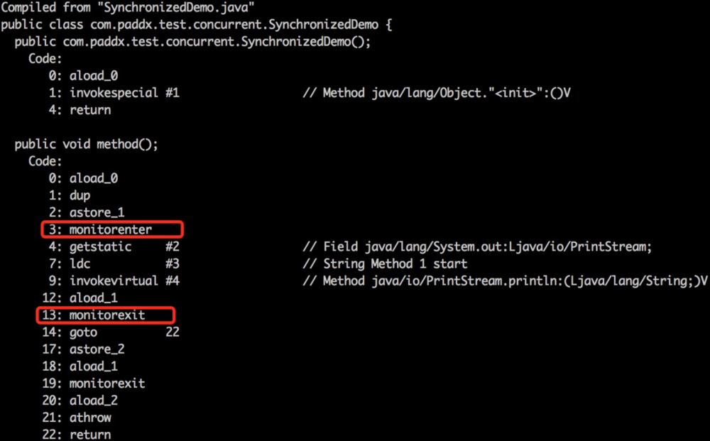
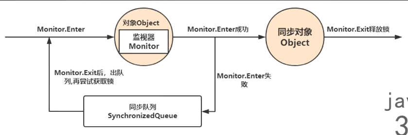

1. 

# 底层

### 同步原理

数据同步需要依赖锁，那锁的同步又依赖谁？**synchronized给出的答案是在软件层面依赖JVM，而j.u.c.Lock给出的答案是在硬件层面依赖特殊的CPU指令**。

当一个线程访问同步代码块时，**首先是需要得到锁才能执行同步代码，当退出或者抛出异常时必须要释放锁**，那么它是如何来实现这个机制的呢？我们先看一段简单的代码：

```java
package com.paddx.test.concurrent;

public class SynchronizedDemo {
    public void method() {
        synchronized (this) {
            System.out.println("Method 1 start");
        }
    }
}
```

查看反编译后结果：




**monitorenter**：每个对象都是一个监视器锁（monitor）。当monitor被占用时就会处于锁定状态，线程执行monitorenter指令时尝试获取monitor的所有权，过程如下：

> 1.  **如果monitor的进入数为0**，则该线程进入monitor，然后将进入数设置为1，该线程即为monitor的所有者；
> 2.  **如果线程已经占有该monitor**，只是重新进入，则进入monitor的进入数加1；
> 3.  **如果其他线程已经占用了monitor**，则该线程进入阻塞状态，直到monitor的进入数为0，再重新尝试获取monitor的所有权；

**monitorexit**：执行monitorexit的线程必须是objectref所对应的monitor的所有者。**指令执行时，monitor的进入数减1，如果减1后进入数为0，那线程退出monitor，不再是这个monitor的所有者**。其他被这个monitor阻塞的线程可以尝试去获取这个 monitor 的所有权

如图:




# 各种锁

## 公平锁与非公平锁

- **公平锁:**  Threads acquire a fair lock in the order in which they requested it
  公平锁，就是很公平，在并发环境中，每个线程在获取锁时会先查看此锁维护的等待队列，如果为空，或者当前线程是等待队列的第一个，就占有锁，否则就会加入到等待队列中，以后**会按照FIFO的规则从队列中取到自已**
- **非公平锁:** a nonfair lock permits barging: threads requesting a lock can jump ahead of the queue of waiting threads if the lockhappens to be available when it is requested.
  非公平锁比较粗鲁，**上来就 直接尝试占有锁，**如果尝试失败，就再采用类似公平锁那种方式。

> 通俗理解: 公平锁, 先来后到	非公平锁, 可以加塞
>
> 非公平锁在高并发下可能会造成优先级反转或者饥饿现象(怎么抢都抢不到), 优点是吞吐量比公平锁大

并发包中的并发包中ReentrantLock的创建可以指定构造函数的boolean类型来得到公平锁或非公平锁，默认是非公平锁, synchronized也是一种非公平锁

###### 源码

```java
/**
 * This is equivalent to using {@code ReentrantLock(false)}.默认是非公平锁
 */
public ReentrantLock() {
    sync = new NonfairSync();
}

// 可以通过指定为公平锁
public ReentrantLock(boolean fair) {
    sync = fair ? new FairSync() : new NonfairSync();
}
```


## 可重入锁 (递归锁)

指的是同一线程外层函数获得锁之后，内层递归函数仍然能获取该锁的代码，在同一个线程在外层方法获取锁的时候，在进入内层方法会自动获取锁
**也即是说，线程可以进入任何一个它已经拥有的锁所同步着的代码块。** **可重入锁避免了死锁的情况**

###### 代码理解

```java
public synchronized void method1() {
    method2();
}
public synchronized void mehtod2() {
    
}
```

synchronized和ReentrantLock都是可重入锁

###### 代码验证 synchronized

```java
// 共享资源
class Phone {
    public synchronized void sendSMS() throws Exception {
        System.out.println(Thread.currentThread().getName() + "\t invoked sendSMS()");
        sendEmail();
    }

    public synchronized void sendEmail() throws Exception {
        System.out.println(Thread.currentThread().getName() + "\t invoked sendEmailing()");
    }
}

public class ReentrantLockDemo {
    public static void main(String[] args) {

        Phone phone = new Phone();
        new Thread(() -> {
            try {
                phone.sendSMS();
            } catch (Exception e) {
                e.printStackTrace();
            }
        }, "t1").start();

        new Thread(() -> {
            try {
                phone.sendSMS();
            } catch (Exception e) {
                e.printStackTrace();
            }
        }, "t2").start();
    }
}
```

###### 结果

```
// t1线程在外层方法获取锁的时候, t1在进入内层方法会自动获取锁
t1	 invoked sendSMS()
t1	 invoked sendEmailing()
t2	 invoked sendSMS()
t2	 invoked sendEmailing()
```

###### 代码验证 ReentrantLock

```java
class Phone2 implements Runnable {

    Lock lock = new ReentrantLock();

    @Override
    public void run() {
        get();
    }

    public void get() {
        // 上两次锁也可以, 但是必须同时释放两次锁
        lock.lock();
        lock.lock();
        try {
            System.out.println(Thread.currentThread().getName() + "\t incvoked get()");
            set();
        } finally {
            lock.unlock();
            lock.unlock();
        }
    }

    public void set() {
        lock.lock();
        try {
            System.out.println(Thread.currentThread().getName() + "\t incvoked set()");
        } finally {
            lock.unlock();
        }
    }
}

public class ReentrantLockDemo {
    public static void main(String[] args) {
        Phone2 phone2 = new Phone2();
        new Thread(phone2, "t3").start();
        new Thread(phone2, "t4").start();
    }
}
```

###### 结果

```
t3	 incvoked get()
t3	 incvoked set()
t4	 incvoked get()
t4	 incvoked set()
```


## 自旋锁

是指尝试获取锁的线程**不会立即阻塞**，而是**采用循环的方式去尝试获取锁**

> 这样的好处是减少线程上:下文切换的消耗，缺点是循环会消耗CPU
>
> 阻塞就是待在那里什么都不干

#### 自己实现自旋锁

相当于模拟一个 ReentrantLock,使用CAS算法, 写出 `lock()` 与`unlock()`

使用CAS算法,采用原子引用类

```java
public class SpinLockDemo {

    // 原子引用线程
    AtomicReference<Thread> atomicReference = new AtomicReference<>();

    // 上锁
    public void myLock() {
        Thread thread = Thread.currentThread();
        System.out.println(Thread.currentThread().getName() + "\t come in....");

        while (!atomicReference.compareAndSet(null, thread)) {
        }
    }

    // 释放锁
    public void myUnlock() {
        Thread thread = Thread.currentThread();

        atomicReference.compareAndSet(thread, null);
        System.out.println(Thread.currentThread().getName() + "\t come out....");

    }

    public static void main(String[] args) {
        SpinLockDemo myLock = new SpinLockDemo();

        new Thread(() -> {
            // 上锁
            myLock.myLock();
            try {
                Thread.sleep(3000);
            } catch (InterruptedException e) {

            }
            // 释放锁
            myLock.myUnlock();
        }, "t1").start();

        new Thread(() -> {

            // 上锁
            myLock.myLock();
            try {
                Thread.sleep(1000);
            } catch (InterruptedException e) {

            }
            // 释放锁
            myLock.myUnlock();
        }, "t2").start();

    }
}
```


## 独占锁与共享锁

- **独占锁:** 指该锁一次只能被一个线程所持有
- **共享锁:** 指该锁可被多个线程所持有

> 对 `ReentrantLock`和`Synchronized`而言都是独占锁
>
> 对`ReentrantReadWriteLock`其读锁是共享锁，其写锁是独占锁。

读锁的共享锁可保证并发读是非常高效的

多个线程同时读一个资源类没有问题, 所以为了满足并发量, 读取共享资源应该可以同时进行, 但是如果有一个线程想要去屑共享资源类, 就不应该再有其他线程可以对该资源进行读或写

> 读写，写读，写写的过程是互斥的
>
> 读读可以同时进行

#### 对比

###### 测试

```java
public class ReadWriteLockDemo {

    public static void main(String[] args) {
        MyCache myCache = new MyCache();

        // 5个线程写
        for (int i = 0; i < 5; i++) {
            int temp = i;
            new Thread(() -> {
                myCache.put(temp + "", temp + "");
            }, String.valueOf(i)).start();
        }

        // 5个线程读
        for (int i = 0; i < 5; i++) {
            int temp = i;
            new Thread(() -> {
                myCache.get(temp + "");
            }, String.valueOf(i)).start();
        }
    }
}
```

###### 不加锁

```java
class MyCache {

    // 缓存的东西要保证可见性， 很重要
    private volatile Map<String, Object> map = new HashMap<>();

    public void put(String key, Object value) {
        try {
            System.out.println(Thread.currentThread().getName() + "\t 正在写入: " + key);
            Thread.sleep(300);
            map.put(key, value);
            System.out.println(Thread.currentThread().getName() + "\t 写入完成");
        } catch (InterruptedException e) {
        }
    }

    public void get(String key) {
        try {
            System.out.println(Thread.currentThread().getName() + "\t 正在读取");
            Thread.sleep(300);
            Object result = map.get(key);
            System.out.println(Thread.currentThread().getName() + "\t 读取完成: " + result);
        } catch (InterruptedException e) {
        }

    }
}
```

###### 结果

```
0	 正在写入: 0
1	 正在写入: 1
2	 正在写入: 2
3	 正在写入: 3
4	 正在写入: 4
0	 正在读取
1	 正在读取
2	 正在读取
3	 正在读取
4	 正在读取
0	 写入完成
1	 写入完成
2	 写入完成
4	 写入完成
3	 写入完成
0	 读取完成: 0
2	 读取完成: 2
1	 读取完成: 1
4	 读取完成: 4
3	 读取完成: 3
```

> 读和写都不是一个完整的统一体, 中间都被打断了, 写入操作是不可以被打断的

###### 加 ReentrantLock

```java
class MyCache {

    // 缓存的东西要保证可见性， 很重要
    private volatile Map<String, Object> map = new HashMap<>();
    // 锁的粒度太粗了, 读写都一致, 并发性落后
    private Lock lock = new ReentrantLock();

    public void put(String key, Object value) {

        lock.lock();

        try {
            System.out.println(Thread.currentThread().getName() + "\t 正在写入: " + key);
            Thread.sleep(300);
            map.put(key, value);
            System.out.println(Thread.currentThread().getName() + "\t 写入完成");
        } catch (InterruptedException e) {
        } finally {
            lock.unlock();
        }
    }

    public void get(String key) {

        lock.lock();
        try {
            System.out.println(Thread.currentThread().getName() + "\t 正在读取");
            Thread.sleep(300);
            Object result = map.get(key);
            System.out.println(Thread.currentThread().getName() + "\t 读取完成: " + result);
        } catch (InterruptedException e) {
        } finally {
            lock.unlock();

        }

    }
}
```

###### 结果

```
0	 正在写入: 0
0	 写入完成
1	 正在写入: 1
1	 写入完成
2	 正在写入: 2
2	 写入完成
3	 正在写入: 3
3	 写入完成
4	 正在写入: 4
4	 写入完成
0	 正在读取
0	 读取完成: 0
1	 正在读取
1	 读取完成: 1
2	 正在读取
2	 读取完成: 2
4	 正在读取
4	 读取完成: 4
3	 正在读取
3	 读取完成: 3
```

> 读和写都是一个完整的统一体, 中间都没有打断了, 锁的粒度粗,读的并发型下降, 其实不需要统一

###### 加读写锁

```java
class MyCache {

    // 缓存的东西要保证可见性， 很重要
    private volatile Map<String, Object> map = new HashMap<>();
    // 锁的粒度太粗了, 读写都一致, 并发性落后
    //    private Lock lock = new ReentrantLock();
    private ReentrantReadWriteLock rwlock = new ReentrantReadWriteLock();

    public void put(String key, Object value) {

        rwlock.writeLock().lock();

        try {
            System.out.println(Thread.currentThread().getName() + "\t 正在写入: " + key);
            Thread.sleep(300);
            map.put(key, value);
            System.out.println(Thread.currentThread().getName() + "\t 写入完成");
        } catch (InterruptedException e) {
        } finally {
            rwlock.writeLock().unlock();
        }
    }

    public void get(String key) {

        rwlock.readLock().lock();

        try {
            System.out.println(Thread.currentThread().getName() + "\t 正在读取");
            Thread.sleep(300);
            Object result = map.get(key);
            System.out.println(Thread.currentThread().getName() + "\t 读取完成: " + result);
        } catch (InterruptedException e) {
        } finally {
            rwlock.readLock().unlock();
        }

    }
}
```

###### 结果

```
1	 正在写入: 1
1	 写入完成
0	 正在写入: 0
0	 写入完成
2	 正在写入: 2
2	 写入完成
3	 正在写入: 3
3	 写入完成
4	 正在写入: 4
4	 写入完成
0	 正在读取
1	 正在读取
3	 正在读取
2	 正在读取
4	 正在读取
0	 读取完成: 0
4	 读取完成: 4
2	 读取完成: 2
3	 读取完成: 3
1	 读取完成: 1
```

> 写是统一体, 读不是统一体, 减小了锁的粒度, 性能被优化

#### 结论

- **不加锁: ** 读和写都不是一个完整的统一体, 中间都被打断了
- **加 ReentrantLock: **读和写都是一个完整的统一体, 锁的粒度粗,读的并发型下降, 
- **加 ReentantReadWriteLock:** 写是统一体, 读不是统一体, 减小了锁的粒度, **性能被优化**


