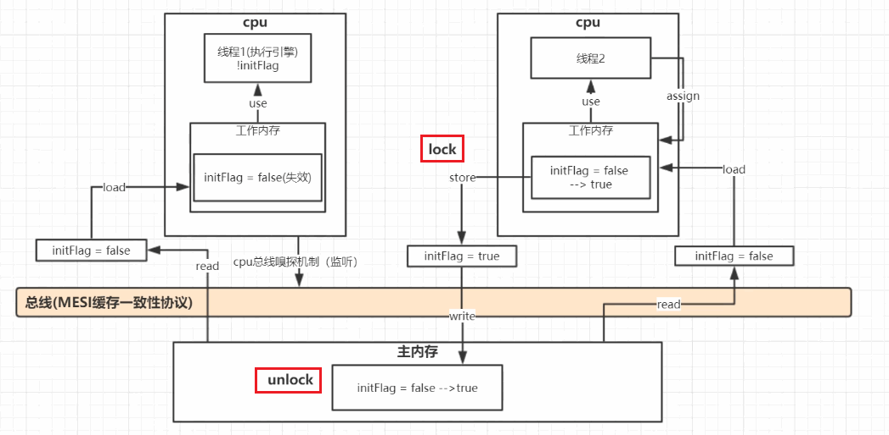

## volatile

### 内存语义

 Java虚拟机提供的**轻量级**的**同步机制**

volitale能够保证 JMM的两个特性

* 保证被volatile修饰的共享变量对所有线程总是可见的

  > 也就是当一个线程修改了一个被volatile修饰共享变量的值，新值总数可以被其他线程立即得知。

* 禁止指令重排序优化

**注意:** 对于 volatile运算操作在多线程环境中. 并不保证原子性. 

### 1. 保证可见性

线程修改了主内存中的值(被 volatile修饰), 及时通知其他线程进行修改

volatile变量为何立即可见?

* 当写一个volatile变量时, JMM会把该线程对应的工作内存中的共享变量值刷新到主内存中;

* 当读取一个volatile变量时 , JMM会把该线程对应的工作内存置为无效。

  > 该内存只能从主内存中重新读取共享变量

#### 证明思路

两个线程同时调用同一个变量, 根据变量的状态做出不同的操作

一个线程修改变量值后, 另一个线程并未状态并未进行改变, 加上 volatile后, 状态进行改变

###### 代码

```java
public class VolatileDemo {

    public static void main(String[] args) {

        MyData myData = new MyData();

        new Thread(() -> {
            System.out.println(Thread.currentThread().getName() + "开始运行");
            try {
                Thread.sleep(3000);
            } catch (InterruptedException e) {
            }
            myData.changeFlag();
            System.out.println("修改 flag: " + myData.isFlag());
            System.out.println(Thread.currentThread().getName() + "结束运行");
        }, "cc").start();

        while (myData.isFlag()) {

        }
        System.out.println("main 结束!");
    }
}

class MyData {

    private volatile boolean flag = true;
    public boolean isFlag() {
        return flag;
    }
    public void changeFlag (){
        flag = false;
    }
}
```

### 2. 禁止指令重排

禁止指令重排优化，从而避免多线程环境下程序出现乱序执行的现象. volatile通过插入内存屏障禁止在内存屏障前后的指令执行重排序优化。

##### 内存屏障( Memory Barrier )

1. 保证特定操作的执行顺序

2. 保证某些变量的内存可见性

   > 通过插入内存屏障指令禁止在内存屏障前后的指令执行重排序优化
   > 强制刷出各种CPU的缓存数据,因此任何CPU上的线程都能读取到这些数据的最新版本

#### 运用: DCL: 双重检索机制

###### 代码

```java
public class SingletonDemo {
	// 构造函数
    private SingletonDemo() {}

    // 单例对象
    private static SingletonDemo instance = null;

    public static SingletonDemo getInstance() {
        // 第一次检索
        if (instance == null) {
            // 在锁的前后进行两次判断
            synchronized (SingletonDemo.class) {
                if (instance == null) {
                    // 多线程环境下可能会出现问题的地方
                    instance = new SingletonDemo();
                }
            }
        }
        return instance;
    }
}
```

DCL (双端检锁)机制不一定线程安全，**原因是有指令重排序的存在，加入volatile可以禁止指令重排**

###### 原因

某一个线程执行到第一次检测， 读取到的 instance不为null时，instance的引用对象可能没有完成初始化。`instance = new SingletonDemo();`可以分为以下3步完成(伪代码)

```java
memory = allocate(); //1.分配对象内存空间
instance(memory);   // 2. 初始化对象
instance = memory; //3. 设置instance指向刚分配的内存地址，此时instance! =null
```

步骤2和步骤3不存在数据依赖关系，而且无论重排前还是重排后程序的执行结果在单线程中并没有改变，因此这种重排优化是允许的。

重排后可能出现

```java
memory = allocate(); //1.分配对象内存空间
instance = memory; //3. 设置instance指向刚分配的内存地址，此时instance! =null,但是对象还没有初始化完成!
instance(memory); //2. 初始化对象
```

重排为上述代码后,此时线程一执行到步骤2, 被挂起, 线程二进行访问, 访问到此时 `instance != null` (但是实际上没有初始化完, 空有其表), 线程二进行返回, **返回的是一个空值, 出现异常**

###### 解决:

不允许instance指令重排, 所以加上关键字 `volatile`后禁止指令重排

```java
private static volatile SingletonDemo instance = null;
```

### 3. 不保证原子性

#### 前提

i++ 在执行时分为其实三个操作:

1. 执行 getfield拿到原始 i
2. 执行 iadd 进行加1操作
3. 执行 putfield  把累加后的值写回

线程争抢太快, 在还没有写回时线程就被挂起, 另一个线程执行. 出现丢失写值的情况

#### 思路

很多很多个线程进行大量累加操作, 证明不保证原子性

###### 代码

```java
public class VolatileDemo {
    public static void main(String[] args) {
        MyData myData = new MyData();
        // 40个线程
        for (int i = 0; i < 40; i++) {
            new Thread(() -> {
                // 每个线程做100自增操作
                for (int j = 0; j < 1000; j++) 
                    myData.addNum();
            }, String.valueOf(i)).start();
        }
        // 默认两个线程, 主线程, GC线程
        while (Thread.activeCount() > 2) {
            Thread.yield();
        }
        // 需要等待上面的线程全部计算完
        System.out.println("number: " + myData.getNumber());
    }
}

class MyData {

    private volatile int number = 0;
    public int getNumber() {
        return number;
    }

    public void addNum() {
        number++;
    }
}
```

#### 如何解决原子性

1. 加 synchronnized, 太重了, 不建议使用

   > synchronized解决的是执行控制的问题, 他会阻止其他线程获得当前对象的监控锁. 这样就使得当前对象中被 synchronized保护的代码块无法被其他线程访问. 也就无法并发执行. 
   >
   > synchronized会创建一个内存屏障, 内存屏障结构保证了所有CPU指令都会刷到主存中, 从而保证了操作的内存可见性. 同时也使得先获得这个锁的线程的所有操作都 happens-before 与随后其他线程对这个锁的操作. 一旦使用synchronized修饰方法头, 由于 synchronized也具备与volatile相同的特性, 因此可以省去volatile修饰变量. 

   ###### 代码

   ```java
   class MyData {
       private int number = 0;
       public synchronized void addNum() {
           number++;
       }
   }
   ```

2. 使用 `atomic`类

   ###### 代码

   ```java
   public AtomicInteger atomicInteger = new AtomicInteger();
   
   public void addAtomic() {
       atomicInteger.getAndIncrement();
   }
   ```

### 什么时候使用 volatile

1. 运行结果并不依赖变量的当前值，或者能够确保只有单一的线程修改变量的值。
2. 变量不需要与其他的状态变量共同参与不变约束。


## volatile底层实现

#### Volatile缓存可见性实现原理

底层实现主要是通过**汇编lock前缀指令，它会锁定这块内存区域的缓存(缓存行锁定)并回写到主内存**

IA-32架构软件开发者手册对lock指令的解释:

1. 会将当前处理器缓存行的数据**立即**写回到系统内存。
2. 这个写回内存的操作会引起在其他CPU里缓存了该内存地址的数据无效(MESI协议)

在多线程中, 为了保证线程安全, 必须要进行加锁, 为了提高并发性, 所以需要把锁的粒度变小. volatile加锁的操作在store之前到 write之后, 将锁的粒度更细化, 速度非常非常快, 时间耗费几乎可以忽略不计. 



#### 回答

结合 Java内存模型, 以及底层的原子操作, 深入到汇编语言级别

副本变量值已修改, 会立马同步回主内存, 之后结合 MESI缓存一致性协议, 把其他副本变量值变失效, 同时还会对赋值操作加一把锁, 让其他线程并发操作, 防止并发读操作


##  volatile和 synchronized的区别

#### 本质

1. volatile本质是在告诉 JVM当前变量在寄存器(工作内存)中的值是不确定的,需要从主存中读取; synchronized则是锁定当前变量，只有当前线程可以访问该变量,其他线程被阻塞住直到该线程完成变量操作为止
2. volatile关键字主要用于解决变量在多个线程之间的可见性; synchronized 关键字解决的是多个线程之间访问资源的同步性
3. volatile标记的变量不会被编译器优化; synchronized标记的变量可以被编译器优化

#### 性能

1. volatile关键字是线程同步的**轻量级实现**，所以volatile性能肯定比synchronized关键字要好
2. synchronized关键字在JavaSE1.6之后进行了主要包括为了减少获得锁和释放锁带来的性能消耗而引入的偏向锁和轻量级锁以及其它各种优化之后执行效率有了显著提升，实际开发中使用 synchronized 关键字的场景还是更多一些

#### 使用地方

volatile仅能使用在变量级别; synchronized则可以使用在变量、方法和类级别

#### 是否线程同步

多线程访问 volatile不会造成线程的阻塞; synchronized可能会造成线程的阻塞

#### 性质

volatile仅能实现变量的修改可见性,不能保证原子性;而synchronized则可以保证变量修改的可见性和原子性

