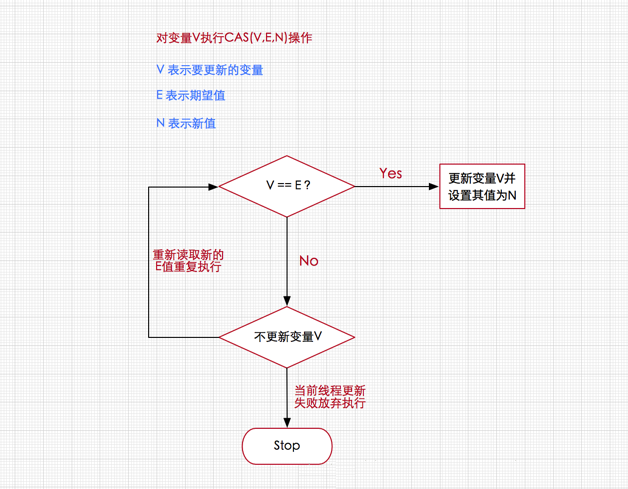
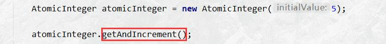
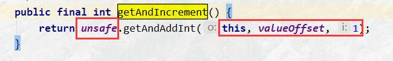
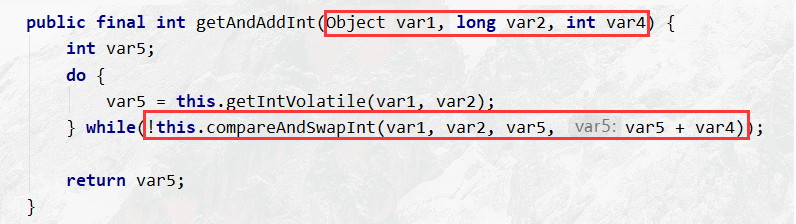
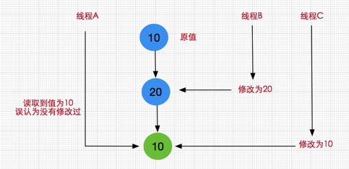

## 无锁的概念

在谈论无锁概念时，总会关联起乐观派与悲观派

* 对于乐观派而言，他们认为事情总会往好的方向发展，总是认为坏的情况发生的概率特别小，可以无所顾忌地做事
* 但对于悲观派而已，他们总会认为发展事态如果不及时控制，以后就无法挽回了，即使无法挽回的局面几乎不可能发生。

这两种派系映射到并发编程中就如同加锁与无锁的策略，即加锁是一种悲观策略，无锁是一种乐观策略

* 因为对于加锁的并发程序来说，它们总是认为每次访问共享资源时总会发生冲突，因此必须对每一次数据操作实施加锁策略。
* 而无锁则总是假设对共享资源的访问没有冲突，线程可以不停执行，无需加锁，无需等待，一旦发现冲突，无锁策略则采用一种称为CAS的技术来保证线程执行的安全性，这项CAS技术就是无锁策略实现的关键


## CAS ( Compare and Swap )

#### 核心思想

CAS的全称是Compare And Swap 即比较交换，其算法核心思想如下

> 执行函数：CAS(V,E,N) 

其包含3个参数

- V: 要更新的变量, 里面的值是变量修改后内存中取出来的值
- E: 预期值, 变量修改前内存中取出来的值
- N: 新值, 变量修改为的值

#### 执行流程



由于CAS操作属于乐观派，它总认为自己可以成功完成操作，当多个线程同时使用CAS操作一个变量时，只有一个会胜出，并成功更新，其余均会失败，但失败的线程并不会被挂起，仅是被告知失败，并且允许再次尝试，当然也允许失败的线程放弃操作，这点从图中也可以看出来。基于这样的原理，CAS操作即使没有锁，同样知道其他线程对共享资源操作影响，并执行相应的处理措施。同时从这点也可以看出，由于无锁操作中没有锁的存在，因此不可能出现死锁的情况，也就是说无锁操作天生免疫死锁。


## CPU指令对CAS的支持

或许我们可能会有这样的疑问，假设存在多个线程执行CAS操作并且CAS的步骤很多，有没有可能在判断V和E相同后，正要赋值时，切换了线程，更改了值。造成了数据不一致呢？

答案是否定的，**因为 CAS是一种系统原语，原语属于操作系统用语范畴，是由若干条指令组成的，用于完成某个功能的一个过程，并且原语的执行必须是连续的，在执行过程中不允许被中断，也就是说CAS是一条CPU的原子指令，不会造成所谓的数据不一致问题。**

CAS允许多线程并发修改, 使发性加强了


## 鲜为人知的指针: Unsafe类

Unsafe类存在于`sun.misc`包中，其内部方法操作可以像C的指针一样直接操作内存，单从名称看来就可以知道该类是非安全的，毕竟Unsafe拥有着类似于C的指针操作，因此总是不应该首先使用Unsafe类, 但还是有必要了解一下

CAS并发原语体现在JAVA语言中就是sun.misc.Unsafe类中的各个方法.  Java中CAS操作的执行依赖于Unsafe类的方法。。**调用UnSafe类中的CAS方法，JVM会帮我们实现出CAS汇编指令。这是一种完全依赖于硬件的功能，通过它实现了原子操作。**

#### 方法说明

Unsafe的主要的方法

CAS是一些CPU直接支持的指令，也就是我们前面分析的无锁操作，在Java中无锁操作CAS基于以下3个方法实现

```java
/**
 * 下面3个方法都通过CAS原子指令执行操作
 *
 * @param o			给定对象
 * @param offset	offset为对象内存的偏移量，通过这个偏移量迅速定位字段并设置或获取该字段的值
 * @param expected	expected表示期望值
 * @param x			x表示要设置的值
 * @return
 */
public final native boolean compareAndSwapObject(Object o, long offset,Object expected, Object x);             
public final native boolean compareAndSwapInt(Object o, long offset,int expected,int x);
public final native boolean compareAndSwapLong(Object o, long offset,long expected,long x);
```


## CAS源码分析

### 分析

通过 AtomicInteger类进行分析CAS实现原理的分析

##### 1.创建 类并且进入 自增方法 `getAndIncrement()`



##### 2. 查看




变量解释

```
this: 这个对象
valueOffset: 表示该变量值在内存中的偏移地址, 通过他可以获取到内存中的值
1: 加一操作
```

##### 3. 点进去



变量间的对应关系

```
this --> var1
valueOffset --> var2
1 --> var4
```

`compareAndSwapInt` 就是 Java中实现CAS算法的一种

1. var5 获得内存中的值, 就是期望值 E
2. 进行While循环, `var5+var4` 就是新值 N, 取出内存中现在的值值V(根据var1获得)两种情况
   1. 内存值V 和期望值 E相等, 为 true, 执行 操作自己本身 +1. `!true == false`, 结束循环,返回旧值(i++)
   2. 内存值V 和期望值 E不相等, 为 false, 执行 不执行操作自己本身 +1. `!false == true`, 继续循环, 重新获得新的期望值 E(因为变量value被volatile修饰, 能获取最新值), 再次循环比较.知道成功

### 实例说明

1. AtomicInteger里 面的 value原始值为3，即主内存中AtomicInteger的value为3，根据JMM模型，线程A和线程B各自持有一份值为3的value的副本分别到各自的工作内存。
2. 线程A通过getintVolatile(var1, var2)拿到value值3，这时线程A被挂起。
3. 线程B也通过getlntVolatile(var1, var2)方法获取到value值3, 此时刚好线程B没有被挂起并执行`compareAndSwapInt`方法比较内存值也为3，成功修改内存值为4，线程B打完收工，一切OK。
4. 这时线程A恢复，执行compareAndSwapInt方法比较， 发现自己手里的值数字3和主内存的值数字4不一致，说明该值已经被其它线程抢先一步修改过了，那A线程本次修改失败，只能重新读取重新来一遍了。
5. 线程A重新获取value值， 因为变量value被volatile修饰， 所以其它线程对它的修改，线程A总是能够看到，线程A继续执行compareAndSwapInt进行比较替换，直到成功。

## CAS特点

#### 使用

CAS多数情况下对于开发者来说是透明的,开发者并不需要直接利用CAS代码去实现线程安全容器的, 更多的是通过并发包间接享受到 lock-free带来的好处. 

**Atomic 系列类, Lock 系列类的底层实现使用的是 CAS**

- J.U.C的atomic包提供了常用的原子性数据类型以及引用、数组等相关原子类型和更新操作工具,是很多线程安全程序的首选
- Unsafe类虽提供CAS服务 ,但因能够操纵任意内存地址读写而有隐患
- Java9以后,可以使用`Variable Handle API`来替代Unsafe

#### 优点

不需要进行线程阻塞, 很高效的解决了原子操作问题

#### 缺点

1. 循环时间长, 开销大

   > 在高并发的情况下, 如果CAS失败,会一直进行尝试, 如果CAS长时间一直不成功, 可能会给CPU带来很大的开销.

2. 只能保证一个共享变量的原子操作

   > 对于多个共享变量的操作时, 无法保证操作的原子性, 需要用锁来保证原子性

3. 引发ABA问题

   > 解决: `AtomicStampedReference`, 通过使用版本号解决问题
   >
   > CAS --> UnSafe -->CAS底层思想 --> ABA -->原子引用更新 -->如何规避ABA问题

## CAS问题

CAS会引发ABA问题

### 什么是ABA

狸猫换太子

CAS算法实现一个重要前提需要取出内存中某时刻的数据并在当下时刻比较并替换，那么在这个时间差类会导致数据的变化。

##### 问题逻辑

1. 变量 value = 1
2. 线程 T1从内存位置 V中取出变量 value的值 1
3. 这时另一个线程 T2也从内存中取出 value，并且线程 T2进行了一些操作将 value变成了 10
4. 然后线程 T2又将value的数据变成 1
5. 这时候线程 T1进行CAS操作发现内存中仍然是 1,然后线程 T1操作成功。

尽管线程 T1的CAS操作成功，但是不代表这个过程就是没有问题的。

##### 图示

另一种情况



### 解决ABA

##### 原子更新引用

理解原子引用 + 新增一种机制-->修改版本号, (类似时间戳)

###### ABA问题与解决代码

```java
public class ABADemo {
    static AtomicReference<Integer> atomicReference = new AtomicReference<>(100);
    static AtomicStampedReference<Integer> atomicStampedReference = new AtomicStampedReference<>(100, 1);

    public static void main(String[] args) throws Exception {

        System.out.println("------------------ABA问题产生--------------------");
        new Thread(() -> {
            atomicReference.compareAndSet(100, 101);
            atomicReference.compareAndSet(101, 100);
        }, "t1").start();

        Thread.sleep(1000);

        new Thread(() -> {
            System.out.println(atomicReference.compareAndSet(100, 2019) + "/t" + atomicReference.get());
        }, "t2").start();

        Thread.sleep(500);

        System.out.println("------------------ABA问题解决--------------------");
        new Thread(() -> {
            int stamp = atomicStampedReference.getStamp();
            System.out.println(Thread.currentThread().getName() + "/t 第一次版本号: " + stamp);

            // 暂停 1秒钟 t3线程, 等 t4获得第一次版本号
            try {
                Thread.sleep(1000);
            } catch (InterruptedException e) {
            }

            // 进行更改, 再改回去, 版本号一直 +1
            atomicStampedReference.compareAndSet(100, 101, atomicStampedReference.getStamp(), atomicStampedReference.getStamp() + 1);
            System.out.println(Thread.currentThread().getName() + "/t 第二次版本号: " + atomicStampedReference.getStamp());
            atomicStampedReference.compareAndSet(101, 100, atomicStampedReference.getStamp(), atomicStampedReference.getStamp() + 1);
            System.out.println(Thread.currentThread().getName() + "/t 第三次版本号: " + atomicStampedReference.getStamp());
        }, "t3").start();

        new Thread(() -> {
            int stamp = atomicStampedReference.getStamp();
            System.out.println(Thread.currentThread().getName() + "/t 第一次版本号: " + stamp);

            // 暂停 3秒钟 t4线程, 保证上面的 t3线程完成了一次 ABA操作
            try {
                Thread.sleep(3000);
            } catch (InterruptedException e) {
            }

            boolean result = atomicStampedReference.compareAndSet(100, 2019, stamp, stamp + 1);
            System.out.println(Thread.currentThread().getName() + "/t 修改成功后与否: " + result +
                               "当前最新版本号: " + atomicStampedReference.getStamp());
            System.out.println(Thread.currentThread().getName() + "/t当前最新值: " + atomicStampedReference.getReference());

        }, "t4").start();

    }
}
```


## CAS与synchronized的使用情景

简单的来说

* CAS适用于写比较少的情况下（多读场景，冲突一般较少）

* synchronized适用于写比较多的情况下（多写场景，冲突一般较多）

##### 使用场景

1. 对于资源竞争较少（线程冲突较轻）的情况，使用synchronized同步锁进行线程阻塞和唤醒切换以及用户态内核态间的切换操作额外浪费消耗cpu资源；而CAS基于硬件实现，不需要进入内核，不需要切换线程，操作自旋几率较少，因此可以获得更高的性能。
2. 对于资源竞争严重（线程冲突严重）的情况，CAS自旋的概率会比较大，从而浪费更多的CPU资源，效率低于synchronized。

**补充：** Java并发编程这个领域中synchronized关键字一直都是元老级的角色，很久之前很多人都会称它为 “重量级锁” 。但是，在JavaSE 1.6之后进行了主要包括为了减少获得锁和释放锁带来的性能消耗而引入的 偏向锁 和 轻量级锁 以及其它各种优化之后变得在某些情况下并不是那么重了。synchronized的底层实现主要依靠 Lock-Free 的队列，基本思路是 自旋后阻塞，竞争切换后继续竞争锁，稍微牺牲了公平性，但获得了高吞吐量。在线程冲突较少的情况下，可以获得和CAS类似的性能；而线程冲突严重的情况下，性能远高于CAS。


## CAS代码模拟

### compareAndSet() 内部实现

```java
protected final boolean compareAndSetState(int expect, int update) {
    return unsafe.compareAndSwapInt(this, stateOffset, expect, update);
}
```

###### 解释

| 参数        | 代表        |
| ----------- | ----------- |
| stateOffset | 内存地址V   |
| expect      | 旧的预期值A |
| update      | 修改的新值B |

1. 从内存地址中取出现在的值, 和A进行比较, 如果相等将值 B写入到内存中,返回 ture, 如果不相等, 则不写入, 返回false
2. compareAndSwapInt方法保证了Compare和Swap操作之间的原子性操作。

```java
// 模拟 CAS
public class TestCAS {
    public static void main(String[] args) {
        final CompareAndSwap cas = new CompareAndSwap();

        for (int i = 0; i < 10; i++) {
            new Thread(() -> {
                // 先获取旧值 A
                int expectedValue = cas.get();
                // 传入旧值和新值
                boolean b = cas.compareAndSet(expectedValue, (int) (Math.random() * 101));
                System.out.println(b);
            }).start();
        }
    }
}

class CompareAndSwap {
    private int value;
    // 获取内存值
    public synchronized int get() {
        return value;
    }

    /**
     * 比较
     *
     * @param expectedValue 相当于 E
     * @param newValue      相当于 N
     * @return 返回内存值 V
     */
    public synchronized int compareAndSwap(int expectedValue, int newValue) {
        // 内存值 V
        int neiValue = value;

        // V == A
        if (neiValue == expectedValue) {
            this.value = newValue;
        }
        return neiValue;
    }

    // 是否可以更新成功
    public synchronized boolean compareAndSet(int expectedValue, int newValue) {
        // A == V
        return expectedValue == compareAndSwap(expectedValue, newValue);
    }
}
```


