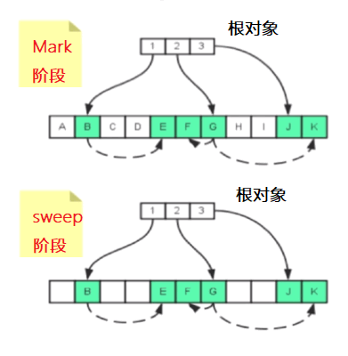
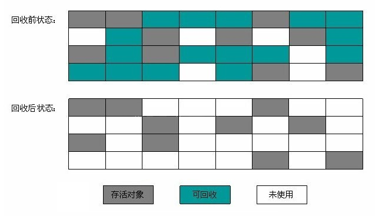
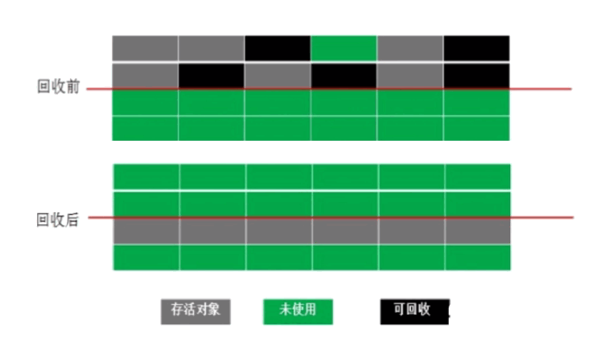
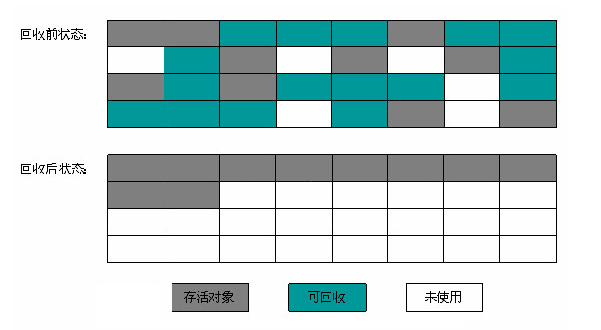
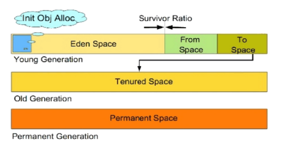
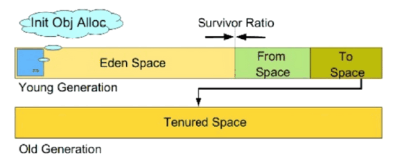
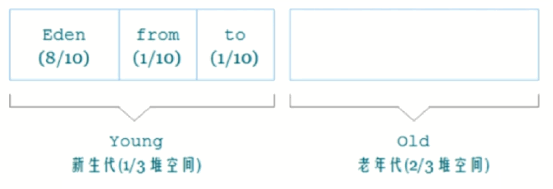
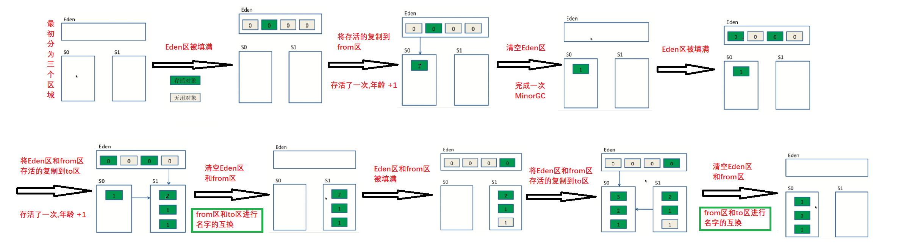

# 垃圾回收算法

## 1. 标记清除算法(Mark-Sweep)

#### 原理

当堆中的有效内存空间（available memory）被耗尽的时候，**就会停止整个程序（也被称为stop the world）**，然后进行两项工作，第一项则是标记，第二项则是清除。

**标记：** 从根集合进行扫描, 对存活的对象进行标记

> 首先用的是可达性算法, 来找到垃圾对象

**清除：**从堆内存从头到尾进行线性遍历，回收不可达对象内存

> 标记完成后,从堆内存从头到尾进行线性遍历，如果发现有堆对象没有被被标识为可达对象. 就将此对象占用的内存给回收掉,并且将之前可达对象的标识给去除掉. 以便进行下一次垃圾回收

#### 图解

###### 图一

###### 图二

#### 特点

* **优点:** 不需要额外空间

* **缺点:** 会产生内存碎片

  > 由于标记清除不需要进行对象的引用, 并且仅对不存活的对象进行处理, 因此标记之后会产生许多大量不连续的内存碎片(如上图2), 空间碎片太多可能对导致以后在程序运行过程中, 分配较大的对象时, 无法找到足够的连续内存, 而不得不提前触发下一次的垃圾回收动作 

## 2. 复制算法(Copying)

#### 原理

1. 将内存分为对象面和空闲面

   > 将可用的内存按容量, 按一定比例划分为为两块或多块. 选择一块或者两块作为对象面, 其他的则作为空闲面
   >

2. 在对象面上创建对象

3. 需要GC时, 将对象面上存活的对象(非垃圾对象)复制到空闲面

4. 将对象面所有对象内存清空

   > 再把已使用过的内存空间, 一次清理掉. 

#### 图解

#### 特点

* **优点**
  * 解决了碎片化的问题
  * 顺序分配内存, 简单高效

* **缺点:** 浪费了内存空间

#### 使用场景

适用于对象存活率低的场景, 比如年轻代, 年轻代的对象每次回收都只有 10%左右的对象存活, 所以需要复制的对象很少, 所以效率还不错

如果对象的存活率很高，我们可以极端一点，假设是100%存活，那么我们需要将所有对象都复制一遍，并将所有引用地址重置一遍。复制这一工作所花费的时间，在对象存活率达到一定程度时，将会变的不可忽视。

## 3. 标记-整理算法(Compacting)

#### 原理

**标记：** 从根集合进行扫描, 对存活的对象进行标记. 采用和标记清除算法一样的标记

**整理：**移动所有存活的对象，且按照内存地址次序依次排列，然后将末端内存地址以后的内存全部回收

#### 图解

#### 特点

* **优点:** 
  * 避免了内存的不连续性, 解决内存碎片化的问题
  * 更加充分利用内存空间(相比较于复制算法, 不用设置两块内存互换 )

* **缺点:** 成本更高

  > 在标记清除算法的基础上进行了移动, 因此成本更高

#### 使用场景

适用于存活率高的场景, 比如老年代

#### 对比

1. 复制算法在应对存活率较高的情况下就有点力不从心了. 要进行较多的复制操作, 效率将会变低, 更关键的是, 如果不想浪费 50%的空间, 就需要有额外的空间进行分配, 以应对被使用的内存中所有对象都 100%存活的极端情况. 所以在老年代一般不能直接选择这种算法. 
2. 标志整理算法比较适合老年代的对象回收

## 4. 总结

#### 对比

**内存效率：**复制算法 > 标记清除算法 > 标记整理算法（只是简单的对比时间复杂度，实际情况不一定如此）
**内存整齐度：**复制算法 = 标记整理算法 > 标记清除算法
**内存利用率：** 标记整理算法 = 标记清除算法 > 复制算法 

#### 结论

1. 效率上来说，复制算法是当之无愧的老大，但是却浪费了太多内存
2. 标记/整理算法兼顾上面所提到的三个指标，相对来说更平滑一些，但效率上依然不尽如人意，它比复制算法多了一个标记的阶段，又比标记/清除多了一个整理内存的过程

**难道就没有一种最优算法吗？**

无，没有最好的算法，只有最合适的算法。—> 分代收集算法

在 Java GC中使用分代收集算法

# 分代收集算法(Generational Collector)

#### 特点

- 垃圾回收算法的组合拳
- 将堆内存进行进一步划分

不同对象的生命周期和存活对象是不一样的, 将分配到不同的区域, 并对堆内存不同区域采用不同的策略进行回收, 是可以提高JVM回收效率的

#### 分配

* 对于年轻代, 采用复制算法

* 对于老年代, 采用标记清除算法或者标记整理算法

## 1. 预备知识: 堆内存分配情况

#### 版本的区别

##### JDK7

在JDK7 及以前, Java堆内存可以分为年轻代, 老年代, 永久代

##### JDK8及之后

永久代被去除掉

在 JDK6, 7, 8及以后的版本, 年轻代和老年代均被保留了下来.

## 2. 年轻代与老年代

#### 1.年轻代

年轻代中的对象的存活率低, 主要采用复制算法

年轻代中 98%的对象都是朝生夕死, 如果采用复制算法中的 1 : 1来分配, 则会浪费很多空间, 所以并不需要按照1:1的比例来划分内存空间.而是将年轻的划分为比较大的Eden区, 和两块较小的 Survivor区

* **Eden区**: 代表伊甸园, 伊甸园代表着人类的起源, 所以对象刚被创建出来的时候, 其内存空间首先被分配到 Eden区.

  > 当然如果 Eden区放不下新创建的对象的话. 对象也有可能被放在 Surivor区甚至老年代中

* **两个Survivor区**

  > 分别定义为 from区和to区, 并且哪个是from区和to区并不是固定的, 会随着垃圾回收的进行而相互转换，年轻代的目标是快速收集那些生命周期短的对象，一般情况下，所有新生成的对象首先都是放在年轻代的

#### 2. 老年代

老年代的内存要比新生代的内存要大, 所以存放生命周期较长的对象

老年代采用标记-清理算法或标记整理算法进行回收

#### 3.大小比例

* 整个内存中, 老年代 : 年轻代 = 2 : 1 (默认比例)

* 整个年轻代中, Eden : Survivor1 : Survivor2 = 8:1:1 (默认比例)

下面讲的是 JDK8的情况

## 2. GC

分代收集中的回收分为两种: MinorGC 和 Full FC

### a. Minor GC

尽可能**快速**的收集掉那些生命周期短的对象

**回收区域:** 年轻代

**采用算法:** 复制算法

#### 清除步骤

1. 对象优先在 Eden中分配, 当Survivor区或Eden区没有足够的地方分配时, 会触发一次 Minor GC
2. 回收时,将Eden和Survivor(from)区存活的对象一次性复制到另一块Survivor区域(to 区)上
3. 清理掉Eden区和 和刚刚用过的Surivior(from)区

##### 图示

#### 年轻代升级为老年代

- 经历一定Minor次数依然存活的对象

  > 对象在Survivor区每熬过一次Minior GC, 其年龄就会被 +1, 当对象的年龄达到某个值时(默认是15岁), 这些对象会成为老年代. 

- Survivor区存放不下的对象

  > 每次轻 GC结束后, Eden区便会被清空, 当Survivor放不下时, 则有分派担保进入到老年代中.

- 新生成的大对象(-XX:PretenuerSizeThreshold, 来控制大对象的大小)

  > 对于较大的对象, 需要一块较大的内存存放, Eden和Suivivor放不下, 也会放入老年代

#### 常用的调优参数

* `-XX:SurvivorRatio `: Eden和Survivor的比值,默认8 : 1
* `-XX:NewRatio` : 老年代和年轻代内存大小的比例
* `-XX:MaxTenuringThreshold` :对象从年轻代晋升到老生代经过GC次数的最大阈值

### b. Full GC

当触发老年代垃圾回收的时候, 也会伴随着对新生代堆内存的回收, 即对整个堆进行垃圾回收

**回收区域:** 老年代

**采用算法:** 标记清除算法或者标记整理算法

##### Full GC会比 Minior GC慢的多

一般会慢 10倍以上, 大多数在老年区域的对象不会那么容易就死掉的, 所以Full GC不会有Minor GC的运行次数那么频繁

#### 触发 Full GC的条件 

* 老年代空间不足

  > 如果创建一个大对象, Eden放不下这个大对象, 就会直接保存在老年代中, 如果老年代空间也不足, 就会触发 Full GC,为了避免这种情况，最好不要创建太大的对象

* 永久代空间不足

  > 仅仅针对jdk7及以前的版本, 当系统中将要加载的类调用的方法很多, 同时永久带中没有足够的空间存放这些类的信息, 方法等的信息, 就会触发一次 Full GC. JDK8以后取消了永久代,该条件不成立，这也是为什么要用元空间替代永久代的原因，为的是降低 Full GC的频率. 减少GC的负担. 提升其效率

* CMS GC时出现 promotion failed，concurrent mode failure

  > 要注意GC日志中是否有promotion failed，concurrent mode failure着两种情况
  >
  > promotion failed: 在进行 Minior GC时, survivor区放不下了, 只能放入老年代. 而此时老年代也放不下
  >
  > concurrent mode failure: 在执行 CMS的过程中.同时有对象要放入老年代中. 而此时老年代空间不足

* Minor GC晋升到老年代的平均大小大于老年代的剩余空间

  > 较为复杂的情况, 在进行 Minior GC时, 做了一个判断, 如果之前统计得到的 Minor GC 晋升到老年代的平均大小大于老年代的剩余空间, 就直接触发 Full GC

* 调用System.gc()

  > 显示调用时, 触发 Full GC, 对新生代和老年代进行回收, 这个方法只是提醒虚拟机进行垃圾回收, 但是回不回收, 还是虚拟机来决定, 程序员对回不回收没有绝对的控制权

* 使用RMI来进行RPC或管理的JDK应用, 每小时执行1次Full GC

### c. 总结

| GC分类   | 回收区域 | 算法           | 特点             |
| -------- | -------- | -------------- | ---------------- |
| Minor GC | 年轻代   | 复制算法       | 发生频繁         |
| Full GC  | 老年代   | 标记-清除/整理 | 比 MinorGC慢10倍 |

# 名词解释

### 1. Stop-the-World

* JVM由于要执行 GC而停止了应用程序的执行. 

* 任何一种 GC算法中都会发生

  > 在发生的时候, 除了 GC的线程, 其他的线程都处于等待的状态. 直到 GC任务完成

* 多数GC优化通过减少 Stop-the-World发生的时间来提高程序性能

  > GC优化很多时候就是指减少 Stop-the-World发生的时间从而使系统具有高吞吐, 低** 的特点

#### 2. Safepoint(安全点)

​	垃圾回收就好像保洁阿姨在打扫卫生, 如果一边打扫, 一边有人扔垃圾, 该怎么办呢?答: 保洁阿姨在打扫前对所有人说, 我要打扫了, 你们不准扔垃圾了. 

* 分析过程中对象引用关系不会发生变化的点

在JVM垃圾回收中, 在可达性分析中, 要分析哪个对象没有引用的时候, 必须在一个快要的状态点进行. **在这个点, 所有的线程都被冻结了.** 不可以出现分析过程中对象引用关系还在变化的情况, 因此需要在某个结点具备确定性. 该结点被叫做安全点. 程序不是哪一个点就随便停下来了，而是到达安全点才会停顿下来. 

* 产生 Safepoint的地方: 方法调用; 循环跳转, 异常跳转

  > 一旦GC发生, 让所有的线程都跑到最新的安全点, 再停顿下来, 如果发现线程不在安全点,就恢复线程，等其跑到安全点再说.

* 安全点数量点适中

  > 安全点数量太少, 会让 GC等待太长的时间, 太多会增加程序运行的负荷，

