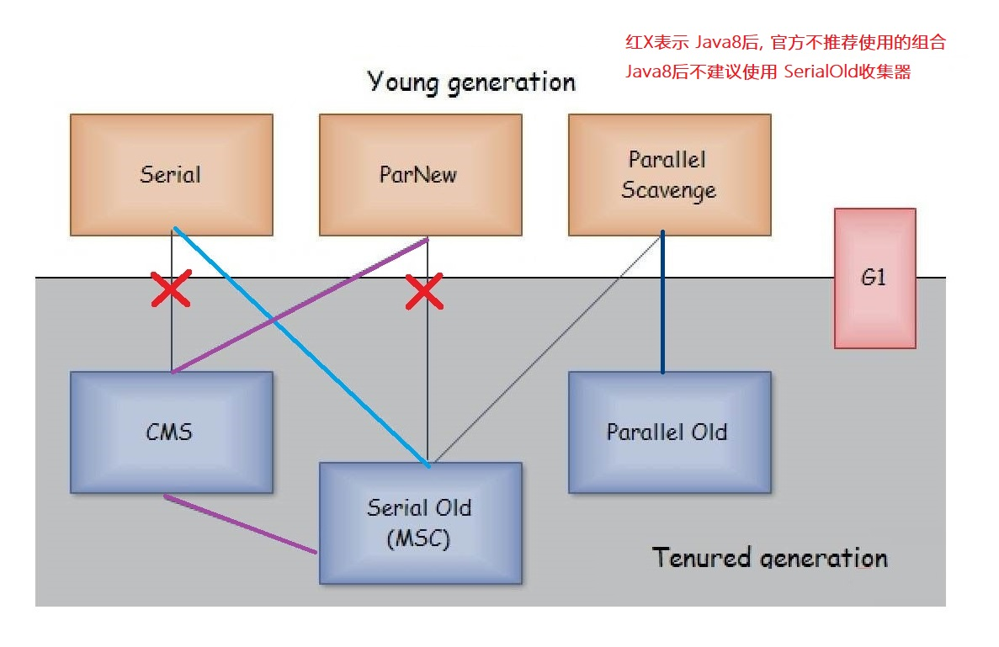
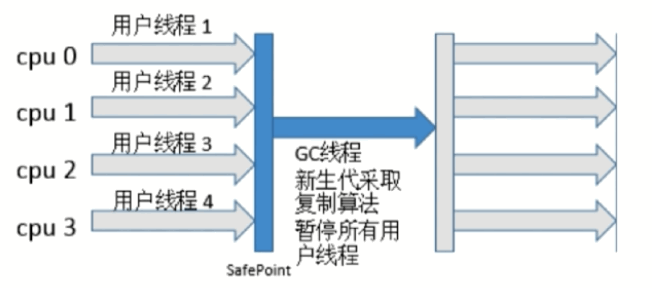
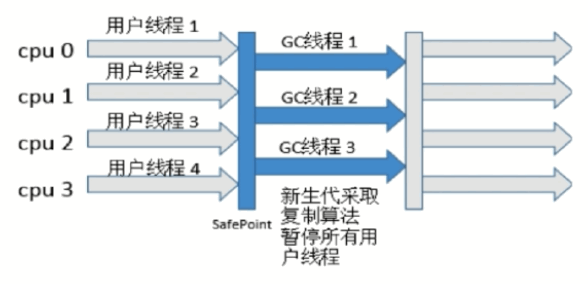
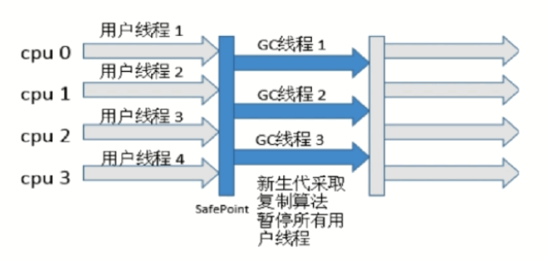
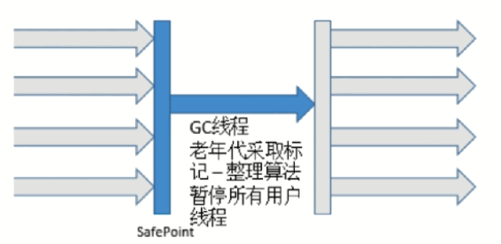
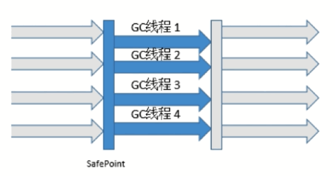
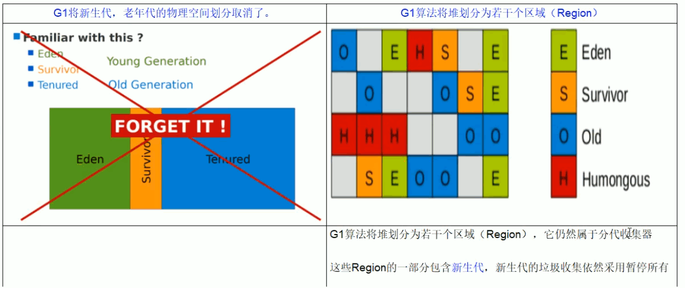
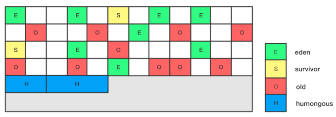
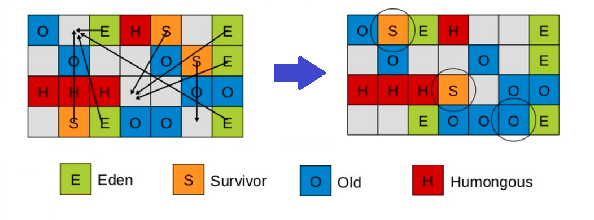

## GC 垃圾回收算法和垃圾收集器的关系？谈谈你的理解？

GC 算法是内存回收的方法论，垃圾收集就是算法的落实的实现。

目前为止还没有完美的收集器的出现，更加没有万能的收集器，只是针对具体应用最适合的收集器，进行分代收集

#### 四种 GC 垃圾回收算法

- 引用计数(不使用)
- 复制回收
- 标记清除
- 标记整理

#### 垃圾回收器 (按类别分)

- 串行垃圾回收器（Serial）

  > 它为单线程环境设计且只使用一个线程进行垃圾回收，会暂停所有的用户线程，所以不适合服务环境。
- 并行垃圾回收器（Parallel）

  > 多个垃圾收集线程并行工作，此时用户线程是暂停的，用于科学计算、大数据处理等弱交互场景。
- 并发垃圾回收器（CMS）

  > 用户线程和垃圾收集线程同时执行（不一定是并行，可能是交替执行），不需要停顿用户线程，互联网公司多用它，适用对相应时间有要求的场景。
- G1 垃圾回收器

  > G1 垃圾回收器将堆内存分割成不同的区域然后并发的对其进行垃圾回收。


## 怎么查看服务器默认垃圾收集器是哪个？

生产是如何配置垃圾收集器？/ 谈谈你对垃圾收集器的理解？(都是一种题目)

- 怎么查看服务器默认垃圾收集器是哪个？

  - Java -XX:+PrintCommandLineFlags
- Java 的 GC 回收的类型主要有：UseSerialGC，UseParallelGC，UseConcMarkSweepGC，UseParNewGC，UseParallelOldGC，UseG1GC
  > Java 8 以后基本不使用 Serial Old


## JVM的运行模式

有两种运行模式

- Server
- Client

### Server/Client 模式是什么

Java 的运行模式

当虚拟机运行在 Client模式的时候，使用的是一个代号为 C1的轻量级编译器, 而 Server模式启动的虚拟机采用相对重量级，代号为C2的编译器，C2比C1编译器编译的相对彻底，服务起来之后,性能更高。

#### 区别

Server模式启动时，速度较慢，但是一旦运行起来后，性能将会有很大的提升。

| 模式       | 启动速度 | 性能 |
| ---------- | -------- | ---- |
| Client模式 | 较快     | 较低 |
| Server模式 | 较慢     | 较高 |

#### 选择

**所以通常用于做服务器的时候我们用服务端模式**，如果你的电脑只是运行一下 Java程序，就客户端模式就可以了。当然这些都是我们做程序优化程序才需要这些东西的，普通人并不关注这些专业的东西了。其实服务器模式即使编译更彻底，然后垃圾回收优化更好，这当然吃的内存要多点相对于客户端模式。

#### 默认设置

* 32位 Window操 作系统，不论硬件如何都默认使用 Client的 JVM模式
* 32位其它操作系统，2G内存同时有2个 cpu以上用 Server模式，低于该配置还是Client模式
* 64位 only server模式

#### 使用

只需要掌握 Server模式即可，Client模式基本不会用


## 常见的垃圾回收器

### 垃圾回收器的关系

如果两个收集器之间有连线, 说明他们可以搭配使用. 



**补:**

* Serial --> 串行
* Parallel --> 并行


## 年轻代常见的垃圾收集器

### 1. Serial收集器( -XX:+UseSerialGC ,复制算法)

程序启动前使用 ` -XX:+UseSerialGC` 指定使用Serial收集器来进行年轻代的垃圾回收. 是Java中最基本, 历史最悠久的收集器. 在 JDK 1.3.1之前, 是Java虚拟机年轻代收集的唯一选择

#### 特点

* 单线程收集, 进行垃圾收集时, **必须暂停所有工作的线程.** 

  > 是采用复制算法的单线程垃圾收集器, 但是他的单线程的意义并不是仅仅说明他只适用于一个 CPU或者一条收集线程去完成垃圾收集工作. 更重要的是他在进行垃圾收集时，必须暂停所有的工作线程. 知道他收集结束. 

* 简单高效, Client模式下默认的年轻代收集器



#### 应用

用户桌面应用场景中. 分配给虚拟机管理的内存, 一般来说,不会很大. 收集几十M 甚至100,200M的年轻代的停顿时间 几十毫秒到100毫秒之间. 只要不是频繁的发生. 这点停顿是完全可以接受的

### 2. ParNew收集器( -XX:+UseParNewGC ,复制算法)

#### 特点

* 多线程收集，其余的行为、特点和 Serial收集器一样

  > 多线程进行垃圾回收, 是Server模式下首选的年轻代收集器

* 单核执行效率不如 Serial ,在多核下执行才有优势

  > 在单核 CPU中,不会有比 Serial收集器有更好的效果. 因为存在线程交互开销., 随着可用CPU数量的增加, 对于GC池资源的有效利用还是很有好处的. 默认开启的线程数与CPU的数量相同. 在CPU数量非常多的情况下. 可以使用 **参数来限制垃圾收集的线程数.  



在Server模式下, 此收集器很重要, 因为除了Serial之外, 只有他能配合 CMS收集器进行工作.

### 3. Parallel Scavenge收集器( -XX:+UseParallelGC ,复制算法)

#### 特点

* 比起用户线程停顿时间, 更关注系统的吞吐量

  > 使用多线程进行垃圾回收, 前面的回收器更关心用户线程停顿时间, 他更关心吞吐量

* 在多核执行下才有优势, Server模式下默认的年轻代收集器



#### 应用

如果对于垃圾收集器的运作原理不太熟悉, 以至于在优化过程中遇到困难的时候.我们会使用 配合自适应调节策略及在启动参数中使用 `-XX:+UseAdaptiveSizePolicy` 会把内存管理的调优任务交给虚拟机去完成

##### 系统吞吐量: 

吞吐量 = 运行用户代码时间 / (运行用户代码时间 + 垃圾收集时间)

>  CPU运行用户代码时间与总消耗时间的比值. 比如一共运行了 100分钟, 垃圾收集时间为 2min, 则吞吐量为 98%
>
>  可以理解为吞吐量越高, 执行效率越大,CPU利用越高

#### 对比

* **用户线程时间短:** 则停顿时间短, 适合与用户交互的程序. 良好的响应速度能提升用户体验

* **吞吐量高:** 高吞吐量则可以高效利用CPU时间.尽可能快的完成运算任务. 主要适合在后台运算, 不需要太多交互的情况. 


## 老年代常见的垃圾收集器

### 1. Serial Old收集器(-XX:+UseSerialOldGC, 标记-整理算法)

是Serial 的老年代版本, 使用标记-整理算法,其他特点都和 Serial是一样的

- 单线程收集, 进行垃圾收集时, 必须暂停所有工作的线程. 
- 简单高效, Client模式下默认的老年代收集器
- 将要被淘汰, 不推荐使用



### 2. Parallel Old收集器( -XX:+UseParallelOldGC ,标记-整理算法)

- 比起用户线程停顿时间, 更关注系统的吞吐量

- 在多核执行下才有优势, Server模式下默认的年轻代收集器



​	在 JDK6之后才开始提供的, 在此之前 新生代的 Parallel Scavenge收集器处于一个尴尬的状态, 原因是如果新生代选择队了Parallel Scavenge收集器, 老年代只能选择Serial Old收集器, 除此之外, 别无选择. 由于老年代Serial Old收集器在服务端用户性能上的拖累, 使用了Parallel Scavenge收集器也未必能在整体应用上获得吞吐量最大化的效果. 由于单线程的老年代无法充分利用服务器或CPU的处理能力, 在老年代很大而且遇见比较高级的环境中这种组合的吞吐量甚至还不如ParNew + Serial 的组合给力, 直到Parallel Old收集器出现后, 吞吐量收集器终于有了名副其实的组合.**在注重吞吐量和CPU敏感的场合, 都可以考虑 Parallel Scavenge + Parallel Old 收集器**

### 3. CMS收集器(-XX:+UserConcMarkSweepGC, 标记-清除算法)

​	几乎占据着 JVM老年代垃圾收集器的半壁江山.  垃圾回收线程与用户线程几乎能与做到同时工作. 是几乎, 但还是不能完全做到 stop-the-world, 只是尽可能的缩短了停顿时间.如果我们的应用程序对停顿比较敏感, 并且在应用程序运行的时候可以提供更大的内存,更多的CPU, 也就是更好的硬件,那么使用 CMS收集器会给你带来好处, 还有如果在 JVM中, 有相对较多存活时间较长的对象, 会更适合使用 CMS, 他的整个垃圾回收过程可以分为以下六步:

1. **初始标记:** stop-the-world

   > 在这个阶段中, 需要虚拟机停顿正在执行的任务, 从垃圾回收的根对象开始.扫描到和根对象直接关联的对象, 并做标记, 所以这个阶段暂停了整个 JVM, 但是很快就完成了

2. **并发标记:** 并发追溯标记,程序不会停顿(和用户线程一起, 不需要暂停)

   > 紧随初始标记阶段, 在初始标记的基础上继续向下追溯标记, 并发标记阶段应用程序的线程和并发标记的线程并发执行, 所以用户不会感受到停顿. 

3. 并发预清理: 查找执行并发标记阶段从年轻代晋升到老年代的对象

   > 仍然是并发的, 在这个阶段, 虚拟机查找在并发标记阶段新进入老年代的对象, 可能会有一些对象从新生代晋升到了老年代, 或者一些对象被分配到老年代. 通过重新扫描, 减少下一个阶段重新标记的工作, 因为下一个阶段会 stop-the-world

4. **重新标记:**暂停虚拟机,扫描CMS堆中的剩余对象, 仍然暂停所有的工作

   > 收集线程扫描CMS堆中剩余的对象, 扫描从根对象开始, 向下追溯, 并处理对象关联, 这一步会相对较慢

5. **并发清理:** 清理垃圾对象,程序不会停顿

   > 这个阶段收集线程和应用程序线程并发执行, 
   >
   > 由于耗时最长的并发标记和并发清除过程中，垃圾收集线程可以和用户现在一起并发工作，所以总体上来看CMS收集器的内存回收和用户线程是一-起并发地执行

6. 并发重置: 重置CMS收集器的数据结构

   > 等待下一次垃圾回收

只有初始标记和重新标记是需要 stop-the-world


并发标记的过程其实就是用户线程同时工作. 也就是一边丢垃圾, 一边打扫, 这样就会带来一个问题.如果垃圾的产生是在标记后发生. 那么这次垃圾就要等到下次才能回收. 当然等到垃圾标记了以后垃圾自然不会和用户线程产生冲突. 而清理过程就能和用户线程一起处理了.对于此垃圾回收器. 此垃圾回收器有一个显著且不可避免的问题. 就是采用的是标记清除算法. 也就是说他不会压缩存活的对象. 这样就会带来内存空间碎片化的问题. 如果需要分配一个较大的内存空间，就只能触发一次GC了

**优点:** 并发收集停顿低

**缺点**

* 并发执行对 CPU 资源压力大，采用的标记清除算法会导致大量碎片

由于并发进行， CMS 在收集与应用线程会同时增加对堆内存的占用，也就是说，CMS 必须要在老年代堆用尽之前完成垃圾回收，否者 CMS 回收失败，将触发担保机制，串行老年代收集器将会以 STW 的方式进行一次 GC，从而造成较大的停顿时间。

标记清除算法无法整理空间碎片，老年代空间会随着应用时长被逐渐耗尽，最后将不得不通过担保机制对堆内存进行压缩。CMS 也提供了参数  -XX:CMSFullGCsBeForeCompaction (默认0，即每次都进行内存整理) 来指定多少次 CMS 收集之后，进行一次压

## Garbage First收集器

### G1是什么

G1 是一种面向服务端的垃圾收集器，应用在多核处理器和大容量内存环境中，在实现高吞吐量的同时，尽可能的满足垃圾收集器的暂停时间(尽可能短)要求。

既用于年轻代又用于老年代. 他的使命是未来可以替换掉 JDK5中发布的 CMS收集器. 与其他 GC收集器相比. 

#### 以前收集器的特点

- 年轻代和老年代是各自独立且连续的内存块
- 年轻代收集器使用 eden + S0 + S1 进行复制算法
- 老年代收集必须扫描整个老年代区域
- 都是以尽可能的少而快速地执行 GC 为设计原则

#### Garbage First收集器有如下的特点:

- 并行和并发

  > G1 能充分利用多 CPU、多核环境硬件优势，尽量缩短 stop-the-world的停顿时间, 与用户线程并发执行.

- 分代收集

  > 独立管理整个堆, 宏观上看 G1 之中不在区分年轻代和老年代，被内存划分为多个独立的子区域。以获得更好的收集效果. 
  >
  > - G1 收集器里面将整个的内存区域混合在一起，**但其本身依然在小范围内要进行年轻代和老年代的区分**。保留了新生代和老年代，但她们不在是物理隔离，而是一部分 Region 的集合且不需要 Region 是连续的，也就是说依然会采用不同的 GC 方式来处理不同的区域。
  > - G1 虽然也是分代收集器，但整个内存分区不存在物理上的年轻代和老年代的区别，也不需要完全独立的 Survivor to space 堆做复制准备。G1 只有逻辑上的分代概念，或者说每个分区都可能随 G1 的运行在不同代之间前后切换。

- 空间整合

  > G1 整体采用标记-整理算法，局部是通过是通过复制算法，**不会产生内存碎片**。

- 可预测的停顿

  > 可以建立可预测的停顿时间模型. 能让使用者明确指定在一个程度为 m毫秒的时间片段内消耗在垃圾收集上的时间不得超过 m毫秒,这些都是可以设置的. 
  >
  > 是可以精确控制停顿。该收集器是把整个堆(新生代、老生代)划分成多个固定大小的区域，每次根据允许停顿的时间去收集垃圾最多的区域。

#### 与CMS比较

- 像 CMS 收集器一样，能与应用程序线程并发执行，整理空闲空间更快，需要更多的时间来预测 GC 停顿时间，不希望牺牲大量的吞吐性能，不需要更大的 JAVA Heap。
- G1 收集器的设计目的是取代 CMS 收集器，同时与 CMS 相比，
  - G1 垃圾收集器是一个有整理内存过程的垃圾收集器，不会产生很多内存碎片。
  - G1 的 Stop The World 更可控，G1 在停顿上添加了预测机制，用户可以指定期望的停顿时间。
- G1 是在 2012 年才在 jdk.1.7u4 中可以呀用，在 jdk9 中将 G1 变成默认垃圾收集器来代替 CMS。它是以款面向服务应用的收集器。
- 主要改变是 Eden、Survivor 和 Tenured 等内存区域不再是连续的，而是变成了一个个大小一样的 region，每个  region 从 1M 到 32M 不等，一个 region 有可能属于 Eden、Survivor 或者 Tenured 内存区域。

#### 对比



#### 总结

  区域化内存划片Region,整体变为了一些不连续的内存区域，避免了全内存区的GC操作。

  核心思想是将整个堆内存区域分成大小相同的子区域(Region)，在JVM启动时会自动设置这些子区域的大小，

  在堆的使用上，G1并不要求对象的存储一定是物理上连续的只要逻辑上连续即可，每个分区也不会固定地为某个代服务，可以按需在年轻代和老年代之间切换。启动时可以通过参数-XX:G1HeapRegionSize=n可指定分区大小(1MB~32MB,且必须是2的幂)，默认将整堆划.分为2048个分区。大小范围在1MB - 32MB，最多能设置2048个区域，也即能够支持的最大内存为: 32MB * 2048 = 65536MB = 64G内存

#### 底层原理

Region 区域化垃圾收集器, 最大好处是化整为零，避免全内存扫描，只需要按照区域来进行扫描即可。

#### Region 区域划分



G1算法将堆划分为若干个区域( Region)，它仍然属于分代收集器

* 这些Region的一部分包含新生代，新生代的垃圾收集依然采用暂停所有应用线程的方式，将存活对象拷贝到老年代或者Survivor空间。
* 这些Region的一部分包含老年代，G1收集器通过将对象从一个区域复制到另外一个区域，完成了清理工作。这就意味着，在正常的处理过程中G1完成了堆的压缩(至少是部分堆的压缩)，这样也就不会有CMS内存碎片问题的存在了。
* 在G1中，还有一种特殊的区域，叫Humongous(巨大的)区域. 如果一个对象占用的空间超过了分区容量50%以上，G1收集器就认为这是一个巨型对象。这些巨型对象默认直接会被分配在年老代，但是如果它是一个短期存在的巨型对象，就会对垃圾收集器造成负面影响。为了解决这个问题，G1 划分了一个Humongous区，它用来专门存放巨型对象。如果一个H区装不下-一个巨型对象，那么G1会寻找连续的H分区来存储。为了能找到连续的H区，有时候不得不启动Full GC。


#### 回收步骤

针对Eden区进行收集，Eden区耗尽后会被触发，主要是**小区域收集** + 形成连续的内存块，避免内存碎片

* Eden区的数据移动到 Survivor区，假如出现Survivor区空间不够，Eden区数据全部会晋升到 Old区

* Survivor区的数据移动到新的 Survivor区， 部会数据晋升到Old区
* 最后Eden区收拾干净了 ，GC结束， 用户的应用程序继续执行

###### 如图



#### 4步过程


1. **初始标记:** 只标记GC Roots 能直接关联到的对象

2. **并发标记:** 进行 GC Roots Tracing的过程
3. **最终标记:** 修正并发标记期间，因程序运行导致标记发生变化的那一部分对象
4. **筛选回收:** 根据时间来进行价值最大化的回收

#### 常用参数配置

- `-XX:+UseG1GC`

- `-XX:G1HeapRegionSize=n`  

  > 设置的G1区域的大小。值是2的幂，范围是1MB到32MB。 目标是根据最小的Java堆大小划分出约2048个区域

- `-XX:MaxGCPauseMillis=n`

  > 最大GC停顿时间， 这是个软目标，JVM将尽可能(但不保证)停顿小于这个时间

- `-XX:nitiatingHeapOccupancyPercent=n`

  > 堆占用了多少的时候就触发GC，默认45

- `-XX:ConcGCThreads=n`

  > 并发GC使用的线程数

- `-XX:G1ReservePercent=n` 

  > 设置作为空闲空间的预留内存百分比，以降低目标空间溢出的风险，默认值是10%

开发人员仅仅需要声明以下参数即可(一般情况下)
**三步归纳:** 开始G1+设 置最大内存+设置最大停顿时间

```
-XX:+UseG1GC  -Xmx32g  -XX:MaxGCPauseMillis=100
```


## 总结垃圾回收器

#### 参数对应的垃圾回收器

- -XX:+UseSerialGC 

  > **开启后会使用:** Serial(Young区用) + Serial Old(Old区用)的收集器组合
  >
  > **表示:** 新生代, 老年代都会使用串行回收收集器, 新生代使用复制算法, 老年代使用标记-整理算法

- -XX:+UseParNewGC 

  > 启用ParNew收集器，只影响新生代的收集，不影响老年代
  >
  > 使用: ParNew(Young区用) + Serial Old的收集器组合，新生代使用复制算法，老年代采用标记-整理算法
  >
  > Serial Old被淘汰的, 官方不推荐使用

- -XX:+UseParallelGC / -XX:+UseParallelOldGC / 系统默认(Java8)

  > 使用并行收集器组合: Parallel Scavenge + Parall Old
  > 俗称吞吐量优先收集器。一句话: 并行收集器在新生代和老年代的并行化

- -XX:+UserConcMarkSweepGC

  > 幵后该参数后会自动将 -XX:+UseParNewGC 打幵
  > 幵后该参数后，使用 ParNew(Young区用) + CMS(Old区用) + Serial Old的收集器组合，Serial Old将作为CMS出错的后备收集器

##### 如图


#### 参数说明

在 GC信息中显示下的所对应的垃圾收集器对应哪一个

- DefNew : Default New Generation
- Tenured : Old
- ParNew : Parallel New Generation
- PSYoungGen : Parallel Scavenge
- ParOldGen : Parallel Old Generation

#### 垃圾回收器特点

| 收集器            | 收集方式 | 收集地方 | 使用算法  | 默认   | 侧重         |
| ----------------- | -------- | -------- | :-------: | ------ | ------------ |
| Serial            | 单线程   | 年轻代   | 复制算法  | Client | 用户线程等待 |
| parNew            | 多线程   | 年轻代   | 复制算法  |        | 用户线程等待 |
| Parallel Scavenge | 多线程   | 年轻代   | 复制算法  | Server | 吞吐量       |
| Serial Old(淘汰)  | 单线程   | 老年代   | 标记-清理 | Client | 用户线程等待 |
| Parallel Old      | 多线程   | 老年代   | 标记-清理 | Server | 吞吐量       |
| CMS               | 多线程   | 老年代   | 标记-清除 |        | 用户线程等待 |
| Garbage First     | 多线程   | 两个都行 | 整理+复制 |        |              |

#### 垃圾回收器对比图

###### 图一


## 其他

### JVMGC + SpringBoot微服务的生产部署和调参优化

实际工作中，如何结合springboot进行调优? ?如何落地? ?
JVMGC -->> 调优-->> springboot微服务的生产部署和调参优化|

1. IDEA开发完微服务:工程
2. maven进行clean package 
3. 要求微服务启动的时候，同时配置我们的JVM/GC的调优参数
   1. 内
   2. 外===>重点

### 生产环境服务器变慢，诊断思路和性能评估谈谈？

总分总的来查

- 整机：top
- CPU：vmstat
- 内存：free
- 硬盘：df
- 磁盘IO：iostat
- 网络IO：ifstat

### 假如生产环境出现 CPU过高，请谈谈你的分析思路和定位？

- 先用 top 命令找出 CPU 占比最高的
- ps -ef 或者 jps 进一步定位，得知是一个怎么样的一个后台程序
- 定位到具体的线程或代码
  - ps -mp 11111 -o THREAD,tid,time
  - -m 显示所有的线程
  - -p 进程使用cpu的时间
  - -o 该参数后是用户自定义格式
- 将需要的线程 ID 转化为 16 进制格式
- jstat <进程ID> | grep <线程ID(16进制)> -A60


