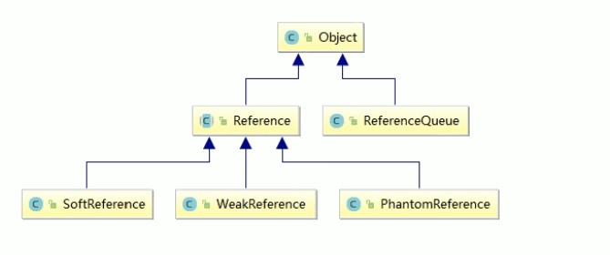
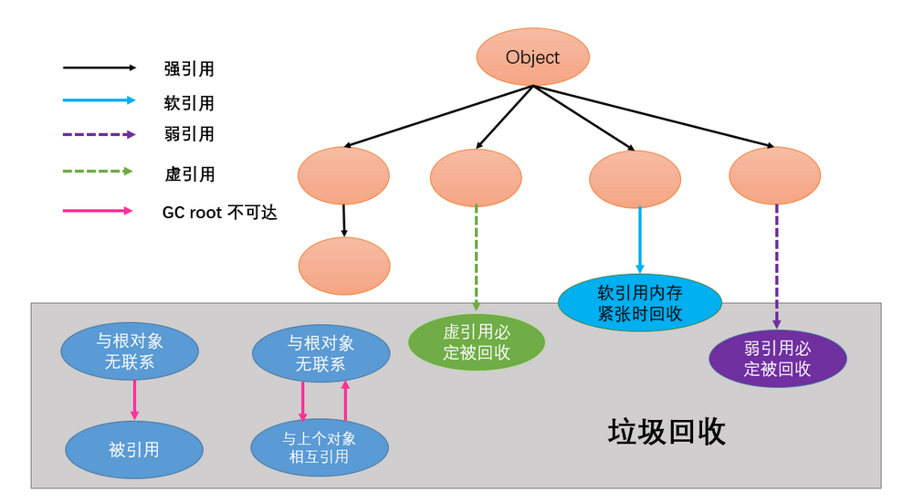

## 强引用、软引用、弱引用和虚引用分别是什么？

在 Java语言中, 除了基本数据类型外, 其他的都是指向各类对象的对象引用；Java中根据其生命周期的长短, 将引用分为 4类

###### 如图



### 1. 强引用 (Strong Reference)

- 最普遍的引用 (默认支持模式): `Object obj = new Object()`

- 当内存空间不足时, 宁可拋出 `OutOfMemoryError` 终止程序, 也不会回收具有强引用的对象, 死都不收

  > 因此强引用是造成 Java内存泄漏的主要原因之一

- 通过将对象设置为 null来弱化引用, 使其被回收

  > 使用`obj = null`, 或者生命周期超出范围, 这时候 GC 认为该对象没有被引用, 就可以回收该对象了, 具体什么时候收集, 取决于该系统

### 2. 软引用 (Soft Reference)

- 表示对象处在有用但非必须的状态

- 只有当内存空间不足时, GC会回收该引用的对象的内存. 在内存空间充足时, 就不会回收该引用

  > 一句话: 内存够用的时候就保留, 不够用就回收

- 可以用来实现高速缓存

  > 实现内存敏感的可以用来实现高速缓存, 这样就不用太担心 `OutOfMemoryError`问题.因为软引用的内存会在内存不足时进行回收. 同时, 由于一般情况下, 内存空间是充足的. 相关对象会一直存在, 便于复用
  >
  > 软引用还可以配合引用队列进行使用

**注意:** 

* `String name = "cuzz"` 这种会放入常量池中
*  `Integer age = 1` 在 int 中 -128 到 127 会被缓存，所以是强引用, 然后 GC 也不会被回收

#### 验证

设置 JVM 参数为 `-Xms10m -Xmx10m -XX:+PrintGCDetails`

###### 代码

```java
public class MyJava {
    public static void main(String[] args) {
        Object obj = new Object();    // 强引用
        // 软引用
        SoftReference<Object> softReference = new SoftReference<>(obj);
        obj = null;
        System.out.println("=========内存撑爆前的软引用: " + softReference.get());

        try {
            // 分配 20M, 撑爆内存
            byte[] bytes = new byte[20 * 1024 * 1024];
        } catch (Exception e) {
            e.printStackTrace();
        } finally {
            System.out.println("=========内存撑爆后的软引用: " + softReference.get());
        }
    }
}
```

###### 输出

```
======================内存撑爆前的软引用: java.lang.Object@14ae5a5
[GC (Allocation Failure) [PSYoungGen: 1976K->504K(2560K)] 1976K->656K(9728K), 0.0032830 secs] [Times: user=0.00 sys=0.00, real=0.01 secs] 
[GC (Allocation Failure) [PSYoungGen: 504K->496K(2560K)] 656K->736K(9728K), 0.0009898 secs] [Times: user=0.00 sys=0.00, real=0.00 secs] 
[Full GC (Allocation Failure) [PSYoungGen: 496K->0K(2560K)] [ParOldGen: 240K->633K(7168K)] 736K->633K(9728K), [Metaspace: 3409K->3409K(1056768K)], 0.0071542 secs] [Times: user=0.02 sys=0.00, real=0.01 secs] 
[GC (Allocation Failure) [PSYoungGen: 0K->0K(2560K)] 633K->633K(9728K), 0.0003649 secs] [Times: user=0.00 sys=0.00, real=0.00 secs] 
[Full GC (Allocation Failure) [PSYoungGen: 0K->0K(2560K)] [ParOldGen: 633K->615K(7168K)] 633K->615K(9728K), [Metaspace: 3409K->3409K(1056768K)], 0.0167356 secs] [Times: user=0.02 sys=0.00, real=0.02 secs] 
======================内存撑爆后的软引用: null
Exception in thread "main" java.lang.OutOfMemoryError: Java heap space
	at test.MyJava.main(MyJava.java:19)
Heap
 PSYoungGen      total 2560K, used 80K [0x00000000ffd00000, 0x0000000100000000, 0x0000000100000000)
  eden space 2048K, 3% used [0x00000000ffd00000,0x00000000ffd143a0,0x00000000fff00000)
  from space 512K, 0% used [0x00000000fff00000,0x00000000fff00000,0x00000000fff80000)
  to   space 512K, 0% used [0x00000000fff80000,0x00000000fff80000,0x0000000100000000)
 ParOldGen       total 7168K, used 615K [0x00000000ff600000, 0x00000000ffd00000, 0x00000000ffd00000)
  object space 7168K, 8% used [0x00000000ff600000,0x00000000ff699ea8,0x00000000ffd00000)
 Metaspace       used 3467K, capacity 4496K, committed 4864K, reserved 1056768K
  class space    used 378K, capacity 388K, committed 512K, reserved 1048576K

Process finished with exit code 1
```

发现当内存不够的时候就会被回收

### 3. 弱引用( Weak Reference )

- 非必须的对象(类似软引用),比软引用更弱一些

- GC时会被回

  > 弱引用具有更短的生命, GC扫描过程中, 一旦发现有弱引用的对象, 就会将他回收. 换言之, 无论当前内存是否紧缺.GC都将回收被弱引用关联的对象
  >
  > 一句话: 不管内存够不够, 只要 GC就回收

- 被回收的概率也不大,因为GC线程优先级比较低

  > 由于垃圾回收是一个优先级很低的线程. 因此不一定很快就发现那些具有弱引用的对象.

- 适用于引用偶尔被使用且不影响垃圾收集的对象

  > 如果对象是偶尔使用的，并且希望在使用时随时就能够获取到, 又不影响此对象的垃圾收集, 就应该是用wake reference来标记该对象

#### 验证

不改变堆内存大小, 即充足够使用

###### 代码

```java
public class MyJava {
    public static void main(String[] args) {
        Object obj = new Object();
        // 弱引用
        WeakReference<Object> weakReference = new WeakReference<>(obj);
        System.out.println("弱引用GC之前: " + weakReference.get());

        obj = null;
        System.gc();    // 进行 gc

        System.out.println("弱引用GC之后: " + weakReference.get());
    }
}
```

###### 输出

```
弱引用GC之前: java.lang.Object@14ae5a5
弱引用GC之后: null
```


### 软引用和弱引用的应用场景

#### 应用

假如有一个应用需要读取大量的本地图片:

* 如果每次读取图片都从硬盘读取则会严重影响性能，
* 如果一次性全部加载到内存中又可能造成内存溢出。

此时使用软引用 / 弱引用可以解决这个问题。
**设计思路:** 用一个HashMap来保存图片的路径和相应图片对象关联的软引用之间的映射关系，在内存不足时，JVM会自动回收这些缓存图片对象所占用的空间，从而有效地避免了OOM的问题。

```java
Map<String, SoftReference<Bitmap>> 
				imageCache = new HashMap<String, SoftReference<Bitmap>>();
```

#### 谈谈 WeakHashMap

###### 代码

```java
public class MyJava {
    public static void main(String[] args) {
        myHashMap();
        System.out.println("================");
        myWeakHashMap();
    }

    private static void myWeakHashMap() {
        WeakHashMap<Integer, String> weakHashMap = new WeakHashMap<>();
        Integer key = new Integer(5);
        String value = "weakHashMap";

        weakHashMap.put(key, value);    // 放入到 node节点中, key是后面的对象, 与 key变量无关
        System.out.println(weakHashMap);

        key = null;
        System.out.println(weakHashMap);
        System.gc();
        System.out.println(weakHashMap + "/t" + weakHashMap.size());
    }

    private static void myHashMap() {
        HashMap<Integer, String> map = new HashMap<>();
        Integer key = new Integer(1);
        String value = "HashMap";

        map.put(key, value);        // 放入到 node节点中, key是后面的对象, 与 key变量无关
        System.out.println(map);

        key = null;
        System.out.println(map);
        System.gc();
        System.out.println(map + "/t" + map.size());
    }
}
```

###### 结果

```
{1=HashMap}
{1=HashMap}
{1=HashMap}	1
================
{5=weakHashMap}
{5=weakHashMap}
{}	0
```


### 4. 虚引用( PhantomReference )

- 不会决定对象的生命周期

  > 顾名思义, 形同虚设, 又称为幽灵引用, 幻想引用
  >
  > 如果一个对象仅持有虚引用, 那么他就和没有任何引用一样, 任何时候都可能被垃圾收集器回收, 他不能单独使用，**也不能通过他访问对象(无法通过虚引用访问对象的任何属性或函数)，必须和引用队列ReferenceQueue联合使用**

- 主要作用是跟踪对象被垃圾收集器回收的活动,起哨兵作用

  > 仅仅是提供了一种确保对象被 finaize以后, 做某些事情的机制. PhantomReference 的get()方法总是返回 null，因此无法访问对应的引用对象，其意义在于说明一个对象已经进入finalization阶段，可以被 gc回收, 用来实现比 finalization机制更灵活的操回收操作

* 换句话说，**设置虚拟用关联的唯一目的就是在这个对象被收集器回收的时候，收到一个系统通知或后续添加进一步的处理**

  > Java技术允许使用finalize()方法在垃圾收集器的对象从内存清除出去之前，做必要的清理工作
  >
  > 通俗: GC 在回收一个对象时, 如果发现该对象具有虚引用. 那么在回收之前, 将会首先将该对象的虚引用加入到与之关联的引用队列当中. 程序可以通过判断引用队列是否已经加入虚引用来了解被引用的对象是否被GC回收.因此起到了一个哨兵的作用

#### 验证

###### 代码

```java
public class MyJava {
    
    public static void main(String[] args) throws InterruptedException {
        Object obj = new Object();
        // 引用队列
        ReferenceQueue<Object> referenceQueue = new ReferenceQueue<>();
        // 软引用, 弱引用也可以这样使用
        // 虚引用, 并且将虚引用放入到引用队列中
        PhantomReference<Object> phantomReference = new PhantomReference<>(obj, referenceQueue);

        System.out.println(obj);
        System.out.println(phantomReference.get());
        System.out.println(referenceQueue.poll());  // 从引用队列中弹出

        obj = null;
        System.gc();
        Thread.sleep(500);
        System.out.println("GC之后=====================");

        System.out.println(obj);
        System.out.println(phantomReference.get());
        // 软/弱/虚引用 在 gc之前会被放入到引用队列中引用 在 gc之前会被放入到引用队列中
        System.out.println(referenceQueue.poll());
    }
}
```

###### 输出

```java
java.lang.Object@14ae5a5
null		// 即使存在, 也是 null
null
GC之后=====================
null
null
java.lang.ref.PhantomReference@7f31245a		// gc之前,被添加到引用队列中
```


### 引用队列( ReferenceQueue )

- 无实际存储结构,存储逻辑依赖于内部节点之间的关系来表达

  > 可以理解为 Queue是一个类似链表的结构, 这里的结点其实就是 Reference本身. 链表的容器, 其自己只存储 Head结点而后面的结点, 由每个 Reference结点通过 next结点来保持即可

这三个引用都可以保存在引用队列里面, 如果再创建一个引用对象时, 指定了ReferenceQueue, 那么当引用对象指定的对象找到合适的状态时, GC会把引用对象本身添加到这个队列中.方便我们处理他. 

#### ReferenceQueue  的意义

在于在外部对 ReferenceQueue 进行监控. 如果有对象即将被回收, 那么相应的Reference对象就会被放到 ReferenceQueue 中了, 我们就拿到 Reference再做一些事情.

如果不带这个 queue中, 就则不断的允许Reference对象通过判断里面的 get()方法是否返回 null来判断是否被回收了, 而通过 get() 判断其引用对象是否为空, 并不适用于PhantomReference (虚引用), 因为他的get()始终为 null, 因此对于 PhantomReference 只能通过 ReferenceQueue 来判断, 这也就是为什么 PhantomReference 只带有有ReferenceQueue  的构造函数的原因

### 总结

**级别由高到低:** 强引用 > 软引用 > 弱引用 > 虚引用

###### 区分

| 引用类型 | 被垃圾回收时间 | 用途         | 生存时间          | 一句话                        |
| -------- | -------------- | ------------ | ----------------- | ----------------------------- |
| 强引用   | 从来不会       | 对象一般状态 | JVM停止运行时终止 | 死都不收                      |
| 软引用   | 在内存不足时   | 对象缓存     | 内存不足时        | 内存够保留, 不够就回收        |
| 弱引用   | 再垃圾回收时   | 对象缓存     | gc运行之后        | 不管内存够不够, 只要 GC就回收 |
| 虚引用   | Unknown        | 标志, 哨兵   | Unknown           | 形同虚设                      |

###### 总结图




