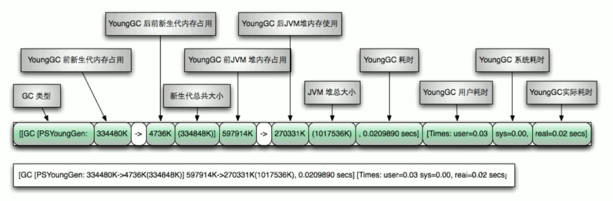
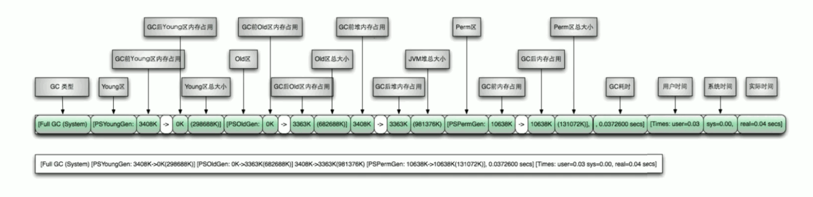

## 请问如何盘点查看 JVM系统默认值？

### 1. JVM的参数类型

- 标配参数

  - -version
  - -help

- X 参数（了解）

  - -Xint：解释执行
  - -Xcomp：第一次使用就编译成本地代码
  - -Xmixed：混合模式

- **XX 参数(重点)**

  - Boolean 类型：-XX：+ 或者 - 某个属性值（+ 表示开启，- 表示关闭）

    > 代表本次程序是否开启这个参数

    - -XX:+PrintGCDetails：打印 GC 收集细节
    - -XX:-PrintGCDetails：不打印 GC 收集细节
    - -XX:+UseSerialGC：使用了串行收集器
    - -XX:-UseSerialGC：不使用了串行收集器

  - KV 设置类型：-XX:key=value

    > 程序中的变量设置默认值, 可以进行修改

    - -XX:MetaspaceSize=128m
    - -XX:MaxTenuringThreshold=15


#### 两个经典参数

-Xms 和 - Xmx

经常使用, 所以为了方便使用, 起了别名

- -Xms 等价于 -XX:InitialHeapSize
- -Xmx 等价于 -XX:MaxHeapSize

使用

```
-Xms1024m -Xmx1024m
```


### 2. 查看当前运行程序的配置

Java程序已经运行, 然后进行查看

不是使用 Java指令, 而是使用的其他指令

#### 命令

**jps:** 查看 java后台进程

**jinfo:** 根据进程号查看 java正在运行程序的各种信息

#### 练习

###### a. 启动代码

```java
public class HelloGC {
    public static void main(String[] args) {
        System.out.println("hello GC...");
        try {
            Thread.sleep(Integer.MAX_VALUE);
        } catch (InterruptedException e) {
            e.printStackTrace();
        }
    }
}
```

###### b. 使用 `jps -l` 命令，查出进程 id

```java
1923 org.jetbrains.jps.cmdline.Launcher
1988 sun.tools.jps.Jps
1173 org.jetbrains.kotlin.daemon.KotlinCompileDaemon
32077 com.intellij.idea.Main
1933 com.cuzz.jvm.HelloGC		// 这个是重点
32382 org.jetbrains.idea.maven.server.RemoteMavenServer
```

###### c. 使用 jinfo查看程序信息

1. 查看某一个参数是否开启, 使用命令 `jinfo -flag PrintGCDetails 1933`

```
// 查看 1933这个进程有没有打开 PrintGCDetails, 打印 GC 收集细节这个参数
> jinfo -flag PrintGCDetails 1933
-XX:-PrintGCDetails			// 默认情况, 减号代表没有开启
```

2. 查看所有参数是否开启, 使用命令`jinfo -flags 1933`

```java
> jinfo -flags 1933
Attaching to process ID 1933, please wait...
Debugger attached successfully.
Server compiler detected.
JVM version is 25.171-b11
// 默认的参数
Non-default VM flags: -XX:CICompilerCount=3 -XX:InitialHeapSize=134217728 -XX:MaxHeapSize=2128609280 -XX:MaxNewSize=709361664 -XX:MetaspaceSize=1073741824 -XX:MinHeapDeltaBytes=524288
-XX:NewSize=44564480 -XX:OldSize=89653248 -XX:+UseCompressedClassPointers -XX:+UseCompressedOops -XX:+UseFastUnorderedTimeStamps -XX:-UseLargePagesIndividualAllocation -XX:+UseParallelGC
// 人工配置的参数
Command line:  -XX:MetaspaceSize=1024m -javaagent:C:\Program Files\JetBrains\IntelliJ IDEA 2018.3.2\lib\idea_rt.jar=54179:C:\Program Files\JetBrains\IntelliJ IDEA 2018.3.2\bin -Dfile.e
ncoding=UTF-8
```


### 查看 JVM默认值

是在启动程序时进行参数的配置

使用指令 java

#### 1. 查看初始默认值：-XX:+PrintFlagsInitial

命令: `java -XX:+PrintFlagsInitial`

```
C:\Users\zn>java -XX:+PrintFlagsInitial
[Global flags]
        uintx AdaptiveSizeDecrementScaleFactor          = 4                {product}
        uintx AdaptiveSizeMajorGCDecayTimeScale         = 10               {product}
        uintx AdaptiveSizePausePolicy                   = 0                {product}
        uintx AdaptiveSizePolicyCollectionCostMargin    = 50               {product}
        uintx AdaptiveSizePolicyInitializingSteps       = 20               {product}
        uintx AdaptiveSizePolicyOutputInterval          = 0                {product}
        uintx AdaptiveSizePolicyWeight                  = 10               {product}
        uintx AdaptiveSizeThroughPutPolicy              = 0                {product}
        uintx AdaptiveTimeWeight                        = 25               {product}
         bool AdjustConcurrency                         = false            {product}
         bool AggressiveOpts                            = false            {product}
         intx AliasLevel                                = 3                {C2 product}
         bool AlignVector                               = true             {C2 product}
         intx AllocateInstancePrefetchLines             = 1                {product}
          ...
```


* ` = 后边跟值`: 如 = 4, 代表是 kv键值对

* `= 后边跟布尔变量`: 如 = true, 代表是否开启


#### 2. 查看修改更新：-XX:+PrintFlagsFinal

命令: `java -XX:+PrintFlagsFinal`

```
C:\Users\zn>java -XX:+PrintFlagsFinal
[Global flags]
        uintx AdaptiveSizeDecrementScaleFactor          = 4                {product}
        uintx AdaptiveSizeMajorGCDecayTimeScale         = 10               {product}
        uintx AdaptiveSizePausePolicy                   = 0                {product}
        uintx AdaptiveSizePolicyCollectionCostMargin    = 50               {product}
        uintx AdaptiveSizePolicyInitializingSteps       = 20               {product}
        uintx AdaptiveSizePolicyOutputInterval          = 0                {product}
        uintx AdaptiveSizePolicyWeight                  = 10               {product}
        uintx AdaptiveSizeThroughPutPolicy              = 0                {product}
        uintx AdaptiveTimeWeight                        = 25               {product}
         bool AdjustConcurrency                         = false            {product}
         bool AggressiveOpts                            = false            {product}
         ...
         intx CICompilerCount                          := 3                {product}
         ...
        uintx InitialHeapSize                          := 134217728        {product}
```

解读: 其中 = 与 := 的区别是

* `= ` 是默认的参数

* `=:` 人为改变或者 jvm 加载时改变的参数

  > 认为改变: 我们手动进行改变
  >
  > JVM加载时改变: 如初始化内存大小, 每个人机器不一样, jvm根据我们机器的不同地咚修改了

#### 3. 打印命令行参数(可以看默认垃圾回收器)：-XX:+PrintCommandLineFlags

命令: : `java -XX:+PrintCommandLineFlags`

为了方便观察, 人为的进行的换行, 默认情况下是不换行进行输出

```
C:\Users\zn> java -XX:+PrintCommandLineFlags
-XX:InitialHeapSize=133027520 
-XX:MaxHeapSize=2128440320 
-XX:+PrintCommandLineFlags 
-XX:+UseCompressedClassPointers 
-XX:+UseCompressedOops 
-XX:-UseLargePagesIndividualAllocation 
-XX:+UseParallelGC
```

#### 4. 练习: 运行程序 + 修改参数 + 查看参数

a. 文件

```java
package test;

public class MyJava {
    public static void main(String[] args) {
        int a = 100;
        int b = 200;
        System.out.println("a+b=" + (a + b));
    }
}
```

b. 运行程序

命令: `java test.MyJava`

```
E:\DataStructure\src>java test.MyJava
a+b=300
```

c. 运行程序并查看参数: 

命令: `java -XX:+PrintFlagsFinal test.MyJava`

```
E:\DataStructure\src>java -XX:+PrintFlagsFinal test.MyJava
[Global flags]
        uintx AdaptiveSizeDecrementScaleFactor          = 4                   {product}
        uintx AdaptiveSizeMajorGCDecayTimeScale         = 10                  {product}
        uintx AdaptiveSizePausePolicy                   = 0                   {product}
        uintx AdaptiveSizePolicyCollectionCostMargin    = 50                  {product}
        uintx AdaptiveSizePolicyInitializingSteps       = 20
        {product}
          ...
         bool ZeroTLAB                                  = false               {product}
         intx hashCode                                  = 5                   {product}
a+b=300
```

d. 运行程序 + 修改参数(修改元空间 + 查看参数

命令: `java -XX:+PrintFlagsFinal -XX:MetaspaceSize=512m test.MyJava`

```
E:\DataStructure\src>java -XX:+PrintFlagsFinal -XX:MetaspaceSize=512m test.MyJava
[Global flags]
        uintx AdaptiveSizeDecrementScaleFactor          = 4                   {product}
        uintx AdaptiveSizeMajorGCDecayTimeScale         = 10                  {product}
          ...
        uintx MetaspaceSize                            := 536870912           {pd product}
          ...
         bool ZeroTLAB                                  = false               {product}
         intx hashCode                                  = 5                   {product}
a+b=300
```

元空间大小已经修改


## 你平时工作用过的 JVM 常用的基本配置参数有哪些？

### 第一组常用参数

* -Xms

  * 初始大小内存，默认为物理内存 1/64
  * 等价于 -XX:InitialHeapSize

* -Xmx
  * 最大分配内存，默认为物理内存的 1/4
  * 等价于 -XX:MaxHeapSize

* -Xss

  > 查看大小时, 如果是 0, 代表使用默认值, 默认值依赖于系统平台, 官方文档中有

  * 设置单个线程栈的大小，一般默认为 512-1024k
  * 等价于 -XX:ThreadStackSize

* -Xmn

  > 一般不需要调整, 使用默认值

  * 设置年轻代的大小
  * **整个JVM内存大小=年轻代大小 + 年老代大小 + 持久代(就是永久代)大小**，持久代一般固定大小为64m，所以增大年轻代后，将会减小年老代大小。此值对系统性能影响较大，Sun官方推荐配置为整个堆的3/8。Java8将持久代取消.

* -XX:MetaspaceSize

  > 元空间默认(20~M)比较小, 为了避免元空间溢出，我们可以调大一点

  * 设置元空间大小（元空间的本质和永久代类似，都是对 JVM 规范中的方法区的实现，不过元空间于永久代之间最大区别在于，**元空间并不在虚拟中，而是使用本地内存**，因此默认情况下，元空间的大小仅受本地内存限制）
  * 进行配置: `-Xms10m -Xmx10m -XX:MetaspaceSize=1024m -XX:+PrintFlagsFinal`

#### 练习

配置前的默认参数(为了方便看, 进行了换行)

```
C:\Users\zn>java -XX:+PrintCommandLineFlags

-XX:InitialHeapSize=133027520 
-XX:MaxHeapSize=2128440320 
-XX:+PrintCommandLineFlags 
-XX:+UseCompressedClassPointers 
-XX:+UseCompressedOops 
-XX:-UseLargePagesIndividualAllocation 
-XX:+UseParallelGC
```

设置需要的参数

```
-Xms128m -Xmx4096m -Xss1024k -XX:MetaspaceSize=512m -XX:+PrintCommandLineFlags -XX:+PrintGCDetails -XX:+UseSerialGC
```

配置后, 输出(为了方便看, 进行了换行), 进行和上面的对比, 发现参数已经进行了修改

```
>java -Xms128m -Xmx4096m -Xss1024k -XX:MetaspaceSize=512m -XX:+PrintCommandLineFlags -XX:+PrintGCDetails -XX:+UseSerialGC

-XX:InitialHeapSize=134217728 
-XX:MaxHeapSize=4294967296 
-XX:MetaspaceSize=536870912 
-XX:+PrintCommandLineFlags 
-XX:+PrintGCDetails 
-XX:ThreadStackSize=1024 
-XX:+UseCompressedClassPointers 
-XX:+UseCompressedOops 
-XX:-UseLargePagesIndividualAllocation 
-XX:+UseSerialGC
```


### 第二组常用参数

* `-XX:+PrintGCDetails`: 输出详细 GC 收集日志信息

#### 练习

a. 代码

```java
public class HelloGC {
    public static void main(String[] args) {
        // 设置大于内存故意撑爆内存
        byte[] bytes = new byte[20 * 1024 * 1024];
    }
}
```

配置好参数,设置 JVM 参数为(设置小一些, 方便演示)

 ```
-Xms10m -Xmx10m -XX:+PrintGCDetails
 ```

打印结果(下面有解读)

```sql
[GC (Allocation Failure) [PSYoungGen: 1231K->448K(2560K)] 1231K->456K(9728K), 0.0015616 secs] [Times: user=0.00 sys=0.00, real=0.00 secs] 
[GC (Allocation Failure) [PSYoungGen: 448K->384K(2560K)] 456K->392K(9728K), 0.0016999 secs] [Times: user=0.00 sys=0.00, real=0.00 secs] 
[Full GC (Allocation Failure) [PSYoungGen: 384K->0K(2560K)] [ParOldGen: 8K->358K(7168K)] 392K->358K(9728K), [Metaspace: 3028K->3028K(1056768K)], 0.0066696 secs] [Times: user=0.01 sys=0.00, real=0.01 secs] 
[GC (Allocation Failure) [PSYoungGen: 0K->0K(2560K)] 358K->358K(9728K), 0.0005321 secs] [Times: user=0.00 sys=0.00, real=0.00 secs] 
[Full GC (Allocation Failure) [PSYoungGen: 0K->0K(2560K)] [ParOldGen: 358K->340K(7168K)] 358K->340K(9728K), [Metaspace: 3028K->3028K(1056768K)], 0.0051543 secs] [Times: user=0.01 sys=0.00, real=0.01 secs] 
Heap
 PSYoungGen      total 2560K, used 81K [0x00000000ffd00000, 0x0000000100000000, 0x0000000100000000)
  eden space 2048K, 3% used [0x00000000ffd00000,0x00000000ffd14668,0x00000000fff00000)
  from space 512K, 0% used [0x00000000fff00000,0x00000000fff00000,0x00000000fff80000)
  to   space 512K, 0% used [0x00000000fff80000,0x00000000fff80000,0x0000000100000000)
 ParOldGen       total 7168K, used 340K [0x00000000ff600000, 0x00000000ffd00000, 0x00000000ffd00000)
  object space 7168K, 4% used [0x00000000ff600000,0x00000000ff655188,0x00000000ffd00000)
 Metaspace       used 3060K, capacity 4496K, committed 4864K, reserved 1056768K
  class space    used 336K, capacity 388K, committed 512K, reserved 1048576K
Exception in thread "main" java.lang.OutOfMemoryError: Java heap space
	at com.cuzz.jvm.HelloGC.main(HelloGC.java:12)
```

#### 打印结果解读

##### GC




```
[GC [PSYoungGen: 334480K->4736K(334848K)] 597914K->270331K(1017536K), 0.0209890 secs] [Times: user=0.03 sys=0.00, reai=0.02 secs]
```

* [PSYoungGen: 334480K->4736K(334848K)]

  > 年轻代总共大小为334848K, 轻 GC前内存占用 334480K, 轻GC后内存占用变为 4936K

* 597914K->270331K(1017536K), 

  > JVM堆总大小为 1017536K, 轻GC前堆内存占用 597914K, 轻GC后堆内存占用变为 270331K

* 0.0209890 secs]

  > 本次 轻GC耗时 0.0209890秒钟

* [Times: user=0.03 sys=0.00, reai=0.02 secs]

  > 本次轻GC用户耗时: 0.03, 系统耗时: 0.00, 实际耗时: 0.02

##### FullGC



##### 规律


### 第三组常用参数

* -XX:SurvivorRatio
  * 设置新生代中 eden 和 S0/S1 空间比例
  * 默认 -XX:SurvivorRatio=8，Eden : S0 : S1 = 8 : 1 : 1

* -XX:NewRatio

  > 一般使用默认

  * 配置年轻代和老年代在堆结构的占比
  * 默认 -XX:NewRatio=2 新生代占1，老年代占2，年轻代占整个堆的 1/3

* -XX:MaxTenuringThreshold

  > 设置时必须在 0-15之间, 否则会报错

  * 设置垃圾最大年龄


下面的还没有看

### 4. 调优总结

#### 年轻代大小选择

**响应时间优先的应用:** 尽可能设大，直到接近系统的最低响应时间限制(根据实际情况选择)。在此种情况下，年轻代收集发生的频率也是最小的。同时，减少到达年老代的对象。

**吞吐量优先的应用:** 尽可能的设置大，可能到达Gbit的程度。因为对响应时间没有要求，垃圾收集可以并行进行，一般适合8CPU以上的应用。

年老代大小选择

**响应时间优先的应用:**年老代使用并发收集器，所以其大小需要小心设置，一般要考虑并发会话率和会话持续时间等一些参数。 如果堆设置小了，可以会造成内存碎片、高回收频率以及应用暂停而使用传统的标记清除方式;如果堆大了，则需要较长的收集时间。最优化的方案，一般需要 参考以下数据获得

- 并发垃圾收集信息
- 持久代并发收集次数
- 传统GC信息
- 花在年轻代和年老代回收上的时间比例

减少年轻代和年老代花费的时间, 一般会提高应用的效率

吞吐量优先的应用: -般吞吐量优先的应用都有一一个很大的年轻代和-一个较小的年老代。原因是，这样可以尽可能回收掉大部分短期对象，减少中期的对象，而年老代尽存放长期存活对象。

```
  较小堆引起的碎片问题因为年老代的并发收集器使用标记、清除算法，所以不会对堆进行压缩。当收集器回收时，他会把相邻的空间进行合并，这样可以分配给较大的对象。但是，当堆空间较小时，运行一段时间以后，就会出现"碎片”，如果并发收集器找不到足够的空间，那么并发收集器将会停止，然后使用传统的标记、清除方式进行回收。如果出现"碎片”，可能需要进行如下配置:
```

