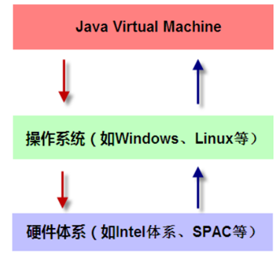
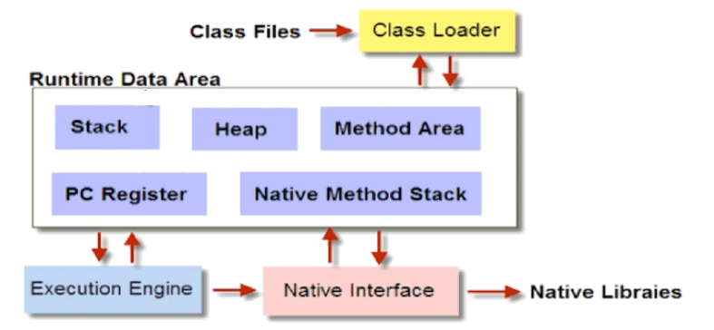
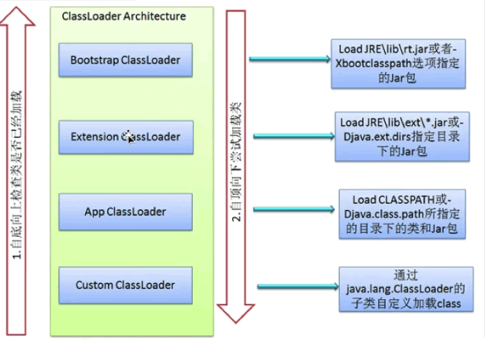

## JVM如何加载 .class文件

### Java虚拟机

我们先来了解一下Java虚拟机，是一种抽象化的计算机，通过在实际的计算机上仿真模拟各种计算机功能来实现了，JVM有自己完善的硬件架构，如处理器，堆栈，寄存器等，具有相应的指令系统，JVM屏蔽了与操作平台相关的信息， 使得 Java程序只需生成在Java虚拟机上运行的目标代码即字节码 就可以在多种平台上不加修改的运行，一般情况下，不需要知道具体的运行原理，只要会写Java代码就可以，**这也是虚拟机存在的原因， 就是屏蔽底层操作系统平台的不同，并且减少基于原生语言开发的复杂性**，只要虚拟机厂商在特定操作系统上实现了虚拟机，定义如何将字节码解析成本操作系统可以执行的二进制码。 Java便能够实现，跨越各种的平台。 

##### 图解



JVM是一个内存中的虚拟机，即 JVM的存储就是内存，我们所写的类，常量， 变量，方法都在内存中

#### 图解



* **Class Loader :**依据特定格式,加载class文件到内存里面

  > 如果 .java文件有语法的错误, 会编译错误,不会生成 .class文件
  >
  > 加载的 .class 文件是有格式和要求的, 加载时**必须符合格式和要求**才能够加载, 加载后能不能运行(代码逻辑有无错误),由Execution Engine 负责
  >

* **Execution Engine(解释器):**对命令进行解析

  > 通过 Execution Engine解析 class文件中的字节码并提交给操作系统区执行

* **Native Interface :**融合不同开发语言的原生库为Java所用

  > 主流的JVM是基于C++实现的,在需要执行较高执行性能运算操作的时候,是需要在Java中调用其他语言的库的, 为了满足要求, JVM专门在内存中开辟了一块区域处理标记为 native的代码
  >
  > 具体做法: Native Method Stack中登记native方法，在Execution Engine 执行时加载本地方法库(native libraies)
  >
  > **eg:** Thread.State -> start0()(730行) 是使用 native修饰, 调用了C语言的底层函数库,
  >
  > JNI (Java native Interface ): C的底层函数库

* **Runtime Data Area :** JVM内存空间结构模型


## 谈谈反射

JAVA反射机制是在运行状态中,对于任意一个类,都能够知道这个类的所有属性和方法;**对于任意一个对象, 都能够调用它的任意方法和属性;这种动态获取信息以及动态调用对象方法的功能称为java语言的反射机制。**

### 写一个反射的例子

反射就是把Java类中的各种成分映射成一个个的 Java对象

参见反射, 写的很全 

### 类从编译到执行的过程

* 编译器将 `Robot.java`源文件编译为`Robot.class` 字节码文件
* `ClassLoader`将字节码转换为 JVM中的 `Class <Robot>対象`
* JVM利用 `Class <Robot>`对象实例化 Robot对象


## 谈谈 ClassLoader

ClassLoader 在Java中有着非常重要的作用,它**主要工作在Class装载的加载阶段**,其**主要作用是从系统外部获得Class二进制数据流。**它是Java的核心组件,所有的Class 都是由ClassLoader 进行加载的, **ClassLoader负责通过将Class文件里的二进制数据流装载进系统,然后交给Java虚拟机进行连接、初始化等操作。**

#### 类加载器的作用

* **类加载的作用：**将class文件字节码内容加载到内存中，并将这些静态数据转换成方法区的运行时数据结构，然后在堆中生成一个代表这个类的 java.lang.Class对象，作为方法区中类数据的访问入口。

* **类缓存：**标准的JavaSE类加载器可以按要求查找类，但一旦某个类被加载到类加载器中，它将维持加载（缓存）一段时间。不过 JVM垃圾回收机制可以回收这些 Class对象

#### 类装载器的种类

- BootStrapClassLoader (启动类加载器, 虚拟机自带的加载器): C+ +編写,加载核心类 `java.*`

  > 用户不可见, 通常核心类不能够被替换掉, 此加载器是由JVM内核实现的, 在主流的JVM中, 是 C++实现的, 由他加载核心内容, 才会有后面的加载器的出现

- ExtClassLoader(扩展类加载器) : Java編写,加载核心类 `javax.*`

  > 用户可见的 classLoader(Java编写就可以看到), 是用来加载 ext下的jar包, 用户也可以将自定义的 jar包放在此目录下, 通过这个 classLoader加载

- AppClassLoader (应用程序类加载器, 也叫系统类加载器): Java編写, 加载程序所在目录

  >  加载当前应用的classpath的所有类, classPath是类路径, 设置环境变量时也会设置
  >
  > classpath 会有很多, 有一个是我们文件 .class的路径, 就是去此路径下加载我们的文件

- 自定义ClassLoader : Java編写,定制化加载

  > 用户自定义加载器  Java.lang.ClassLoader的子类，用户可以定制类的加载方式
  >
  > 要加载的内容可以不在 classpath下, 也可以不是class文件或者 jar文件, 加载方式可以自己来定义

每种 classLoader加载的路径和方式都不同

Ext 会去自己所对应的路径下查看有没有 .class文件, 如果有,就会加载进来, 不是一次性加载进来, 用到才会加载

### 自定义 ClassLoader

###### 源码

```java
// 根据类的名字加载字节码返回 Class对象
protected Class<?> findClass(String name) throws ClassNotFoundException {
    throw new ClassNotFoundException(name);
}

// 定义一个类, 传进来一个 byte数组的字节流,然后定义, 最后返回 class
// 将字节数组形成一个 Class对象返还给调用者
@Deprecated
protected final Class<?> defineClass(byte[] b, int off, int len)throws ClassFormatError {
    return defineClass(null, b, off, len, null);
}
// 总结
// findClass() 根据类的名字加载字节码, 再在内部调用defineClass返回 class对象
```

#### 1. 编写 java类并编译成 .class文件

```java
public class test {
    static {
        System.out.println("hello boy");
    }
}
```

进行编译

```
E:/za/classLoaderTest>javac test.java
```

#### 2. 自定义加载器

```java
// 继承ClassLoader
public class MyClassLoader extends ClassLoader {
    // .class路径和文件名称
    private String path;
    private String classLoaderName;

    public MyClassLoader(String path, String classLoaderName) {
        this.path = path;
        this.classLoaderName = classLoaderName;
    }

    // 重写方法, 用于寻找类文件
    @Override
    public Class findClass(String name) {
        byte[] b = loadClassData(name);
        // 将二进制流转换为 Class类
        return defineClass(name, b, 0, b.length);
    }

    // 用于加载类文件
    private byte[] loadClassData(String name) {
        name = path + name + ".class";
        InputStream in = null;
        ByteArrayOutputStream out = null;
        try {
            in = new FileInputStream(new File(name));
            out = new ByteArrayOutputStream();
            int i = 0;
            while ((i = in.read()) != -1) {
                out.write(i);
            }
        } catch (Exception e) {
            e.printStackTrace();
        } finally {
            try {
                out.close();
                in.close();
            } catch (Exception e) {
                e.printStackTrace();
            }
        }
        return out.toByteArray();
    }
}
```

#### 步骤

1. ClassLoader是抽象类, 但是没有抽象方法, 想要自定义加载器, 需要继承此抽象类

2. 然后编写 findClass和 defineClass方法.

   > 我们编写的`classLoader`并没有直接调用 `findClass()`, 而是在`loadClass()` 方法中调用了`findClass()`方法, 后面有源码的解读

#### 3. 使用自定义类加载器加载 .class文件

```java
public class ClassLoaderChecker {
    public static void main(String[] args) throws Exception{
        // 实例化自定义加载器
        MyClassLoader m = new MyClassLoader("E://za//classLoaderTest//", "test");
        // 创建 Class
        Class c = m.loadClass("test");
        c.newInstance();
    }
}
// 结果
// hello boy
```


## 谈谈类加载器的双亲委派机制

不同 classLoader加载类的方式和路径有所不同, 为了实现分工, 各自实现各自负责的区块,使得逻辑更加明确.所以存在一个机制, 让他们之间相互协作. 形成一个整体

###### 如图



#### classLoader源码解析

###### 源码

```java
protected Class<?> loadClass(String name, boolean resolve)
    throws ClassNotFoundException{
    synchronized (getClassLoadingLock(name)) {
        // 第一次加载, 检查之前是否已经加载
        Class<?> c = findLoadedClass(name);
        // 如果没有加载
        if (c == null) {
            long t0 = System.nanoTime();
            try {
                // 父加载器不为空时(启动类加载机制为 null)
                if (parent != null) {
					// 父加载器在执行 loadClass
                    c = parent.loadClass(name, false);
                } else {
                    // 如果父加载器为 bootstrap, 则调用此方法, 最里面是 native方法, 如果想要看, 需要进入openjdk官网去查询
                    c = findBootstrapClassOrNull(name);
                }
            } catch (ClassNotFoundException e) {
                // ClassNotFoundException thrown if class not found
                // from the non-null parent class loader
            }
			// 如果从上层的加载器都没有找到此 Class
            if (c == null) {
                // 本层再去加载
                long t1 = System.nanoTime();
                // findClass 默认没有内容, 所以是自定义加载器重写的方法
                c = findClass(name);
                // this is the defining class loader; record the stats
                sun.misc.PerfCounter.getParentDelegationTime().addTime(t1 - t0);
                sun.misc.PerfCounter.getFindClassTime().addElapsedTimeFrom(t1);
                sun.misc.PerfCounter.getFindClasses().increment();
            }
        }
        // 是否进行链接(加载后的操作), 默认是 false
        if (resolve) {
            resolveClass(c);
        }
        // 返回类对象
        return c;
    }
}
```

###### 验证

```java
public class ClassLoaderChecker {
    public static void main(String[] args) throws Exception {
        // 自定义加载器
        MyClassLoader m = new MyClassLoader("E://za//classLoaderTest//", "test");
        Class c = m.loadClass("test");
        // 打印此 Class的加载器
        System.out.println(c.getClassLoader());
        System.out.println(c.getClassLoader().getParent());
        System.out.println(c.getClassLoader().getParent().getParent());
        System.out.println(c.getClassLoader().getParent().getParent().getParent());
        c.newInstance();
    }
}
/*
结果:
    jvmDemo.muke.MyClassLoader@7f31245a
    sun.misc.Launcher$AppClassLoader@18b4aac2
    sun.misc.Launcher$ExtClassLoader@135fbaa4
    null
    hello boy
*/
```


## 为什么使用双亲委派机制去加载类

#### 1. 避免多分同样字节码的加载

内存是宝贵的, 没有必要保存两份相同的对象

* **如果不使用委托机制,** 而是加载自己的, 那么类 A打印的时候就会加载一份 System字节码, 类 B打印的时候又会加载一份 System字节码, **内存中就会出现两份相同的字节码**
* **如果使用委托机制.** 那就从当前的委托机制逐层的向上层查找. 假设类A是第一次加载 System字节码, 会委托到 Bootstrap加载到. 当类B还要加载时, 也会是双亲委托机制. 到达 bootstrap时, 发现已经加载了System.就会之间返回同一个System. **这样内存中就只有一份字节码了**

#### 2. 沙箱安全机制: 防止恶意修改代码

可以确保 Java核心库的类型安全,确保 Java核心类库所提供的类不会被定义的类所替代

所有的 Java应用都至少会引用 `java.lang.Object`, 也就是说在运行期, `java.lang.Object`这个类会被加载到 Java虚拟机中, 如果这个加载过程是由 Java应用自己的类加载器所完成的, 那么很可能就会在 JVM中存在多个版本的 `java.lang.Objec` 类, 而且这些类之间还是不兼容的, 相互不可见的(正是命名空间发挥着作用)

借助于双亲委托机制, Java核心类库中的类的加载工作都是由启动器加载器来统一完成, 从而确保类 Java应用所使用的都是同一个版本的Java核心类库, 他们之间是相互兼容的

#### 3. 框架的应用

​	不同的类加载器可以为相同名称(binary name)的类创建额外的命名空间, 相同名称的类可以并存在 Java虚拟机中,只需要用不同的类加载器来加载他们即可. 不同类加载器锁加载的类之间是不兼容的,这就相当于在 Java虚拟机内部创建了一个又一个相互隔离的 Java类空间, 这类技术再很多框架中都得到了实际应用

### 扩充

#### 1. 什么是沙箱

Java安全模型的核心就是Java沙箱(sandbox), 所有的 Java程序运行都可以指定沙箱，可以定制安全策略。

沙箱是一个限制程序运行的环境。沙箱机制就是将 Java 代码限定在虚拟机(JVM)特定的运行范围中，并且严格限制代码对本地系统资源访问，通过这样的措施来保证对代码的有效隔离，防止对本地系统造成破坏。沙箱**主要限制系统资源访问**

系统资源包括什么？

`CPU、内存、文件系统、网络`。不同级别的沙箱对这些资源访问的限制也可以不一样。

#### 2. 什么是命名空间

每个类加载器都有自己的命名空间，命名空间由该加载器及所有父类加载器所加载的类组成

在同一个命名空间中, 不会出现类的完整名字(类的命名相同的两个类)

在不同的命名空间中, 有可能会出现类的完整名字

#### 3. 不同类加载器的命名空间关系

1. 同一个命名空间内的类是相互可见的。

2. 子加载器的命名空间包含所有父加载器的命名空间。因此由子加载器加载的类能看见父加载器加载的类。

   > 例如系统类加载器加载的类能看见根类加载器加载的类。

3. 由父加载器加载的类不能看见子加载器加载的类。

4. 如果两个加载器之间没有直接或间接的父子关系，那么它们各自加载的类相互不可见。

