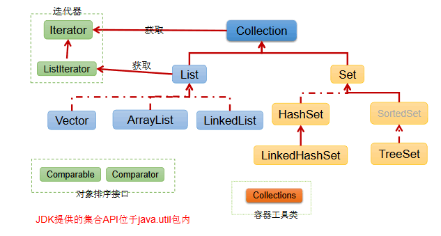
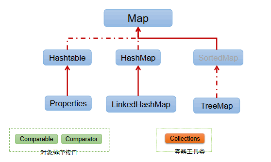
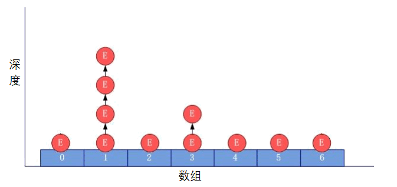
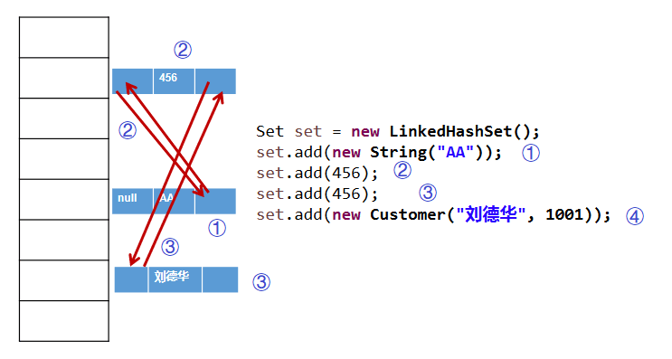
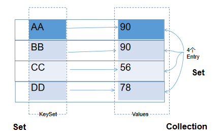
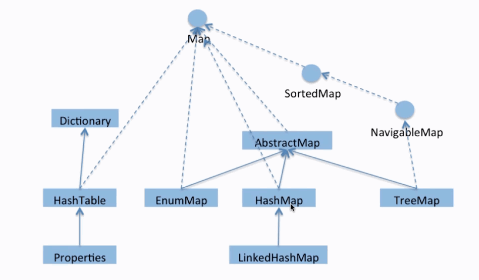
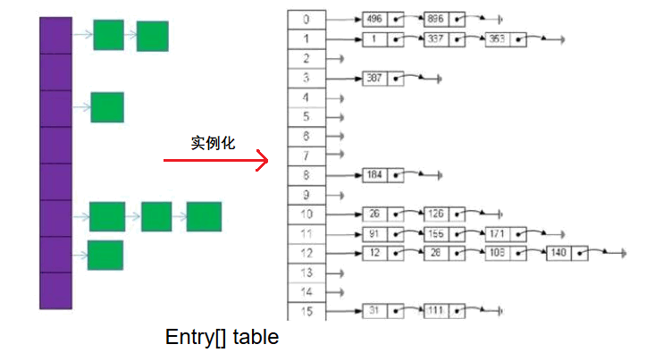
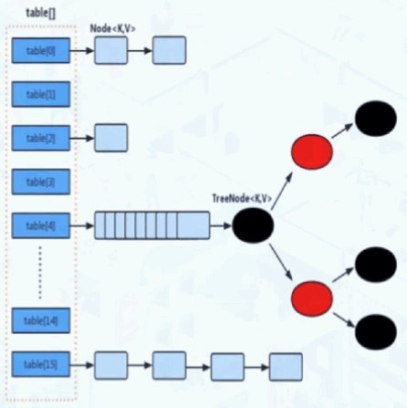

# 集合体系

​	集合作为一个容器, 可以存储多个元素. 但是由于数据结构的不同. Java提供了多种集合类, 将集合类中共性的功能不断向上抽取, 最终形成了集合体系结构. 

Java 集合可分为Collection 和Map 两种体系

* **Collection接口：**单列数据，定义了存取一组对象的方法的集合
  * List：元素有序、可重复的集合

  * Set：元素无序、不可重复的集合

* **Map接口：**双列数据，保存具有映射关系“key-value对”的集合

### Collection体系



### Map体系




# Iterator

* Iterator对象称为迭代器(设计模式的一种)，**主要用于遍历Collection 集合中的元素。**

* GOF给迭代器模式的定义为: **提供一种方法访问一个容器(container)对象中各个元素，而又不需暴露该对象的内部细节。** 迭代器模式，就是为容器而生。类似于“公交车上的售票员”、“火车上的乘务员”、“空姐”。
* Collection接口继承了 java.lang.Iterable接口，该接口有一个iterator()方法，那么所有实现了Collection接口的集合类都有一个iterator()方法，用以返回一个实现了Iterator接口的对象。
* **Iterator 仅用于遍历集合，Iterator本身并不提供承装对象的能力。** 如果需要创建 Iterator 对象，则必须有一个被迭代的集合。
* 集合对象每次调用 iterator()方法都得到一个全新的迭代器对象，默认游标都在集合的第一个元素之前。


# List

#### 特点

* List 集合类中**元素有序、且可重复**，集合中的每个元素都有其对应的顺序索引。

* List 容器中的元素都对应一个整数型的序号记载其在容器中的位置，可以根据序号存取容器中的元素

#### 实现

JDK API中List接口的实现类常用的有：ArrayList、LinkedList和 Vector

## 1. ArrayList

对于频繁的查询的操作，建议使用ArrayList类，效率较高

ArrayList是List 接口的典型实现类、主要实现类

本质上，ArrayList是对象引用的一个”变长”数组

### 版本区别

#### a. JDK 7情况下

###### 使用

```java
// 底层创建了长度是 10的Object[]数组 elementData
ArrayList list = new ArrayList();	
// elementData[0] = new Integer(123);
list.add(123);		

...	// 很多添加操作
// 如果此次的添加导致底层elementData数组容量不够，则扩容。
list.add(11);		

// 默认情况下，扩容为原来的容量的1.5倍，同时需要将原有数组中的数据复制到新的数组中
```

**结论：**建议开发中使用带参的构造器：ArrayList list = new ArrayList(int capacity)

#### b. JDK 8

###### 使用

```java
// 底层Object[] elementData初始化为{}.并没有创建长度为10的数组
ArrayList list = new ArrayList();

// 第一次调用add()时，底层才创建了长度10的数组，并将数据123添加到elementData[0]
list.add(123);
...
// 后续的添加和扩容操作与jdk 7无异
```

#### 实现区别

* JDK 7中的 ArrayList像饿汉式，直接创建一个初始容量为10的数组

* JDK 8中的ArrayList像懒汉式，一开始创建一个长度为0的数组，当添加第一个元素时再创建一个始容量为10的数组

  > **优点:** 延迟了数组的创建，节省内存


## 2. LinkedList

对于频繁的插入或删除元素的操作，建议使用LinkedList类，效率较高

双向链表，内部没有声明数组，而是定义了Node类型的first和last，用于记录首末元素。

同时，定义内部类Node，作为LinkedList中保存数据的基本结构。

###### 使用

```java
// 内部声明了 Node类型的 first和 last属性，默认值为 null
LinkedList list = new LinkedList(); 
// 将 123封装到 Node中，创建了 Node对象。
list.add(123);			
```

###### node

其中，Node定义为：体现了LinkedList的双向链表的说法

```java
private static class Node<E> {
    E item;
    Node<E> next;
    Node<E> prev;

    Node(Node<E> prev, E element, Node<E> next) {
        this.item = element;
        this.next = next;
        this.prev = prev;
    }
}
```


## 3. Vector

Vector 是一个古老的集合，JDK1.0就有了。大多数操作与ArrayList相同，**区别之处在于Vector是线程安全的。**所以效率比较低

#### 特点

1. jdk7和 jdk8中通过Vector()构造器创建对象时，底层都创建了长度为 10的数组。

2. 在扩容方面，默认扩容为原来的数组长度的**2倍**。(区别于ArrayList)


## 4. 对比

### 三者的选择

- 在各种 list中，最好把 ArrayList作为缺省选择。(默认使用)

- 当插入、删除频繁时，使用 LinkedList
- Vector总是比ArrayList慢，所以尽量避免使用。

### 面试题：ArrayList、LinkedList、Vector三者的异同？

同: 三个类都是实现了List接口，存储数据的特点相同：存储有序的、可重复的数据

异, 按方向分开回答

#### ArrayList和LinkedList的异同

二者都线程不安全，相对线程安全的Vector，执行效率高。

* ArrayList是实现了基于动态数组的数据结构，LinkedList基于链表的数据结构。
* 对于随机访问 get和 set，ArrayList 优于LinkedList，因为LinkedList要移动指针。
* 对于新增和删除操作 add(特指插入)和 remove，LinkedList比较占优势，因为ArrayList要移动数据。

#### ArrayList和Vector的区别

* Vector和 ArrayList几乎是完全相同的,唯一的区别在于 Vector是同步类(synchronized)，属于强同步类。因此开销就比 ArrayList要大，访问要慢。
* 正常情况下,大多数的Java程序员使用ArrayList而不是Vector,因为同步完全可以由程序员自己来控制。
* Vector每次扩容请求其大小的2倍空间，而ArrayList是1.5倍。
* Vector还有一个子类Stack。

### 我们知道`Arraylist`是线程不安全的，请编写一个不安全的案例，并给出解决方案

#### 思路

多个线程一起 add(), 会抛出异常

###### 代码

```java
public class ContainerNotSafeDemo {

    public static void main(String[] args) {
        List<String> list = new ArrayList<>();

        // 30个线程同时添加
        for (int i = 1; i <= 30; i++) {
            new Thread(() -> {
                list.add("aa");
                System.out.println(list);
            }, String.valueOf(i)).start();
        }
    }
}
```

###### 结果报错

```java
java.util.ConcurrentModificationException: 
// Java 并发修改异常
```

#### 解决

##### 1. 使用 Vector, 被淘汰了, 不建议使用

```java
List<String> list = new Vector<>();
// vector: 方法加锁, 可以保证数据的一致性, 但是并发性急剧下降		  JDK 1.0
// ArrayList: 为了杜绝上述情况,不加锁牺牲多线程安全性为代价, 提高效率	JDK 1.2
```

##### 2. 使用集合类进行加锁

```java
List<String> list = Collections.synchronizedList(new ArrayList<>());
```

##### 3. 使用 CopyOnWriteArrayList()

```java
List<String> list = new CopyOnWriteArrayList<>();
```

###### 原理

`copyonwrite容器`即**写时夏制**的容器

###### 源码分析

```java
public boolean add(E e) {
    // 进行上锁, 保证同步性
    final ReentrantLock lock = this.lock;
    lock.lock();
    try {
        Object[] elements = getArray();
        int len = elements.length;
        // 将 Object[] 进行扩容一个
        Object[] newElements = Arrays.copyOf(elements, len + 1);
        // 加到尾部
        newElements[len] = e;
        // 原容器的引用指向新的容器
        setArray(newElements);
        return true;
    } finally {
        lock.unlock();
    }
}
```

 好处是可以对 `CopyOnWrite容器`进行并发的读，而不需要加锁，**因为当前容器不会添加任住何元素。**所以`CopyOnwrite 容器也是一种读写分离的思想`, 读和写是不同的容器

**参考文章:** [谈谈写入时复制的思想---以CopyOnWriteArrayList为例](https://www.jianshu.com/p/5f570d2f81a2)


# Set 接口

Set接口是Collection的子接口，set接口没有提供额外的方法

#### 特点

* Set 集合不允许包含相同的元素，如果试把两个相同的元素加入同一个Set 集合中，则添加操作失败。

* Set集合是无序的

  > 不等于随机性。存储的数据在底层数组中并非按照数组索引的顺序添加，而是根据数据的哈希值决定的。

* Set 判断两个对象是否相同不是使用 == 运算符，而是根据equals() 方法

#### 实现

HashSet, LinkedHashSet, TreeSet

## 1. HashSet

HashSet是Set 接口的典型实现，大多数时候使用Set 集合时都使用这个实现类。

HashSet按Hash 算法来存储集合中的元素，因此具有很好的存取、查找、删除性能。

#### 1. 特点

* 不能保证元素的排列顺序
* HashSet不是线程安全的
* 集合元素可以是 null

#### 2. hashSet底层结构

数组 + 链表的结构



底层是数组，初始容量为16，当如果使用率超过0.75，（16*0.75=12）就会扩大容量为原来的2倍。（16扩容为32，依次为 64, 128....等）

##### `HashSet`的底层是什么

是HashMap

###### 源码

```java
// 构造方法
public HashSet() {
    map = new HashMap<>();
}
```

##### 为什么 `HashSet`是传一个值, 而`HashMap`是传入两个值?

###### 源码

```java
// Dummy value to associate with an Object in the backing Map
private static final Object PRESENT = new Object();

public boolean add(E e) {
    return map.put(e, PRESENT)==null;
}
```

HashSet只是使用的 HashMap的 key(保证不允许相同), value 统一是一个 Object的常量

#### 3. 添加元素的过程

向 HashSet中添加元素 a

1. 首先调用元素 a所在类的 hashCode()方法，计算元素 a的哈希值(根据属性计算出来)
2. 此哈希值接着通过某种算法计算出在 HashSet底层数组中的存放位置即为：索引位置, 判断数组此位置上是否已经有元素
   - 如果此位置上没有其他元素，则元素a添加成功。 —> 情况1
   - 如果此位置上有其他元素 b(或以链表形式存在的多个元素），则比较元素a与元素b的hash值：
     - 如果hash值不相同，则元素 a添加成功。—> 情况2
     - 如果hash值相同，进而需要调用元素 a所在类的 equals()方法
       - equals()返回 true,元素a添加失败
       - equals()返回 false,则元素a添加成功。—> 情况3

**补:** 对于添加成功的情况2和情况3而言：元素 a与已经存在指定索引位置上数据以链表的方式存储

* jdk 7 :元素a放到数组中，指向原来的元素。

* jdk 8 :原来的元素在数组中，指向元素a

**总结：**七上八下

#### 4. HashSet 集合判断两个元素相等的标准

两个对象通过hashCode() 方法比较相等，并且两个对象的equals() 方法返回值也相等。

**注意:** 对于存放在Set容器中的对象，对应的类一定要重写equals()和hashCode(Object obj)方法，以实现对象相等规则。即：“相等的对象必须具有相等的散列码”。

#### 5. 重写hashCode() 方法的基本原则

* 在程序运行时，同一个对象多次调用 hashCode() 方法应该返回相同的值。
* 当两个对象的 equals() 方法比较返回true 时，这两个对象的hashCode() 方法的返回值也应相等。
* 对象中用作equals() 方法比较的Field，都应该用来计算hashCode 值。

#### 6. 重写equals() 方法的基本原则

以自定义的 Customer类为例，何时需要重写equals()？

* 当一个类有自己特有的“逻辑相等”概念,当改写 equals()的时候，总是要改写 hashCode()

  > 根据一个类的equals方法（改写后），两个截然不同的实例有可能在逻辑上是相等的. 但是，根据Object.hashCode()方法，它们仅仅是两个对象。因此，违反了“相等的对象必须具有相等的散列码”。

* **结论：** 复写equals方法的时候一般都需要同时复写 hashCode方法。通常参与计算hashCode的对象的属性也应该参与到equals()中进行计算。


## 2.LinkedHashSet

LinkedHashSet是 HashSet的子类

LinkedHashSet根据元素的hashCode值来决定元素的存储位置，但它同时使用双向链表维护元素的次序，这使得元素看起来是以插入顺序保存的。

LinkedHashSet插入性能略低于HashSet，但在迭代访问Set 里的全部元素时有很好的性能。对于频繁的遍历操作，LinkedHashSet效率高于HashSet

#### 1. 底层实现




## 3. TreeSet

**TreeSet是 SortedSet接口的实现类，TreeSet可以确保集合元素处于排序状态。**

TreeSet底层使用红黑树结构存储数据

TreeSet两种排序方法：自然排序和定制排序。默认情况下，TreeSet采用自然排序


# Map

#### 理解

* Map与Collection并列存在。用于保存具有映射关系的数据:key-value

* Map 中的 key 和 value 都可以是任何引用类型的数据

* Map 中的 key用 Set来存放，不允许重复，即同一个Map 对象所对应的类，要重写hashCode()和equals()方法

* 常用String类作为Map的“键”

* key 和value 之间存在单向一对一关系，即通过指定的key 总能找到唯一的、确定的value

* Map接口的常用实现类：HashMap、TreeMap、LinkedHashMap和Properties。

  > 其中，HashMap是Map 接口使用频率最高的实现类

map中的 key是不可重复的, value是可以重复的

###### 源码

```java
public interface Map<K,V> {
    Set<K> keySet();			// key是由 set存放的
    Collection<V> values();		// value是由Collection来存放的
}
```

###### 图示



#### 整体框架




## 1. HashMap

HashMap是 Map 接口使用频率最高的实现类

根据 key生成数组下标

#### 特点

* 允许使用 null键和 null值，与 HashSet一样，不保证映射的顺序。

* 所有的key构成的集合是Set: 无序的、不可重复的。

  > 所以，key所在的类要重写：equals()和hashCode()

* 所有的 value构成的集合是 Collection:无序的、可以重复的

  > 所以，value所在的类要重写：equals()

* 一个key-value构成一个entry

* 所有的 entry构成的集合是Set:无序的、不可重复的

* HashMap 判断两个key 相等的标准是：两个key 通过equals() 方法返回true，hashCode值也相等。

* HashMap 判断两个value相等的标准是：两个value 通过equals() 方法返回 true

#### 底层结构

##### HashMap(JDK7): 数组 + 链表

**特点**

* 数组的特点: 查询速度快, 增删较慢
* 链表的特点: 查询速度慢, 增删较快
* 因此, HashMap结合了两者的优势. 同时 HashMap的操作是 非 synchronized, 效率比较高. 
* 使用数组 + 链表可以减少数组的扩容, 如果只用数组, 效果会很差

###### JDK1.7的HashMap结构



**说明**

1. 数组长度默认值为 16
2. 数组中存储的是链表的头结点, 通过类似取模的操作(`hash(key.hashCode()%len`)获取添加元素要存放的位置下标. 

**问题**

极端情况下, 通过散列运算总是得出相同的值, 即分配到同一个桶中, 这样会使得某个链表变得很长, 有由于查询是由头部开始遍历. 因此性能将会恶化, 从 O(1)变成 O(n).

所以JDK 8对 Hash的底层结构进行了改变

##### HashMap(JDK8及以后): 数组 + 链表 + 红黑树

###### 图示


最坏情况下的性能从O(n)提高到 O(logn)

#### 源码分析

###### 代码分析

```java
public class HashMap<K,V> extends AbstractMap<K,V> implements Map<K,V>, Cloneable, Serializable {

    // 树化值
    static final int TREEIFY_THRESHOLD = 8;
	// 转换为链表的值
    static final int UNTREEIFY_THRESHOLD = 6;

    // 扩容因子
    static final float DEFAULT_LOAD_FACTOR = 0.75f;

    // 通过 table数组 + Node(元素)链表 组成的结构
    // Java8之前 Node叫 Entry, 因为之后引入了树, 让名字更为贴切
    transient Node<K,V>[] table;

    // node结点
    static class Node<K,V> implements Map.Entry<K,V> {
        final int hash;
        final K key;
        V value;
        Node<K,V> next;

        Node(int hash, K key, V value, Node<K,V> next) {
            this.hash = hash;
            this.key = key;
            this.value = value;
            this.next = next;
        }
    }

    // 构造函数, 仅仅给相关变量赋值, 懒加载, 首次使用的时候才会被初始化. 
    public HashMap() {
        this.loadFactor = DEFAULT_LOAD_FACTOR; // all other fields defaulted
    }

    // put方法
    public V put(K key, V value) {
        // 参数: key的 hash值, key值
        return putVal(hash(key), key, value, false, true);
    }

    // 计算 hash值, 通过位运算
    static final int hash(Object key) {
        int h;
        // 先获取到 hashCode, 再将高位数移到低位数
        return (key == null) ? 0 : (h = key.hashCode()) ^ (h >>> 16);
    }

    final V putVal(int hash, K key, V value, boolean onlyIfAbsent,
                   boolean evict) {
        Node<K,V>[] tab; Node<K,V> p; int n, i;
        // 当 table为空的时候, 调用 resize() 来初始化 table
        if ((tab = table) == null || (n = tab.length) == 0)
            n = (tab = resize()).length;
        // 做 hash运算, 计算出键值对在table中的具体位置, 为 p元素
        // 如果此时没有元素, 即 p == null, 直接 new放在数组的位置中
        if ((p = tab[i = (n - 1) & hash]) == null)
            tab[i] = newNode(hash, key, value, null);
        // 如果有元素, 
        else {
            Node<K,V> e; K k;
            // 存在键值对, 且 key的 hash值相同, 将数组元素中的值进行替换. 
            if (p.hash == hash &&
                ((k = p.key) == key || (key != null && key.equals(k))))
                e = p;
            // 判断结点是否是已经树化的结点, 按照树化的方式存储键值对
            else if (p instanceof TreeNode)
                e = ((TreeNode<K,V>)p).putTreeVal(this, tab, hash, key, value);
            // 如果不是树化的
            else {
                // 按照链表的方式, 向后面添加元素
                for (int binCount = 0; ; ++binCount) {
                    if ((e = p.next) == null) {
                        p.next = newNode(hash, key, value, null);
                        // 链表的长度一旦超过定制, 进行树化, 转为黑红树
                        if (binCount >= TREEIFY_THRESHOLD - 1) // -1 for 1st
                            treeifyBin(tab, hash);
                        break;
                    }
                    if (e.hash == hash &&
                        ((k = e.key) == key || (key != null && key.equals(k))))
                        break;
                    p = e;
                }
            }
            // 插入的键存在于 hashMap中, 
            if (e != null) { // existing mapping for key
                V oldValue = e.value;
                if (!onlyIfAbsent || oldValue == null)
                    // 对值进行更新操作
                    e.value = value;
                afterNodeAccess(e);
                return oldValue;
            }
        }
        ++modCount;
        // 当 size的值 > 阈值的值时, 进行扩容
        if (++size > threshold)
            // 用于初始化和扩容的操作
            resize();
        afterNodeInsertion(evict);
        return null;
    }

    public V get(Object key) {
        Node<K,V> e;
        return (e = getNode(hash(key), key)) == null ? null : e.value;
    }

    final Node<K,V> getNode(int hash, Object key) {
        Node<K,V>[] tab; Node<K,V> first, e; int n; K k;
        // tab[(n - 1) & hash], 通过 hash找到数组下标的位置
        if ((tab = table) != null && (n = tab.length) > 0 &&
            (first = tab[(n - 1) & hash]) != null) {
            // key.equals(k), 找到正确的结点
            if (first.hash == hash && // always check first node
                ((k = first.key) == key || (key != null && key.equals(k))))
                return first;
            if ((e = first.next) != null) {
                if (first instanceof TreeNode)
                    return ((TreeNode<K,V>)first).getTreeNode(hash, key);
                do {
                    if (e.hash == hash &&
                        ((k = e.key) == key || (key != null && key.equals(k))))
                        return e;
                } while ((e = e.next) != null);
            }
        }
        return null;
    }
}
```

##### HashMap源码中的重要常量

* DEFAULT_INITIAL_CAPACITY : **HashMap的默认容量**，16
* MAXIMUM_CAPACITY ：HashMap的最大支持容量，2^30
* DEFAULT_LOAD_FACTOR: HashMap的**默认扩容因子** 0.75f
* TREEIFY_THRESHOLD：默认值为 8, Bucket中链表长度大于该默认值，转化为红黑树
* UNTREEIFY_THRESHOLD：默认值为 6, Bucket中红黑树存储的Node小于该默认值，转化为链表
* MIN_TREEIFY_CAPACITY：桶中的Node被树化时最小的hash表容量。（当桶中Node的数量大到需要变红黑树时，若hash表容量小于MIN_TREEIFY_CAPACITY时，此时应执行resize扩容操作这个
* MIN_TREEIFY_CAPACITY的值至少是TREEIFY_THRESHOLD的4倍。）
* table：存储元素的数组，总是2的n次幂
* entrySet：存储具体元素的集
* size：HashMap中存储的键值对的数量
* modCount：HashMap扩容和结构改变的次数。
* threshold：**扩容的临界值**，= 容量*扩容因子
* loadFactor：填充因子

#### HashMap : put方法的逻辑(1.7)

1. 在实例化以后，底层创建了长度是16的一维数组Entry[] table。
2. (...可能已经执行过多次put...), 执行 map.put(key1,value1):

3. 首先，调用 key1所在类的 hashCode()计算key1哈希值, 此哈希值经过某种算法计算以后，得到在Entry数组中的存放位置。

   * 如果此位置上的数据为空，此时的 key1-value1添加成功。  **— 情况1**

   * 如果此位置上的数据不为空，(意味着此位置上存在一个或多个数据(以链表形式存在)),比较key1和已经存在的一个或多个数据的哈希值：

     * 如果key1的哈希值与已经存在的数据的哈希值都不相同，此时 key1-value1添加成功。 **— 情况2**

     * 如果key1的哈希值和已经存在的某一个数据(key2-value2)的哈希值相同，继续比较：调用key1所在类的equals(key2)方法，比较：

       * 如果equals()返回false:此时key1-value1添加成功。**— 情况3**

       * 如果equals()返回true:使用value1替换value2。

**补充：**关于情况2和情况3：此时 key1-value1和原来的数据以链表的方式存储。

在不断的添加过程中，会涉及到扩容问题，当超出临界值(且要存放的位置非空)时，扩容。默认的扩容方式：扩容为原来容量的2倍，并将原有的数据复制过来。

#### JDK 1.8相较于之前的变化：

1. HashMap map = new HashMap(); 默认情况下，先不创建长度为16的数组,, 当首次调用map.put()时，再创建长度为16的数组

2. 数组为 Node类型，在jdk7中称为Entry类型

3. 形成链表结构时，新添加的key-value对在链表的尾部（七上八下）

   > 并发情况下, 1.7中在头部插入, 所以扩容时调换了链表的顺序(头结点变成尾节点), 可能出现死循环的情况. 1.8在在尾节点插入, 扩容时顺序没有改变, 避免了死循环

4. 当数组指定索引位置的链表长度 >8时，且 map中的数组的长度 > 64时，此索引位置上的所有key-value对使用红黑树进行存储

####  HashMap : put方法的逻辑(1.8)

再结合 1.7进行回答

1. 如果HashMap未被初始化过,则初始化(创建时时懒加载)
2. 对 Key求 Hash值 ,然后再计算数组 table下标
3. 如果没有碰撞,直接放入桶中

4. 如果碰撞了,以链表的方式链接到后面

5. 如果链表长度超过阀值 8,就把链表转成红黑树
6. 如果链表长度低于6 ,就把红黑树转回链表
7. 如果节点已经存在就替换旧值

8. 如果桶满了(容量16加载因子0.75) ,就需要resize (扩容2倍后重排)

#### HashMap :如何有效减少碰撞

除了树化被动的方式提升性能之外, hash运算也是一个能提升性能的关键, 那如何减少碰撞呢?

* **扰动函数:** 促使元素位置分布均匀,减少碰撞机率

  >两个不相等的对象返回不想等的 hashCode, 或者说元素的位置尽量分布均匀些, 碰撞的几率就会小些, 也就意味着能够通过数组就获取了, 能够提升 hashMap的性能. 

* 使用final对象,并采用合适的 equals()和 hashCode(方法

  > 不可变性使得能够缓存不同键的 hashCode, 将提高获取速度, 使用 String, Integer这样的作为键, 是非常好的选择. 因为 String是 final的, 并且重写了 hashCode和 equals方法了. 不可变性和 final是必要的. 因为要计算 hashCode, 就要防止键值改变, 

#### HashMap从获取 hash到散列的过程


##### 问题

如果直接拿这个下标作为hash的访问值的话, int的范围大概有40亿的映射空间, 一般映射的比较松散, 是很难出现碰撞的, 但问题是 40亿长的数组, 内存是放不下的. 并且hashMap扩容之前的大小是16, 所有使用这个散列值是不现实的, 所以有了上图的散列过程

##### 解决步骤

1. 先将高位移动向低位移动16位, 再和自己做异或运算

   > 这样做为了混合hash值的高位和低位, 以此来加大低位的随机性, 而且低位参杂了高位的特征, 这样高位的信息也被变相保存了下来. 这么做主要是从速度, 质量, 功效来考虑的. 可以在数组 table的length比较小的时候能保证到高低位均参与到 运算中, 同时也不会有太大的开销. 更通俗的说是理论和实际相结合, 得到了更为散列的做法. 

2. 计算下标时, 使用了 `(n-1) & hash`的方法

   > 类似于取模的操作, 只是用位与操作, 能够使效率更高, 能够这样使用, 得益于数组的长度总是 2^n

**注意:** 构造函数中可以传入数组的大小, 但是传入后会根据传入值换算成最接近此数的 2^n的值, 不一定会使用我们传进来的值

###### 源码

```java
public HashMap(int initialCapacity, float loadFactor) {
    if (initialCapacity < 0)
        throw new IllegalArgumentException("Illegal initial capacity: " +
                                           initialCapacity);
    if (initialCapacity > MAXIMUM_CAPACITY)
        initialCapacity = MAXIMUM_CAPACITY;
    if (loadFactor <= 0 || Float.isNaN(loadFactor))
        throw new IllegalArgumentException("Illegal load factor: " +
                                           loadFactor);
    this.loadFactor = loadFactor;
    // 而是经过转变后的大小
    this.threshold = tableSizeFor(initialCapacity);
}

// 将 cap转换为离他最接近的 2^n的值
static final int tableSizeFor(int cap) {
    int n = cap - 1;
    n |= n >>> 1;
    n |= n >>> 2;
    n |= n >>> 4;
    n |= n >>> 8;
    n |= n >>> 16;
    return (n < 0) ? 1 : (n >= MAXIMUM_CAPACITY) ? MAXIMUM_CAPACITY : n + 1;
}
```

#### 扩容与树形化

###### 源码

```java
final Node<K,V>[] resize() {
    Node<K,V>[] oldTab = table;
    int oldCap = (oldTab == null) ? 0 : oldTab.length;
    int oldThr = threshold;
    int newCap, newThr = 0;
    if (oldCap > 0) {
        if (oldCap >= MAXIMUM_CAPACITY) {
            threshold = Integer.MAX_VALUE;
            return oldTab;
        }
        else if ((newCap = oldCap << 1) < MAXIMUM_CAPACITY &&
                 oldCap >= DEFAULT_INITIAL_CAPACITY)
            // 扩容时 创建一个二倍的新数组
            newThr = oldThr << 1; // double threshold
    }
    else if (oldThr > 0) // initial capacity was placed in threshold
        newCap = oldThr;
    else {               // zero initial threshold signifies using defaults
        newCap = DEFAULT_INITIAL_CAPACITY;
        newThr = (int)(DEFAULT_LOAD_FACTOR * DEFAULT_INITIAL_CAPACITY);
    }
    if (newThr == 0) {
        float ft = (float)newCap * loadFactor;
        newThr = (newCap < MAXIMUM_CAPACITY && ft < (float)MAXIMUM_CAPACITY ?
                  (int)ft : Integer.MAX_VALUE);
    }
    threshold = newThr;
    @SuppressWarnings({"rawtypes","unchecked"})
    Node<K,V>[] newTab = (Node<K,V>[])new Node[newCap];
    table = newTab;
    // 将原数组中的值放入到新的数组中, 需要重新进行散列
    if (oldTab != null) {
        for (int j = 0; j < oldCap; ++j) {
            Node<K,V> e;
            if ((e = oldTab[j]) != null) {
                oldTab[j] = null;
                if (e.next == null)
                    newTab[e.hash & (newCap - 1)] = e;
                else if (e instanceof TreeNode)
                    ((TreeNode<K,V>)e).split(this, newTab, j, oldCap);
                else { // preserve order
                    Node<K,V> loHead = null, loTail = null;
                    Node<K,V> hiHead = null, hiTail = null;
                    Node<K,V> next;
                    do {
                        next = e.next;
                        if ((e.hash & oldCap) == 0) {
                            if (loTail == null)
                                loHead = e;
                            else
                                loTail.next = e;
                            loTail = e;
                        }
                        else {
                            if (hiTail == null)
                                hiHead = e;
                            else
                                hiTail.next = e;
                            hiTail = e;
                        }
                    } while ((e = next) != null);
                    if (loTail != null) {
                        loTail.next = null;
                        newTab[j] = loHead;
                    }
                    if (hiTail != null) {
                        hiTail.next = null;
                        newTab[j + oldCap] = hiHead;
                    }
                }
            }
        }
    }
    return newTab;
}
```


#### HashMap什么时候进行扩容和树形化呢？

##### 扩容

当HashMap中的元素个数超过数组大小 * loadFactor时，就会进行数组扩容(数组总大小length,不是数组中个数size)

**理解**

loadFactor的默认值(DEFAULT_LOAD_FACTOR)为0.75，这是一个折中的取值。

也就是说，默认情况下，数组大小(DEFAULT_INITIAL_CAPACITY)为16，那么当HashMap中元素个数超过16`*`0.75=12（这个值就是代码中的threshold值，也叫做临界值）的时候，就把数组的大小扩展为2*16=32，即扩大一倍

然后重新计算每个元素在数组中的位置，而这是一个非常消耗性能的操作，所以如果我们已经预知 HashMap中元素的个数，那么预设元素的个数能够有效的提高 HashMap的性能。

##### 树形化

**当HashMap中的其中一个链的对象个数如果达到了8个，此时如果capacity没有达到 64，那么HashMap会先扩容解决，如果已经达到了64，那么这个链会变成树，结点类型由Node变成TreeNode类型。**当然，如果当映射关系被移除后，下次resize方法时判断树的结点个数低于6个，也会把树再转为链表

HashMap: 扩容的问题

* 多线程环境下,调整大小会存在条件竞争,容易造成死锁
* rehashing是一个比较耗时的过程

#### 面试题: 负载因子值的大小，对HashMap有什么影响

* 负载因子的大小决定了 HashMap的数据密度
  * 负载因子越大密度越大，发生碰撞的几率越高，数组中的链表越容易长,造成查询或插入时的比较次数增多，性能会下降。
  * 负载因子越小，就越容易触发扩容，数据密度也越小，意味着发生碰撞的几率越小，数组中的链表也就越短，查询和插入时比较的次数也越小，性能会更高。但是会浪费一定的内容空间. 而且经常扩容也会影响性能，建议初始化预设大一点的空间。
* 按照其他语言的参考及研究经验，会考虑将负载因子设置为0.7~0.75，此时平均检索长度接近于常数。


## 2. LinkedHashMap

* LinkedHashMap是HashMap的子类
* 在HashMap存储结构的基础上，使用了一对双向链表来记录添加元素的顺序
* 与LinkedHashSet类似，LinkedHashMap可以维护Map 的迭代顺序：迭代顺序与Key-Value 对的插入顺序一致


## 3. TreeMap

* TreeMap存储Key-Value 对时，需要根据 key-value 对进行排序。TreeMap可以保证所有的 Key-Value 对处于有序状态。
* TreeSet底层使用红黑树结构存储数据
* TreeMap的Key 的排序：
  * 自然排序：TreeMap的所有的Key 必须实现Comparable 接口，而且所有的Key 应该是同一个类的对象，否则将会抛出ClasssCastException
  * 定制排序：创建TreeMap时，传入一个Comparator 对象，该对象负责对TreeMap中的所有key 进行排序。此时不需要Map 的Key 实现Comparable 接口
* TreeMap判断两个key相等的标准：两个key通过compareTo()方法或者compare()方法返回0


## 4. Hashtable

Hashtable中的 t是小写的

与 HashMap相比

#### 不同

* Hashtable是个古老的Map 实现类，JDK1.0就提供了。不同于HashMap，Hashtable是线程安全的。
* 与HashMap不同，Hashtable不允许使用null 作为key 和value

#### 相同

* Hashtable实现原理和HashMap相同，功能相同。底层都使用哈希表结构，查询速度快，很多情况下可以互用。
* 与HashMap一样，Hashtable也不能保证其中Key-Value 对的顺序
* Hashtable判断两个 key相等、两个 value相等的标准，与 HashMap一致

#### 建议

由于线程安全, 导致性能低下, 所以不再使用, 使用 ConcurrentHashMap代替


# ConcurrentHashMap

## 1. 使用的原因

为什么使用currentHashMap,这时候我们就需要和HashMap以及HashTable进行比较

#### HashMap线程不安全的原因?

在多线程的情况下,HashMap的操作会引起死循环,导致CPU的占有量达到100%,所以在并发的情况下,我们不会使用HashMap.

至于为什么会引起死循环,大概是因为HashMap的Entry链表会形成链式的结构,一旦形成了Entry的链式结构,链表中的next指针就会一直不为空,这样就会导致死循环

[HashMap并发问题](https://www.jianshu.com/p/4930801e23c8)

#### 不使用HashTable的原因?

其中使用synchronize来保证线程安全,即当有一个线程拥有锁的时候,其他的线程都会进入阻塞或者轮询状态,这样会使得效率越来越低


## 2. 版本的区别

### JDK1.7版

#### 底层结构

在JDK1.7版本中，ConcurrentHashMap的数据结构是由一个Segment数组和多个HashEntry组成，如下图所示：


#### 实现原理

Segment数组的意义就是**将一个大的table分割成多个小的table来进行加锁**，也就是上面的提到的锁分离技术，而每一个Segment元素存储的是HashEntry数组+链表，这个和HashMap的数据存储结构一样

**注意初始化后 Segment不可扩容, 扩容的是里面的小 table**

使用分段锁技术, 将锁一段一段的去存储. 然后给每一段数据配一把锁, 当一个线程占用一把锁, Segment, 即访问其中一段数据的时候. 位于其他 Segment的数据也能同时被其他线程所访问. **默认会分配 16把锁. 这样他的效率要比 HashTable要提高了 16倍.** 

可以把锁拆的更细, 或者说没有必要使用分段锁. 而是 table里面的每个 bucket都用一把不同的锁来管理. ConcurrentHashMap的效率得到了更好的提高

### JDK1.8版

#### 底层结构

CAS + synchronized使锁更细化



Java8之后采用了 CAS + synchronized使锁更细化. 同时还做了进一步的优化, 即数据结构和 Java8的 HashMap一样. 使用 **数组+链表+红黑树**. synchronized只锁定当前链表或者红黑树的首结点, 这样, 只要 Hash不冲突, 就不会产生并发, 这样他的效率就得到了进一步的提高. 

是利用 CAS和 synchronized进行高效同步更新数据的

###### 源码分析

```java
public class ConcurrentHashMap<K,V> extends AbstractMap<K,V> implements ConcurrentMap<K,V>, Serializable {

    // 用来做大小控制的标识符, 是用来初始化或扩容时的控制为标志量
    // 负数代表正在初始化或者扩容操作. -1代表正在初始化, -n代表有 n-1个线程正在进行扩容操作
    // 正数或者 0代表还没有被初始化这个数值代表下一次初始化或者扩容的大小
    // 有 volitale修饰, 代表是多线程之间可见的, 可以起到控制的作用
    private transient volatile int sizeCtl;

    // put操作
    public V put(K key, V value) {
        return putVal(key, value, false);
    }

    final V putVal(K key, V value, boolean onlyIfAbsent) {
        // 不允许插入 null键
        if (key == null || value == null) throw new NullPointerException();
        // 计算 key的 hashCode
        int hash = spread(key.hashCode());
        int binCount = 0;
        // 使用 CAS的机制来更新的. 需要不断的做失败重试. 直到成功为止. 
        for (Node<K,V>[] tab = table;;) {
            Node<K,V> f; int n, i, fh;
            // 如果为空, 进行初始化.
            if (tab == null || (n = tab.length) == 0)
                tab = initTable();
            // 如果不为空, 就找到 f, 即链表或者红黑树的头结点
            else if ((f = tabAt(tab, i = (n - 1) & hash)) == null) {
                // 如果没有元素, 尝试使用 CAS进行添加
                if (casTabAt(tab, i, null,
                             new Node<K,V>(hash, key, value, null)))
                    // 如果添加失败, 跳出, 进入下一次循环
                    break;                   // no lock when adding to empty bin
            }
            // 如果已经存在元素了, 因为是多线程, 可能其他线程正在移动元素.
            else if ((fh = f.hash) == MOVED)
                // 那么就协助其扩容. 
                tab = helpTransfer(tab, f);
            // 发生了 hash碰撞. 就会锁住链表或者红黑树的头结点. 
            else {
                V oldVal = null;
                synchronized (f) {
                    // 判断 f是否是链表的头结点. 
                    if (tabAt(tab, i) == f) {
                        if (fh >= 0) {
                            // 如果是, 就会初始化链表的计数器. 
                            binCount = 1;
                            // 遍历链表
                            for (Node<K,V> e = f;; ++binCount) {
                                K ek;
                                // 如果存在, 就更新 value
                                if (e.hash == hash &&
                                    ((ek = e.key) == key ||
                                     (ek != null && key.equals(ek)))) {
                                    oldVal = e.val;
                                    if (!onlyIfAbsent)
                                        e.val = value;
                                    break;
                                }
                                // 如果不存在, 就在链表尾部添加新结点
                                Node<K,V> pred = e;
                                if ((e = e.next) == null) {
                                    pred.next = new Node<K,V>(hash, key,
                                                              value, null);
                                    break;
                                }
                            }
                        }
                        // 如果是红黑树的头结点
                        else if (f instanceof TreeBin) {
                            Node<K,V> p;
                            binCount = 2;
                            // 尝试向树中添加结点
                            if ((p = ((TreeBin<K,V>)f).putTreeVal(hash, key,
                                                                  value)) != null) {
                                oldVal = p.val;
                                if (!onlyIfAbsent)
                                    p.val = value;
                            }
                        }
                    }
                }
                if (binCount != 0) {
                    // 如果达到临界值, 就转化为树结构
                    if (binCount >= TREEIFY_THRESHOLD)
                        treeifyBin(tab, i);
                    if (oldVal != null)
                        return oldVal;
                    break;
                }
            }
        }
        // 数量 +1
        addCount(1L, binCount);
        return null;
    }
}
```

### put方法的逻辑

JDK1.8版本的

1. 判断Node[]数组是否初始化 ,没有则进行初始化操作

2. 通过 hash定位数组的索引坐标是否有头结点 f (Node节点), 如果没有则使用 CAS进行添加(链表的头节点) ,添加失败则进入下次循环。

3. 检查到内部正在扩容,就帮助它一块扩容。

4. 如果f != null (f为链表或者红黑树的头结点),则使用 synchronized锁住f元素(链表/红黑二叉树的头元素)
   1. 如果是 Node(链表结构)则执行链表的添加操作。
   2. 如果是 TreeNode(树型结构)则执行树添加操作。

5. 判断链表长度已经达到临界值8 (当然这个8是默认值,自己也可以去做调整)

   > 当节点数超过这个值就需要把链表转换为树结构。

## 总结

1.8中比起1.7的 Segment ,锁拆得更细. 只要hash不冲突, 就不会出现并发或者锁的情况

* 首先使用无锁操作 CAS插入头节点, 失败则循环重试

  > 如果插入失败, 则说明有别的线程插入头结点了. 那么需要再次循环进行操作

* 若头节点已存在, 则尝试获取头节点的同步锁, 再进行操作

  > 获取头结点, 继续进行后续的操作. 性能比 Segment又提高了很多. 

**注意**

* size()方法和mappingCount()方法的异同,两者计算是否准确?
* 多线程环境下如何进行扩容?

#### 三者的区别

对 hashtable进行优化, 将锁细粒化到锁的每个元素. 来提升并发性能. 

* HashMap线程不安全, 数组+链表+红黑树
* Hashtable线程安全,锁住整个对象,数组+链表
* ConccurentHashMap线程安全, CAS+同步锁,数组+链表+红黑树
* HashMap的 key、 value均可为null ,而其他的两个类不支持


---

##### 参考文章

​	[ConcurrentHashMap原理分析（1.7与1.8）-put和 get 需要执行](https://www.cnblogs.com/aspirant/p/8623864.html)