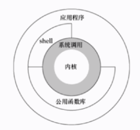

## Linux 的体系结构



体系结构主要分为用户态( 用户上层活动) 和内核态

内核: 本质是一段管理计算机硬件设备的程序

> 所有的操作都要通过内核传递给硬件

系统调用: 内核的访问接口, 是一种不能再简化的操作

> 类似于原子操作

公用函数库:系统调用的组合拳

**Shell:** 命令解释器, 可编程


## 如何查找特定的文件

find

> 语法: find path [options] params

**作用:** 指定目录向下递归地遍历其各个子目录，将满足条件的文件或者目录显示在终端

如果不设置任何参数, 将在当前目录下查找文件, 并将查找到的文件进行显示

举例:

#### 精准查找文件

```shell
# 查找当前目录目录下 名字为 hello.txt的文件
find -name hello.txt 
# 查找 /home 目录下 名字为 hello.txt的文件
find /home -name hello.txt 
# 进行全局搜索
find / -name "hello.txt" 
```

#### 模糊查找文件

```shell
# 查找以 hello打头的文件, *代表匹配一个或者多个字符, 模糊查询
find ~ -name "hello*"
```

#### 不区分大小写

```shell
# -iname 忽略大小写
find ~ -iname "hello"
```

#### 更多使用说明

```shell
man find
```


## 检索文件内容

### grep

> 语法: grep [options] pattern file

全称: Global Regular Expression Print, 支持正则表达式

作用: 查找文件里符合条件的字符串

```shell
# 从 target* 文件(使用正则)中查找包含 moo内容的文件, 只会筛选出目标字符串所在的行
grep "moo" target*
```

### 管道操作符 `|`

可将指令连接起来,前一一个指令的输出作为后一一个指令的输入

```shell
# 前半部分: 列出当前目录下所有的文件和目录, 后半部分: 将前面得到的内容座位输入流进行查找包含 hello的字符的文件或目录
find ~ | grep "hello"
```

##### 注意: 

1. 管道命令只处理前一个命令正确输出, 不处理错误输出

2. 右边命令必须能够接收标准输入流，否则传递过程中数据会被抛弃，

   > 常用来作为接收管道的命令: `sed,awk,grep,cut,head,top,less,more,wc,join,sort,split `


在内容里面查找包含某个字段的文件, 并将相关的行展示出来

```shell
grep 'partial[truel]' bsc-plat-al-data.info.lo
```

通过 -o 选择出正则表达式中想要筛选的内容

```shell
grep -o 'enginel[[O-9a-z]*]'
```

过滤掉包含相关字符串的内容

```shell
grep -V 'grep'
```


## 对文件内容做统计

### awk 

适合处理格式化的数据

语法: `awk [options] 'cmd' file`

* 一次读取一行文本，按输入分隔符进行切片,切成多个组成部分
* 将切片直接保存在内建的变量中, `$1,$2...($0表示行的全部)`
* 支持对单个切片的判断,支持循环判断, **默认分隔符为空格**

```shell
# 按照空格分隔开, 按列, 逐行保存起来, 第一列和第四列的内容被筛选出来了
awk '{print $1,$4}' netstat.txt
#  打印第一个切片为 "tcp" 并且第二个切片为 1的所有行
awk '$1=="tcp" && $2==1 {print $0}' netstat.txt
# 并且打印表头, 第一行打印出来
awk '($1=="tcp" && $2==1) || NR == 1 {print $0}' netstat.txt
# 分隔符为 "," 要用 -F
awk -F "," '{print $0}' test.txt
```


## 批量替换文件内容

### sed

**语法:** `sed [option] 'sed command' filename`

* 全名stream editor ,流编辑器
* 适合用于对文本的行内容进行处理

```shell
# 以 Str打头的内容行替换为 String
sed -i 's/Str/String/' replace.java
# 末尾的句号替换为 ;
sed -i's/.$/;/' replace.java
# 将 Jack 替换为 me, /g 全文替换
sed -i's/Jack/me/g' replace.java

# /d, 删除符合条件的行, 删除空行
sed -i '/^ *$/d' replace.java
# 删除包含hello的行
sed -i '/hello/d' replace.java
```

