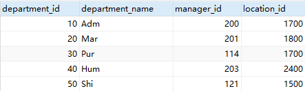
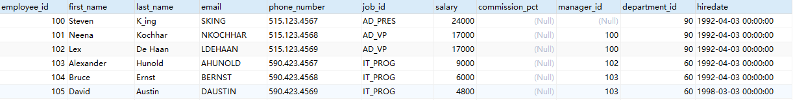
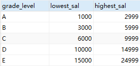
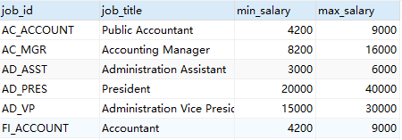
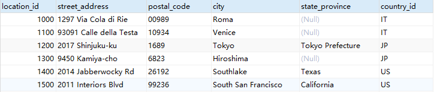

对应相关文件中的 myemployees.sql

## 表结构

#### 1. 所有表


#### 2. departments_部门表



#### 3. employees_员工表



#### 4. job_grades_工作级别



#### 5. jogs_工作表



#### 6. locations_地域表




## 基础查询

#### 练习一

```sql
USE myemployees;

-- 1.查询表中的单个字段
SELECT last_name FROM employees;

-- 2.查询表中的多个字段
SELECT last_name,salary,email FROM employees;

-- 3.查询表中的所有字段
-- 方式一：
SELECT 
    `employee_id`,
    `first_name`,
    `last_name`,
    `phone_number`,
    `last_name`,
    `job_id`,
    `phone_number`,
    `job_id`,
    `salary`,
    `commission_pct`,
    `manager_id`,
    `department_id`,
    `hiredate` 
FROM
    employees ;
-- 方式二：  
SELECT * FROM employees;

-- 4.查询常量值
SELECT 100;
SELECT 'john';

-- 5.查询表达式
SELECT 100%98;
```

#### 练习二

```sql
-- 6.查询函数
SELECT VERSION();

-- 7.起别名
 /*
 ①便于理解
 ②如果要查询的字段有重名的情况，使用别名可以区分开来
 */
-- 方式一：使用as
SELECT 100%98 AS 结果;
SELECT last_name AS 姓,first_name AS 名 FROM employees;

-- 方式二：使用空格
SELECT last_name 姓,first_name 名 FROM employees;


-- 案例：查询salary，显示结果为 out put
SELECT salary AS "out put" FROM employees;

-- 8.去重
-- 案例：查询员工表中涉及到的所有的部门编号
SELECT DISTINCT department_id FROM employees;

-- 9.+号的作用
/*
mysql中的+号：
仅仅只有一个功能：运算符
1. select 100+90; 两个操作数都为数值型，则做加法运算
2. select '123'+90;只要其中一方为字符型，试图将字符型数值转换成数值型. 如果转换成功，则继续做加法运算
3. select 'john'+90;	如果转换失败，则将字符型数值转换成0
4. select null+10; 只要其中一方为null，则结果肯定为null
*/

-- 案例：查询员工名和姓连接成一个字段，并显示为 姓名
SELECT 
	CONCAT(last_name,first_name) AS 姓名
FROM
	employees;
```

#### 练习三

```sql
-- 1.显示表departments的结构，并查询其中的全部数据
DESC departments;
SELECT * FROM `departments`;

-- 2.显示出表employees中的全部job_id（不能重复）
SELECT DISTINCT job_id FROM employees;

-- 3.显示出表employees的全部列，各个列之间用逗号连接，列头显示成OUT_PUT
SELECT
CONCAT(`first_name`,',',`last_name`,',',`job_id`,',',IFNULL(commission_pct,0)) AS out_put
FROM employees;
```


## 条件查询

#### 概念

```sql
-- 语法：
	select 
		查询列表
	from
		表名
	where
		筛选条件;

-- 分类：
	一、按条件表达式筛选
	简单条件运算符：> < = != <>(不等于 >= <=
	
	二、按逻辑表达式筛选
	逻辑运算符：
	作用：用于连接条件表达式
		&& || !
		and or not
		
	&&和and：两个条件都为true，结果为true，反之为false
	||或or： 只要有一个条件为true，结果为true，反之为false
	!或not： 如果连接的条件本身为false，结果为true，反之为false
	
	三、模糊查询
		like
		between and
		in
		is null
```

#### 练习一: 表达式和逻辑运算

```sql
一、按条件表达式筛选
-- 案例1：查询工资>12000的员工信息
SELECT *
FROM employees
WHERE salary > 12000;
	
-- 案例2：查询部门编号不等于90号的员工名和部门编号
SELECT 
	last_name,
	department_id
FROM
	employees
WHERE
	department_id <> 90;


二、按逻辑表达式筛选
-- 案例1：查询工资 在10000到20000之间的员工名、工资以及奖金
SELECT
	last_name,
	salary,
	commission_pct
FROM
	employees
WHERE
	salary>=10000 AND salary<=20000;

--案例2：查询部门编号不是在90到110之间，或者工资高于15000的员工信息
SELECT
	*
FROM
	employees
WHERE
	NOT(department_id>=90 AND  department_id<=110) OR salary>15000;
```

#### 练习二: 模糊查询

```sql
-- 1.like
/*
特点：
①一般和通配符搭配使用
	通配符：
	% 任意多个字符,包含0个字符
	_ 任意单个字符
*/

-- 案例1：查询员工名中包含字符a的员工信息
select 
	*
from
	employees
where
	last_name like '%a%';#abc

-- 案例2：查询员工名中第三个字符为 n，第五个字符为 l的员工名和工资
select
	last_name,
	salary
FROM
	employees
WHERE
	last_name LIKE '__n_l%';

-- 案例3：查询员工名中第二个字符为_的员工名

SELECT
	last_name
FROM
	employees
WHERE
	last_name LIKE '_$_%' ESCAPE '$';

-- 2.between and
/*
① 使用between and 可以提高语句的简洁度
② 包含临界值
③ 两个临界值不要调换顺序
*/

-- 案例1：查询员工编号在100到120之间的员工信息
SELECT
	*
FROM
	employees
WHERE
	employee_id >= 120 AND employee_id<=100;
----------------------
SELECT
	*
FROM
	employees
WHERE
	employee_id BETWEEN 120 AND 100;

-- 3.in
/*
含义：判断某字段的值是否属于in列表中的某一项
特点：
	① 使用in提高语句简洁度
	② in列表的值类型必须一致或兼容
	③ in列表中不支持通配符
*/

-- 案例：查询员工的工种编号是 IT_PROG、AD_VP、AD_PRES中的一个员工名和工种编号
SELECT
	last_name,
	job_id
FROM
	employees
WHERE
	job_id = 'IT_PROT' OR job_id = 'AD_VP' OR JOB_ID ='AD_PRES';
------------------
SELECT
	last_name,
	job_id
FROM
	employees
WHERE
	job_id IN( 'IT_PROT' ,'AD_VP','AD_PRES');

-- 4、is null
/*
 = 或 <> 不能用于判断null值
 is null或is not null 可以判断null值
*/

-- 案例1：查询没有奖金的员工名和奖金率
SELECT
	last_name,
	commission_pct
FROM
	employees
WHERE
	commission_pct IS NULL;

-- 案例2：查询有奖金的员工名和奖金率
SELECT
	last_name,
	commission_pct
FROM
	employees
WHERE
	commission_pct IS NOT NULL;

-- 案例三: 查询工资为 12000的员工名和奖金率
-- 错误写法
SELECT
	last_name,
	commission_pct
FROM
	employees
WHERE 
	salary IS 12000;
-- 正确写法
SELECT
	last_name,
	commission_pct, salary
FROM
	employees
WHERE 
	salary = 12000;

-- 安全等于  <=>
-- 案例1：查询没有奖金的员工名和奖金率
SELECT
	last_name,
	commission_pct
FROM
	employees
WHERE
	commission_pct <=> NULL;
	
-- 案例2：查询工资为12000的员工信息
SELECT
	last_name,
	salary
FROM
	employees

WHERE 
	salary <=> 12000;
	

-- is null pk <=>
IS NULL:仅仅可以判断NULL值，可读性较高，建议使用
<=>    :既可以判断NULL值，又可以判断普通的数值，可读性较低
```


## 常见函数

#### 概念

```sql
/*
概念：类似于java的方法，将一组逻辑语句封装在方法体中，对外暴露方法名
好处：1、隐藏了实现细节  2、提高代码的重用性
调用：select 函数名(实参列表) 【from 表】;
特点：
	① 叫什么（函数名）
	② 干什么（函数功能）

分类：
	1、单行函数
	如 concat、length、ifnull等
	2、分组函数
	
	功能：做统计使用，又称为统计函数、聚合函数、组函数
	
常见函数：
	一、单行函数
	字符函数：
        length:获取字节个数(utf-8一个汉字代表3个字节,gbk为2个字节)
        concat
        substr
        instr
        trim
        upper
        lower
        lpad
        rpad
        replace
	
	数学函数：
        round
        ceil
        floor
        truncate
        mod
	
	日期函数：
        now
        curdate
        curtime
        year
        month
        monthname
        day
        hour
        minute
        second
        str_to_date
        date_format
	其他函数：
        version
        database
        user
        控制函数
        if
        case
*/
```

#### 常见函数: 字符函数

```sql
-- 1.length 获取参数值的字节个数
SELECT LENGTH('john');
SELECT LENGTH('张三丰hahaha');
SHOW VARIABLES LIKE '%char%'

-- 2.concat 拼接字符串
SELECT CONCAT(last_name,'_',first_name) 姓名 FROM employees;

-- 3.upper、lower
SELECT UPPER('john');
SELECT LOWER('joHn');
-- 示例：将姓变大写，名变小写，然后拼接
SELECT CONCAT(UPPER(last_name),LOWER(first_name))  姓名 FROM employees;

-- 4.substr、substring
-- 注意：索引从1开始
-- 截取从指定索引处后面所有字符
SELECT SUBSTR('李莫愁爱上了陆展元',7)  out_put;
-- 截取从指定索引处指定字符长度的字符
SELECT SUBSTR('李莫愁爱上了陆展元',1,3) out_put;

-- 案例：姓名中首字符大写，其他字符小写然后用_拼接，显示出来
SELECT 
	CONCAT(UPPER(SUBSTR(last_name,1,1)),'_',LOWER(SUBSTR(last_name,2)))  out_put
FROM employees;

-- 5.instr 返回子串第一次出现的索引，如果找不到返回0
SELECT INSTR('杨不殷六侠悔爱上了殷六侠','殷八侠') AS out_put;

-- 6.trim
SELECT LENGTH(TRIM('    张翠山    ')) AS out_put;

SELECT TRIM('aa' FROM 'aaaaaaaaa张aaaaaaaaaaaa翠山aaaaaaaaaaaaaaaaaaaaaaaaaaaaaaaaaaaaa')  AS out_put;

#7.lpad 用指定的字符实现左填充指定长度

SELECT LPAD('殷素素',2,'*') AS out_put;

#8.rpad 用指定的字符实现右填充指定长度

SELECT RPAD('殷素素',12,'ab') AS out_put;


#9.replace 替换
SELECT REPLACE('周芷若周芷若周芷若周芷若张无忌爱上了周芷若','周芷若','赵敏') AS out_put;
```

#### 二、数学函数

```sql
#round 四舍五入
SELECT ROUND(-1.55);
SELECT ROUND(1.567,2);


#ceil 向上取整,返回>=该参数的最小整数

SELECT CEIL(-1.02);

#floor 向下取整，返回<=该参数的最大整数
SELECT FLOOR(-9.99);

#truncate 截断

SELECT TRUNCATE(1.69999,1);

#mod取余
/*
mod(a,b) ：  a-a/b*b

mod(-10,-3):-10- (-10)/(-3)*（-3）=-1
*/
SELECT MOD(10,-3);
SELECT 10%3;
```

#### 三、日期函数

```sql
#now 返回当前系统日期+时间
SELECT NOW();

#curdate 返回当前系统日期，不包含时间
SELECT CURDATE();

#curtime 返回当前时间，不包含日期
SELECT CURTIME();


#可以获取指定的部分，年、月、日、小时、分钟、秒
SELECT YEAR(NOW()) 年;
SELECT YEAR('1998-1-1') 年;

SELECT  YEAR(hiredate) 年 FROM employees;

SELECT MONTH(NOW()) 月;
SELECT MONTHNAME(NOW()) 月;


#str_to_date 将字符通过指定的格式转换成日期

SELECT STR_TO_DATE('1998-3-2','%Y-%c-%d') AS out_put;

#查询入职日期为1992--4-3的员工信息
SELECT * FROM employees WHERE hiredate = '1992-4-3';

SELECT * FROM employees WHERE hiredate = STR_TO_DATE('4-3 1992','%c-%d %Y');


#date_format 将日期转换成字符

SELECT DATE_FORMAT(NOW(),'%y年%m月%d日') AS out_put;

#查询有奖金的员工名和入职日期(xx月/xx日 xx年)
SELECT last_name,DATE_FORMAT(hiredate,'%m月/%d日 %y年') 入职日期
FROM employees
WHERE commission_pct IS NOT NULL;


#四、其他函数

SELECT VERSION();
SELECT DATABASE();
SELECT USER();


#五、流程控制函数
#1.if函数： if else 的效果

SELECT IF(10<5,'大','小');

SELECT last_name,commission_pct,IF(commission_pct IS NULL,'没奖金，呵呵','有奖金，嘻嘻') 备注
FROM employees;


#2.case函数的使用一： switch case 的效果

/*
java中
switch(变量或表达式){
	case 常量1：语句1;break;
	...
	default:语句n;break;


}

mysql中

case 要判断的字段或表达式
when 常量1 then 要显示的值1或语句1;
when 常量2 then 要显示的值2或语句2;
...
else 要显示的值n或语句n;
end
*/

/*案例：查询员工的工资，要求

部门号=30，显示的工资为1.1倍
部门号=40，显示的工资为1.2倍
部门号=50，显示的工资为1.3倍
其他部门，显示的工资为原工资

*/


SELECT salary 原始工资,department_id,
CASE department_id
WHEN 30 THEN salary*1.1
WHEN 40 THEN salary*1.2
WHEN 50 THEN salary*1.3
ELSE salary
END AS 新工资
FROM employees;


#3.case 函数的使用二：类似于 多重if
/*
java中：
if(条件1){
	语句1；
}else if(条件2){
	语句2；
}
...
else{
	语句n;
}

mysql中：

case 
when 条件1 then 要显示的值1或语句1
when 条件2 then 要显示的值2或语句2
。。。
else 要显示的值n或语句n
end
*/

#案例：查询员工的工资的情况
如果工资>20000,显示A级别
如果工资>15000,显示B级别
如果工资>10000，显示C级别
否则，显示D级别


SELECT salary,
CASE 
WHEN salary>20000 THEN 'A'
WHEN salary>15000 THEN 'B'
WHEN salary>10000 THEN 'C'
ELSE 'D'
END AS 工资级别
FROM employees;
```

