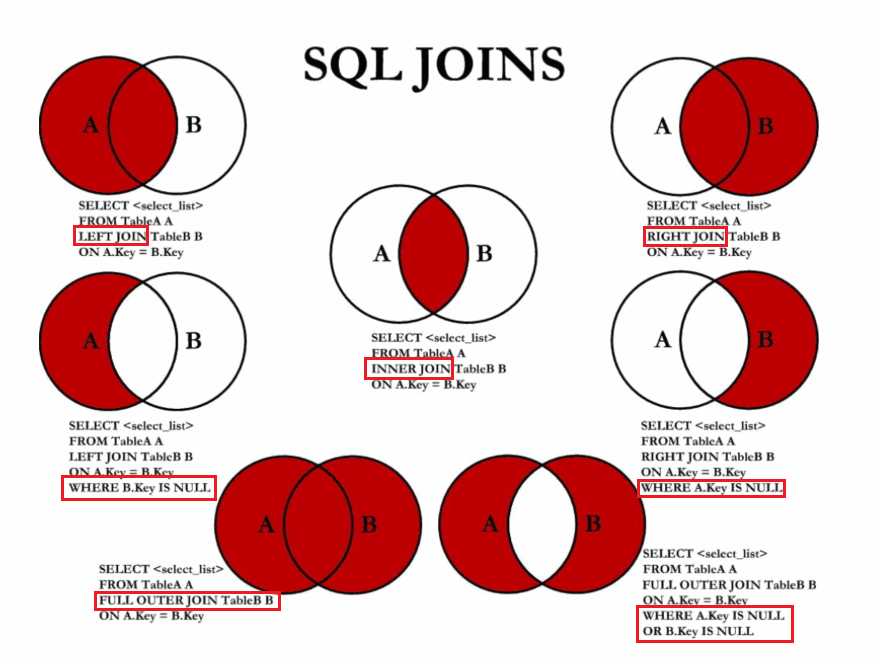

## 排序查询

#### 讲解

```sql
语法：
select 查询列表
from 表名
【where  筛选条件】
order by 排序的字段或表达式;

特点：
1、asc代表的是升序，可以省略
desc代表的是降序
2、order by子句可以支持 单个字段、别名、表达式、函数、多个字段
3、order by子句在查询语句的最后面，除了limit子句
```

#### 练习一

```sql
# 1.按单个字段排序
SELECT * FROM employees ORDER BY salary DESC;

# 2.添加筛选条件再排序
-- 案例：查询部门编号>=90的员工信息，并按员工编号降序
SELECT *
FROM employees
WHERE department_id>=90
ORDER BY employee_id DESC;

#3、按表达式排序
-- 案例：查询员工信息 按年薪降序
SELECT *,salary*12*(1+IFNULL(commission_pct,0))
FROM employees
ORDER BY salary*12*(1+IFNULL(commission_pct,0)) DESC;

# 4.按别名排序
-- 案例：查询员工信息 按年薪升序
SELECT *,salary*12*(1+IFNULL(commission_pct,0)) 年薪
FROM employees
ORDER BY 年薪 ASC;

# 5.按函数排序
-- 案例：查询员工名，并且按名字的长度降序
SELECT LENGTH(last_name),last_name 
FROM employees
ORDER BY LENGTH(last_name) DESC;

#6、按多个字段排序
-- 案例：查询员工信息，要求先按工资降序，再按employee_id升序
SELECT *
FROM employees
ORDER BY salary DESC,employee_id ASC;
```

#### 练习二

```sql
-- 1.查询员工的姓名和部门号和年薪，按年薪降序 按姓名升序
SELECT last_name,department_id,salary*12*(1+IFNULL(commission_pct,0)) 年薪
FROM employees
ORDER BY 年薪 DESC,last_name ASC;

-- 2.选择工资不在8000到17000的员工的姓名和工资，按工资降序
SELECT last_name,salary
FROM employees
WHERE salary NOT BETWEEN 8000 AND 17000
ORDER BY salary DESC;

-- 3.查询邮箱中包含e的员工信息，并先按邮箱的字节数降序，再按部门号升序
SELECT *,LENGTH(email)
FROM employees
WHERE email LIKE '%e%'
ORDER BY LENGTH(email) DESC,department_id ASC;
```


## 分组查询

#### 概念

```
select 查询列表
from 表
【where 筛选条件】
group by 分组的字段
【order by 排序的字段】;

特点：
1、和分组函数一同查询的字段必须是group by后出现的字段
2、筛选分为两类：分组前筛选和分组后筛选
			针对的表				  位置		连接的关键字
分组前筛选	  原始表				group by前		where
	
分组后筛选	group by后的结果集      group by后	  having

问题1：分组函数做筛选能不能放在where后面
答：不能

问题2：where——group by——having

一般来讲，能用分组前筛选的，尽量使用分组前筛选，提高效率

3、分组可以按单个字段也可以按多个字段
4、可以搭配着排序使用
```

#### 练习一

```sql
-- 引入：查询每个部门的员工个数
SELECT COUNT(*) FROM employees WHERE department_id=90;

#1.简单的分组
-- 案例1：查询每个工种的员工平均工资
SELECT AVG(salary),job_id
FROM employees
GROUP BY job_id;

-- 案例2：查询每个位置的部门个数
SELECT COUNT(*),location_id
FROM departments
GROUP BY location_id;


# 2、可以实现分组前的筛选
-- 案例1：查询邮箱中包含a字符的 每个部门的最高工资
SELECT MAX(salary),department_id
FROM employees
WHERE email LIKE '%a%'
GROUP BY department_id;

-- 案例2：查询有奖金的每个领导手下员工的平均工资
SELECT AVG(salary),manager_id
FROM employees
WHERE commission_pct IS NOT NULL
GROUP BY manager_id;

#3、分组后筛选
-- 案例：查询哪个部门的员工个数>5
-- ① 查询每个部门的员工个数
SELECT COUNT(*),department_id
FROM employees
GROUP BY department_id;
-- ② 筛选刚才 ①结果
SELECT COUNT(*),department_id
FROM employees
GROUP BY department_id
HAVING COUNT(*)>5;

-- 案例2：每个工种有奖金的员工的最高工资>12000的工种编号和最高工资
SELECT job_id,MAX(salary)
FROM employees
WHERE commission_pct IS NOT NULL
GROUP BY job_id
HAVING MAX(salary)>12000;

-- 案例3：领导编号>110的每个领导手下的最低工资大于5000的领导编号和最低工资
SELECT manager_id, MIN(salary)
FROM employees
WHERE manager_id > 110
GROUP BY manager_id
HAVING MIN(salary) > 5000;

#4.添加排序
-- 案例：每个工种有奖金的员工的最高工资>6000的工种编号和最高工资,按最高工资升序
SELECT job_id,MAX(salary) m
FROM employees
WHERE commission_pct IS NOT NULL
GROUP BY job_id
HAVING m>6000
ORDER BY m ;

#5.按多个字段分组
-- 案例：查询每个工种每个部门的最低工资,并按最低工资降序
SELECT MIN(salary),job_id,department_id
FROM employees
GROUP BY department_id,job_id
ORDER BY MIN(salary) DESC;
```

#### 练习二

```sql
-- 1.查询各 job_id的员工工资的最大值，最小值，平均值，总和，并按 job_id升序
SELECT MAX(salary),MIN(salary),AVG(salary),SUM(salary),job_id
FROM employees
GROUP BY job_id
ORDER BY job_id;

-- 2.查询员工最高工资和最低工资的差距（DIFFERENCE）
SELECT MAX(salary)-MIN(salary) DIFFRENCE
FROM employees;

-- 3.查询各个管理者手下员工的最低工资，其中最低工资不能低于6000，没有管理者的员工不计算在内
SELECT MIN(salary),manager_id
FROM employees
WHERE manager_id IS NOT NULL
GROUP BY manager_id
HAVING MIN(salary)>=6000;

-- 4.查询所有部门的编号，员工数量和工资平均值,并按平均工资降序
SELECT department_id,COUNT(*),AVG(salary) a
FROM employees
GROUP BY department_id
ORDER BY a DESC;

-- 5.选择具有各个job_id的员工人数
SELECT COUNT(*) 个数,job_id
FROM employees
GROUP BY job_id;
```


## 连接查询

#### 讲解

```sql
含义：又称多表查询，当查询的字段来自于多个表时，就会用到连接查询

笛卡尔乘积现象：表1 有m行，表2有n行，结果=m*n行

发生原因：没有有效的连接条件
如何避免：添加有效的连接条件

分类：
	按年代分类：
	sql92标准:仅仅支持内连接
	sql99标准【推荐】：支持内连接+外连接（左外和右外）+交叉连接
	
	按功能分类：
		内连接：
			等值连接
			非等值连接
			自连接
		外连接：
			左外连接
			右外连接
			全外连接
		
		交叉连接
```

#### 练习一: 内连接

```sql
#查询员工名、工种号、工种名
SELECT e.last_name,e.job_id,j.job_title
FROM employees e,jobs j
WHERE e.`job_id`=j.`job_id`;

#3、两个表的顺序是否可以调换, 可以
-- 查询员工名、工种号、工种名
SELECT e.last_name,e.job_id,j.job_title
FROM jobs j,employees e
WHERE e.`job_id`=j.`job_id`;


#4、可以加筛选
-- 案例：查询有奖金的员工名、部门名
SELECT last_name,department_name,commission_pct
FROM employees e,departments d
WHERE e.`department_id`=d.`department_id`
AND e.`commission_pct` IS NOT NULL;

-- 案例2：查询城市名中第二个字符为o的部门名和城市名
SELECT department_name,city
FROM departments d,locations l
WHERE d.`location_id` = l.`location_id`
AND city LIKE '_o%';

#5、可以加分组
-- 案例1：查询每个城市的部门个数
SELECT COUNT(*) 个数,city
FROM departments d,locations l
WHERE d.`location_id`=l.`location_id`
GROUP BY city;

-- 案例2：查询有奖金的每个部门的部门名和部门的领导编号和该部门的最低工资
SELECT department_name,d.`manager_id`,MIN(salary)
FROM departments d,employees e
WHERE d.`department_id`=e.`department_id`
AND commission_pct IS NOT NULL
GROUP BY department_name,d.`manager_id`;

#6、可以加排序
-- 案例：查询每个工种的工种名和员工的个数，并且按员工个数降序
SELECT job_title,COUNT(*)
FROM employees e,jobs j
WHERE e.`job_id`=j.`job_id`
GROUP BY job_title
ORDER BY COUNT(*) DESC;

#7、可以实现三表连接？
-- 案例：查询员工名、部门名和所在的城市
SELECT last_name,department_name,city
FROM employees e,departments d,locations l
WHERE e.`department_id`=d.`department_id`
AND d.`location_id`=l.`location_id`
AND city LIKE 's%'
ORDER BY department_name DESC;

#2、非等值连接
-- 案例1：查询员工的工资和工资级别
SELECT salary,grade_level
FROM employees e,job_grades g
WHERE salary BETWEEN g.`lowest_sal` AND g.`highest_sal`
AND g.`grade_level`='A';

#3、自连接
-- 案例：查询 员工名和上级的名称
SELECT e.employee_id,e.last_name,m.employee_id,m.last_name
FROM employees e,employees m
WHERE e.`manager_id`=m.`employee_id`;
```

#### 练习二 

```
语法：
	select 查询列表
	from 表1 别名 【连接类型】
	join 表2 别名 
	on 连接条件
	【where 筛选条件】
	【group by 分组】
	【having 筛选条件】
	【order by 排序列表】
	

分类：
内连接（★）：inner, 可以省略
外连接
	左外(★):left 【outer】
	右外(★)：right 【outer】
	全外：full【outer】
交叉连接：cross 

#一）内连接

语法：

select 查询列表
from 表1 别名
inner join 表2 别名
on 连接条件;

分类：
等值
非等值
自连接

特点：
①添加排序、分组、筛选
②inner可以省略
③ 筛选条件放在where后面，连接条件放在on后面，提高分离性，便于阅读
④inner join连接和sql92语法中的等值连接效果是一样的，都是查询多表的交集
```

#### 练习一: 内连接

```sql
#1、等值连接
-- 案例1.查询员工名、部门名
SELECT last_name,department_name
FROM departments d
JOIN  employees e
ON e.`department_id` = d.`department_id`;

-- 案例2.查询名字中包含e的员工名和工种名（添加筛选）
SELECT last_name,job_title
FROM employees e
INNER JOIN jobs j
ON e.`job_id`=  j.`job_id`
WHERE e.`last_name` LIKE '%e%';

-- 3. 查询部门个数>3的城市名和部门个数，（添加分组+筛选）

#①查询每个城市的部门个数
#②在①结果上筛选满足条件的
SELECT city,COUNT(*) 部门个数
FROM departments d
INNER JOIN locations l
ON d.`location_id`=l.`location_id`
GROUP BY city
HAVING COUNT(*)>3;


#案例4.查询哪个部门的员工个数>3的部门名和员工个数，并按个数降序（添加排序）

#①查询每个部门的员工个数
SELECT COUNT(*),department_name
FROM employees e
INNER JOIN departments d
ON e.`department_id`=d.`department_id`
GROUP BY department_name

#② 在①结果上筛选员工个数>3的记录，并排序

SELECT COUNT(*) 个数,department_name
FROM employees e
INNER JOIN departments d
ON e.`department_id`=d.`department_id`
GROUP BY department_name
HAVING COUNT(*)>3
ORDER BY COUNT(*) DESC;

#5.查询员工名、部门名、工种名，并按部门名降序（添加三表连接）

SELECT last_name,department_name,job_title
FROM employees e
INNER JOIN departments d ON e.`department_id`=d.`department_id`
INNER JOIN jobs j ON e.`job_id` = j.`job_id`

ORDER BY department_name DESC;

#二）非等值连接

#查询员工的工资级别

SELECT salary,grade_level
FROM employees e
JOIN job_grades g
ON e.`salary` BETWEEN g.`lowest_sal` AND g.`highest_sal`;
 
 
-- 查询工资级别的个数>20的个数，并且按工资级别降序
SELECT COUNT(*),grade_level
FROM employees e
JOIN job_grades g
ON e.`salary` BETWEEN g.`lowest_sal` AND g.`highest_sal`
GROUP BY grade_level
HAVING COUNT(*)>20
ORDER BY grade_level DESC;
  
三）自连接
-- 查询员工的名字、上级的名字
SELECT e.last_name,m.last_name
FROM employees e
JOIN employees m
ON e.`manager_id`= m.`employee_id`;

-- 查询姓名中包含字符k的员工的名字、上级的名字
SELECT e.last_name,m.last_name
FROM employees e
JOIN employees m
ON e.`manager_id`= m.`employee_id`
WHERE e.`last_name` LIKE '%k%';
```

#### 练习三: 外连接

```sql
 /*
 应用场景：用于查询一个表中有，另一个表没有的记录

 特点：
 1、外连接的查询结果为主表中的所有记录
	如果从表中有和它匹配的，则显示匹配的值
	如果从表中没有和它匹配的，则显示null
	外连接查询结果=内连接结果+主表中有而从表没有的记录
 2、左外连接，left join左边的是主表
    右外连接，right join右边的是主表
 3、左外和右外交换两个表的顺序，可以实现同样的效果 
 4、全外连接=内连接的结果+表1中有但表2没有的+表2中有但表1没有的
 */


-- 案例1：查询哪个部门没有员工
#左外
SELECT d.*,e.employee_id
FROM departments d
LEFT OUTER JOIN employees e
ON d.`department_id` = e.`department_id`
WHERE e.`employee_id` IS NULL;

#右外
SELECT d.*,e.employee_id
FROM employees e
RIGHT OUTER JOIN departments d
ON d.`department_id` = e.`department_id`
WHERE e.`employee_id` IS NULL;

#全外
USE girls;
SELECT b.*,bo.*
FROM beauty b
FULL OUTER JOIN boys bo
ON b.`boyfriend_id` = bo.id;

#交叉连接
SELECT b.*,bo.*
FROM beauty b
CROSS JOIN boys bo;

#sql92和 sql99pk
/*
功能：sql99支持的较多
可读性：sql99实现连接条件和筛选条件的分离，可读性较高
*/
```

#### 结构图



#### 练习四

```sql
USE myemployees;
-- 1.显示所有员工的姓名，部门号和部门名称。
SELECT last_name,d.department_id,department_name
FROM employees e,departments d
WHERE e.`department_id` = d.`department_id`;
或者
SELECT last_name,d.department_id,department_name
FROM employees e
JOIN departments d
ON e.`department_id` = d.`department_id`;

-- 2.查询90号部门员工的job_id和90号部门的location_id
SELECT job_id,location_id
FROM employees e,departments d
WHERE e.`department_id`=d.`department_id`
AND e.`department_id`=90;

-- 3.选择所有有奖金的员工的 last_name, department_name, location_id, city
SELECT last_name , department_name , l.location_id , city
FROM employees e,departments d,locations l
WHERE e.department_id = d.department_id
AND d.location_id=l.location_id
AND e.commission_pct IS NOT NULL;


-- 4.选择city在Toronto工作的员工的last_name , job_id , department_id , department_name 
SELECT last_name , job_id , d.department_id , department_name 
FROM employees e,departments d ,locations l
WHERE e.department_id = d.department_id
AND d.location_id=l.location_id
AND city = 'Toronto';

-- 5.查询每个工种、每个部门的部门名、工种名和最低工资
SELECT department_name,job_title,MIN(salary) 最低工资
FROM employees e,departments d,jobs j
WHERE e.`department_id`=d.`department_id`
AND e.`job_id`=j.`job_id`
GROUP BY department_name,job_title;

-- 6.查询每个国家下的部门个数大于2的国家编号
SELECT country_id,COUNT(*) 部门个数
FROM departments d,locations l
WHERE d.`location_id`=l.`location_id`
GROUP BY country_id
HAVING 部门个数>2;

-- 7、选择指定员工的姓名，员工号，以及他的管理者的姓名和员工号，结果类似于下面的格式
employees	Emp#	manager	Mgr#
kochhar		101	king	100

SELECT e.last_name employees,e.employee_id "Emp#",m.last_name manager,m.employee_id "Mgr#"
FROM employees e,employees m
WHERE e.manager_id = m.employee_id
AND e.last_name='kochhar';

-- 查询哪个城市没有部门
SELECT city
FROM departments d
RIGHT OUTER JOIN locations l 
ON d.`location_id`=l.`location_id`
WHERE  d.`department_id` IS NULL;

-- 查询部门名为SAL或IT的员工信息
SELECT e.*,d.department_name,d.`department_id`
FROM departments  d
LEFT JOIN employees e
ON d.`department_id` = e.`department_id`
WHERE d.`department_name` IN('SAL','IT');
```


