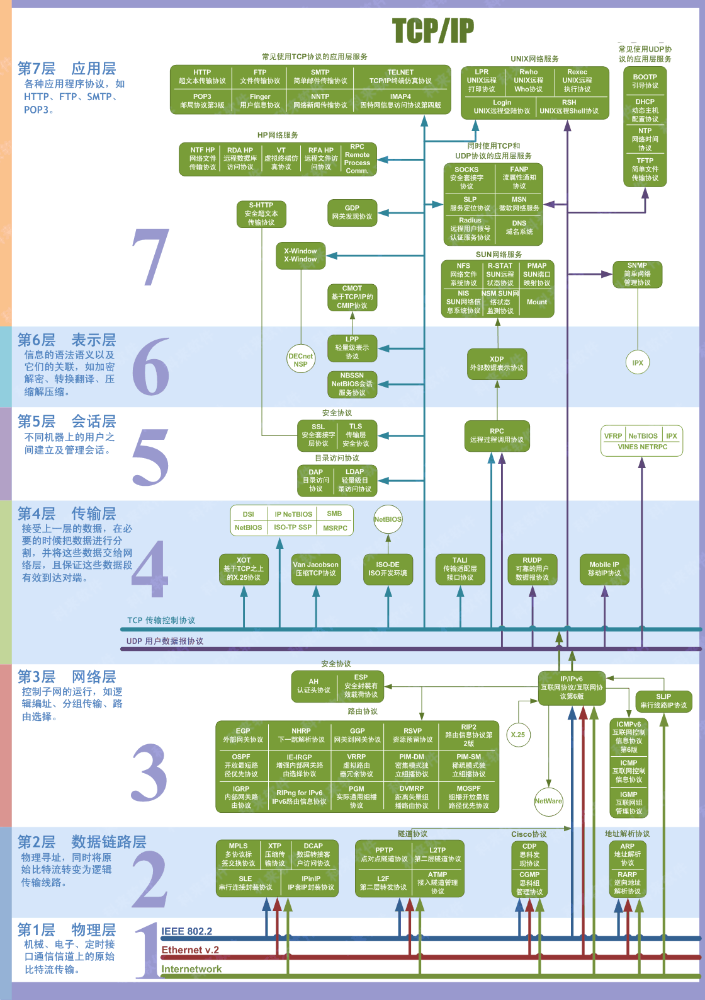
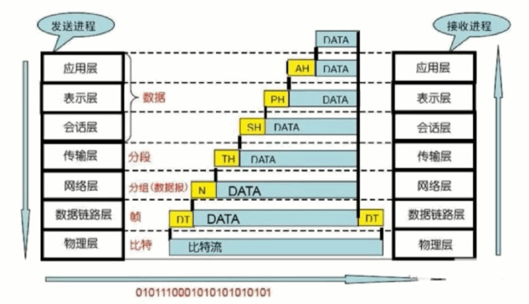

## OSI七层模型

#### 出现

国际标准化组织 ISO 制定的 OSI模型是业界提出来的概念性框架

OSI 开放系统参考模型及OSI七层协议

分组通信协议很复杂，OSI参考模型将其分为了易于理解的七个分层

##### 模型理解

##### 每层的作用

##### 具体协议

#### 理解

* **物理层:** 首先要解决物理间信息传输的问题, 如何传输, 物理层解决

  > 物理接口规范，传输比特流,网卡是工作在物理层的。
  >
  > 基本的数据单位是比特

* **数据链路层:** 传输过程中可能出现数据传输错误, 丢失等问题, 数据链路层来解决

  > 封装成帧成帧，保证帧的无误传输，MAC地址，形成EHTHERNET帧
  >
  > 基本的数据单位是帧, 将比特封装成帧

* **网络层:** 可以传输了, 但是如何定位发送的主机, 确定具体位置, 网络层来解决

  > 路由选择，流量控制，IP地址，形成IP包
  >
  > 基本的数据单位是IP数据报

* **传输层:** 随着要求, 发送的数据, 越来越大, 将数据进行切割发送. 如何将数据发送过去的方式, 传输层来解决

  > 端口地址，如HTTP对应80端口。TCP和UDP工作于该层,还有就是差错校验和流量控制。

* **会话层:** 自动收发包, 自动寻址. 会话层

  > 组织两个会话进程之间的通信,并管理数据的交换使用NETBIOS和WINSOCK协议。QQ等软件进行通讯因该是工作在会话层的。

* **表示层:** 不同系统之间要进行通信,语法等不一致, 表示层解决

  > 使得不同操作系统之间通信成为可能。

* **应用层:** 解析这些数据是干什么的. 应用层

  > 对应于各个应用软件

### 1. 物理层

#### 出现

首先要解决两台物理机之间的通信需求，具体就是机器 A往机器 B发送比特流，机器B能收到这些比特流，这便是物理层要做的事情

物理层主要定义了物理设备的标准，如网线的类型，光纤的接口类型，各种传输介质的传输速率

传输比特流(即一串 0101二进制数据信息)，将他们转化为电流强弱来进行传出，到达目的后，再转化比特流(0101的机器码)，也就是我们常说的数模转换与模数转换

#### 其他

物理层的数据单位是做**比特流**. 

网卡就是工作在这一层里面

### 2. 数据链路层

#### 出现

在传输比特流的过程中，会产生错传数据传输不完整的可能，因此呢，数据链路上应运而生

数据链路上 **定义了如何格式化数据以进行传输, 以及如何控制对物理介质的访问**，这层还**提供错误检测和纠正，以确保数据传输的可靠性**

#### 基本问题

本层将**比特数据组成了帧**, 其中交换机工作在这一层里面对帧解码，并根据帧包含的信息把数据发送到正确的接收方

##### 1. 封装成帧

将网络层传下来的分组添加首部和尾部，用于标记帧的开始和结束。

##### 2. 透明传输

透明表示一个实际存在的事物看起来好像不存在一样。

帧使用首部和尾部进行定界，如果帧的数据部分含有和首部尾部相同的内容，那么帧的开始和结束位置就会被错误的判定。需要在数据部分出现首部尾部相同的内容前面插入转义字符。如果数据部分出现转义字符，那么就在转义字符前面再加个转义字符。在接收端进行处理之后可以还原出原始数据。这个过程透明传输的内容是转义字符，用户察觉不到转义字符的存在。

##### 3. 差错检测

数据在传输的时候，最后都是以bit流的形式传输。而传输我们不能保证一定不出错，所以提供一定的检测和纠错机制还是很有必要的；其实说这个是数据链路层的差错检测，也可以说是整个网络数据传输过程中的一种差错检测的思想；因为稍后你就会看到我们将的不仅是数据链路层的差错检测；

目前数据链路层广泛使用了循环冗余检验（CRC）来检查比特差错。

#### MAC 地址

MAC 地址是链路层地址，长度为 6 字节（48 位），用于唯一标识网络适配器（网卡）。一台主机拥有多少个网络适配器就有多少个 MAC 地址。例如笔记本电脑普遍存在无线网络适配器和有线网络适配器，因此就有两个 MAC 地址。

#### 其他

数据链路层的数据单位是**数据帧**, 代表性的数据帧: MAC帧(截止访问控制帧)

交换机就是工作在这一层里面

数据链路层协议的代表包括：PPP, CSMA/CD等。

### 3. 网络层

随着网络节点的不断增加，点对点通信的时候，是需要经过多个节点的，那么如何找到目标节点，如何选择最佳路径便成为了首要需求

便有了网络层, 主要作用**将网络地址翻译成对应的物理地址，并决定如何将数据从发送方路由到接收方**，网络层通过综合考虑发送优先权网络拥塞程度，服务质量以及可选路由的花费来决定从一个网络中节点a到另一个网络中节点b的最佳路径，由于网络层处理并智能制造数据传送. 路由器连接网络各段，所以路由器属于网络层

#### 其他

此层的数据我们称之为数据包，本层我们需要关注的协议，主要是TCP/IP协议里面的IP协议

与 IP 协议配套使用的还有三个协议：

- 地址解析协议 ARP (Address Resolution Protocol): 通过ip地址来解析主机的mac地址
- 网际控制报文协议 ICMP (Internet Control Message Protocol): 两部分ICMP差错报告报文、ICMP询问报文, 比如我们经常用来测试网络连接畅通的ping命令等
- 网际组管理协议 IGMP (Internet Group Management Protocol): 用于多播

网络层的数据单位是**数据包/ 数据分组**, 代表性数据分组: IP数据分组

### 4. 传输层

#### 出现

随着网络通信需求的进一步扩大，通信过程中需要发送大量的数据，如海量文件传输的，可能需要很长时间，而网络在通信的过程中会中断好多次，此时为了保证传输大量文件是的准确性，需要对发出去数据进行切分，切割为一个一个的段落(即segment)进行了发送，那么其中一个段落丢失了该怎么办？要不要重传每个段落？要按照顺序到达吗？这个便是传输层需要考虑的问题了

网络层只把分组发送到目的主机，但是真正通信的并不是主机而是主机中的进程。传输层提供了进程间的逻辑通信，传输层向高层用户屏蔽了下面网络层的核心细节，使应用程序看起来像是在两个传输层实体之间有一条端到端的逻辑通信信道。

传输层解决了**主机间的数据传输, 数据间的传输可以是不同网络的，并且呢，传输层解决了传输质量的问题,该层称之为 OSI模型中最重要的一层了**，传输协议同时进行流量控制或是基于接收方可接收数据的快慢程度，规定适当的发送速率，除此之外，传输层按照网络能处理的最大尺寸，将较强的数据包进行强制分割，例如以太网无法接收大于1500字节的数据包，发送方节点的传输层, 将数据分成较小的数据片. 同时，对每一数据片安排一个序列号。以便数据到达接收方节点的传输层时，能以正确的顺序重组，该过程即称为排序

#### 其他

传输层中需要我们关注的协议有TCP/IPC 中的的TCP协议和UDP协议

* TCP的数据单位是是**报文段**
* UDP的数据单位是**用户数据报**

### 5. 会话层

现在，我们已经保证给正确的计算机发送正确的封装过后的信息了，但是用户级别的体验好不好，难道我每次都要去调用TCP去打包，然后调用IP协议去找路由自己去发?

当然不行，所以我们**要建立一个自动收发包自动寻址的功能**，于是发明了会话层. 会话层的作用就是建立和管理应用程序之间的通信

### 6. 表示层

现在能保证应用程序自动收发包和选址了，但我要用Linux给windows发包，两个系统语法不一致，就像安装包一样，exe是不能在linux那上面去执行的，shell在windows下也是不能直接运行的. 表示层来帮我们解决不同系统之间的通信语法的问题，在表示层数据将按照网络能理解的方案进行格式化，这种格式化也因所使用网络的类型不同而不同

### 7. 应用层

虽然发送方知道自己发送的是什么东西(01字符的顺序), 但是转换成字节数据之后有多长，但接收方肯定不知道

所以应用层的网络协议诞生了，它规定发送方和接收方必须使用一个固定长度的消息头，消息头必须使用某种固定的组成，而且消息头里必须记录消息体的长度等一系列信息，**以方便接收方能够正确的解析发送方发送的数据**，应用层，能够让你更方便的应用服务网络中接收到的数据，至于数据的传递，没有该层你也可以直接在两台电脑前开干，只不过传来传去就是一个1和0组成的字节数组，该层需要我们重点去关注的是与之相对应的TCP/IP协议中的HTTP协议

数据单位是 **报文**

#### 总结

以上就是关于 OSI各层次的划分，那从应用层的开始，都会对要传输的数据头部进行处理，加上本层的一些信息，最终呢，由物理层通过以太网电缆等介质，将数据解析成比特流在网络中传输，数据传递到目标地址，并自底而上的将先前对应成的头部给解析分离出来

#### OSI开放式互联参考模型

先自上而下, 后自下而上处理数据头部

