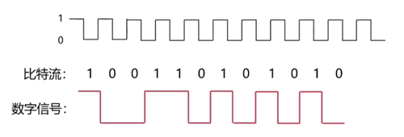
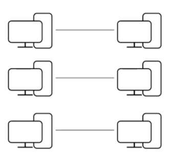

## 物理层概述

### 位置

物理层位于层次结构的最底层. 

## 物理层的作用

### 1. 连接不同的物理设备

#### 举例

* 中国的主干 ISP和美国的主干 ISP相连接, 需要通过海底电缆进行连接

* 路由器到本地的计算机通过网线进行连接

  > 电缆和网线都属于物理层的设备

#### 连接不同物理设备的介质

* **双绞线:** 包括无屏蔽 / 有屏蔽双绞线, 网线也是一种双绞线

  

* **同轴电缆**

  

* **光纤** 

  

* **无线介质:** 红外线, 无线 wife信号, 激光

### 2. 传输比特流

比特流就是 0101这样的高低电频或者数字信号

#### 比特流

高电频表示 1, 低电频表示 0, 这样高低电频的交替表示就可以表示我们的比特流

讨论物理层是更多讨论物理层的设备, 我们更关心

* 机械特性
* 电气特性
* 功能特性
* 过程特性

##### 一句话总结

物理层解决的问题是连接问题, 是连接不同的物理设备, 传输比特流

## 信道

#### 是什么

* 信道是**往一个方向传送信息的媒体.** 

* **一条通信电路包含一个接收信道和一个发送信道**, 因为通信电路中的接收以及发送是信息传送的两个方向

  

  

#### 问题

一条通信电路既发送又接收, 这样子引起了冲突怎么办? 

物理层已经解决了这个问题, 具体的不用了解

#### 信道分类

* **单工通信信道:** 只能一个方向通信, 没有反方向反馈的信道

  > 现实生活中的有限电视, 无线电收音机等等

* **半双工通信信道:** 双方都可以发送和接受信息. 但是不能双方不能同时发送或者同时接收

  > 这个信道是比较落后的, 通常采用全双工通信信道

* **全双工通信信道:** 双方都可以同时发送和接收信息

  > 基本都是用这种比如网线, 网络

##### 一句话总结

信道就是单向的信息传递的道路, 有三中类型

## 分用 - 复用技术

#### 由来

如果两个计算机进行通信的话, 在他们之间有一条通信电路(包括发送信道和接收信道)

#### 问题

我们考虑一种情况, 有很多的计算机, 他们之间要进行连接, 就会有很多的发送信道和接收信道, 并且在很多时候他们之间并不是出于活跃的状态, **会导致信道的利用率并不高.** 

#### 解决

于是提出了分用-复用的技术, 通过这个技术提高信道的利用率. 

左侧多个计算机连接复用器, 右侧多个计算机连接分用器. 通过复用器和分用器两个设备, 可以共享一条发送信道和接收信道, 这样就大大提升了信道的利用效率.  

#### 注意

* 如果计算机对于信道的使用率比较低的话, 可以大大提升信道的利用效率

* 如果计算机对于信道的使用率比较频繁, 很多计算机都复用和分用的话. 也可能造成信道的拥塞

### 分用-复用技术的实现

使用到的技术

* 频分复用: 按照频率的不同.. 
* 时分复用
* 波分复用
* 码分复用

这些技术都是应用在物理层里面的, 是我们不需要关心的. 

##### 一句话总结

复用-分用技术是用来解决信道利用率低的问题, 提高信道的利用率