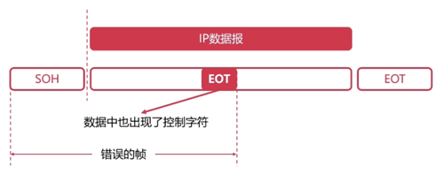
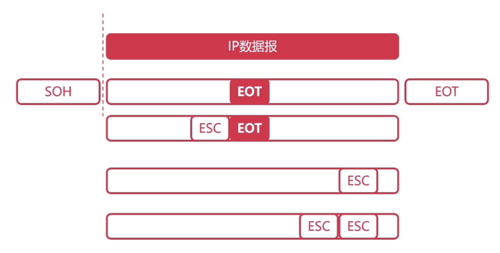
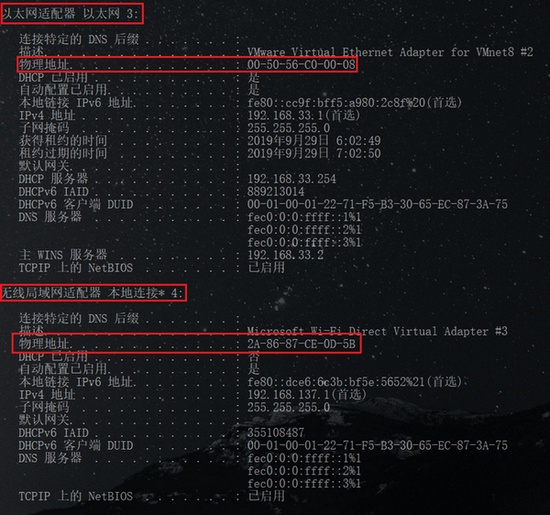
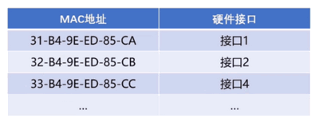

## 数据链路层

### 位置

### 作用

数据链路层主要解决三个问题

* 发送的 0101比特流怎么组装起来 — 封装成帧

* 如何解决封装成帧带来的问题 — 透明传输

* 发送的数据出现错误怎么解决 — 差错检测 

## 封装成帧

#### 什么是 "帧"

* "帧"是数据链路层数据的基本单位(物理层的基本单位是 bit)

* 发送端在网络层的一段数据前后添加特定标记形成 "帧" 

* 接收端根据前后特定标记识别出"帧" (**只有在数据链路层才会认识帧, 物理层是不认识帧的. 只管比特流的传输**)

  > 体现了网络层设计的原则: 层与层之间是相互独立的, 完全解耦

##### 一句话总结

数据链路层的单位是帧, 传输时帧转化为物理层的 0101比特流,之后再在转换成帧

#### 如何封装成帧

1. 网络层会将 IP数据报传送到数据链路层
2. 数据链路层将数据报看作为"帧"的数据, 会在帧的前后添加一些标记. 标识帧的首部和尾部

##### 如图

#### 理解

* "帧"在物理层的表现形式就是 0101组成的比特流

* 帧首部和尾部特特定的控制字符(特定比特流) 

  

#### 问题

如果数据里面恰好有这些比特流(帧的首部或者尾部), 就会提前划分, 怎么解决这个问题? 

透明传输解决这个问题

## 透明传输

### a. 什么是透明

* "透明"在计算机领域是非常重要的一个术语. 平时在设计 API的时候会常说你这个API设计的足够良好的话, 那么这个底层 API的操作对于这个操作的调用方式透明的. 
* 比如上述的数据链路层和物理层, 对于数据链路层来说, 物理层所做的工作就是透明的, 物理层只需要提供一些 API给数据链路层使用就可以了
* 一种实际存在的事物却又看起来不存在一样. 
* 将透明应用在在数据链路层的表现 : 即使控制字符在帧数据中, 但是要当做不存在的去处理

### b. 问题

如果IP数据报里面恰好有这些比特流怎么办? 

帧的数据里面有一个 EOT的控制字符, 如果没有进行透明处理, 就会将数据中心的 EOT字符看作为数据帧的尾部. 从而识别出一个错误的帧. 

###### 如图

需要做一些操作, 让接收方不认为数据报中的 EOT是控制字符

### c. 解决

需要对数据报中的控制字符做特殊的处理, 处理方法为

1. 在数据报中的控制字符前面加上转义字符 ESC. 
2. 这样子在接收到 EOT字符就会判断在前面是否有转义字符, 判断是否为控制字符.

如果数据中心也出现转义字符怎么办, 在转义字符前面再加上转义字符

#### 如图

#### 理解

> 转义和编程时的转义是一样的
>
> "/n", "/t"等控制字符, 表示 `/`和 `//`, 要写成 `// 和 ////`

## 差错检测

物理层只管传输比特流, 无法控制是否出错. 如果物理层在进行传输过程中受到一些干扰(射线, 闪电等), 会影响比特流的传输. 物理层无法察觉这些错误. 因此在数据链路层解决这个问题. 

使用下面的方法解决上述问题

没有写笔记, 需要时在补充

#### 1. 奇偶校验法

#### 2. 循环冗余检验（CRC）

## 最大传输单元 MTU

### MTU 最大传输单元

#### MTU的出现(什么是 MTU)

* 因为数据链路层的数据帧也不是无限大的. 

* 如果不是无限大的, 肯定有一个最大值, 最大传输单元 MTU描述的就是最大的数据帧

* MTU(Maximum Transmission Unit): 最大传输单元

* A和 B进行通讯, 数据通信所能传的数据帧的最大长度是受 MTU所影响的. 数据帧的长度不能超过 MTU的大小. 

#### 设计 MTU的好处

* MTU是**受到底层物理硬件的影响.** 

* 数据帧并不是越大越好的. 数据帧过大或者过小都会影响传输效率.

  > 常用的以太网的 MTU一般为 1500字节, 总时延 = 发送时延 + 排队时延 + 传播时延 + 处理时延

  - 如果数据帧过大, 则发送时延, 排队时延, 处理时延都会增加, 会导致发送端和接收端处理信息的时间过长. 
  - 如果数据帧太小又会影响到性能. 假设 1个字节一个字节的发送. 将需要发送 1500字, 虽然总时延减少了, 但是我们要重复1500次. 这样也会影响通信的效率

### 路径MTU

通过例子来了解什么是路径 MTU

##### 举例

计算机 A通过多个小型网络来到计算机 B. A要和 B进行信息的传输. 路径的 MTU是怎么决定的?

每个连接的 MTU分别如上图, 路径 MTU是受最小的 MTU所影响的. 称之为木桶效应. 

所以上图的路径 MTU为 1492

## 以太网协议

学习了上述内容, 并没有完全理解数据链路层. 还需要学习以太网协议

### 1. 前言

学习某一层的具体一个协议. **就希望屏蔽一些其它层的细节**. 

如学习数据链路层的协议, 因此重点是考虑数据链路层是如何进行数据传输的. 在学习过程中就不需要关注物理层是怎么样实现比特传输的. 甚至可以直接的认为比特流直接的从某一个设备的数据链路层直接传输到下一个设备的数据链路层. 以此简化我们的理解

### 2. 问题

假设有如图所示的网络拓扑, 有 A, B, C三个计算机通过路由器进行连接的. 假设 A通过网络拓扑向 C发送数据, 数据是如何到达计算机的? 换句话说 路由器是如何知道 A要将数据发送给 C呢?

解决这个问题先来学习一下的概念

### 3. MAC地址

* MAC地址是物理地址, 硬件地址

* 每一个设备都拥有唯一的 MAC地址

  > MAC地址就像是我们的身份证, 是唯一的

* MAC地址共有 48位, 使用 16进制表示

#### 通过命令查看 MAC地址

通过命令 `inconfig /all`, 查看本机所有物理设备的 MAC地址

#### MAC地址的格式

2A-86-87-CE-0D-5B

* 有 6组数字和字母的组合, 有 5个横线. 

* MAC地址是使用 16进制来显示的, 每个字符有 4bit(16位), 一共有12个字符, 一个 MAC地址有 48位.(4*12)

### 4. 以太网协议

* 以太网(Ethernet)是一种使用广泛的局域网技术

* 是应用于数据链路层的协议

* 使用以太网可以完成**相邻设备**的数据帧传输

##### 一句话总结

以太网协议是**数据链路层**中解决**相邻设备之间数据传输如何进行传输**

#### 以太网数据格式

#### 详解

* MAC地址通过发送和接收分为目的地址和源地址. 分别占有 6个字节. 

  > 下面的 6代表 6个字节(48 / 8)

* 类型占两个字节

  > 代表帧数据具体是什么类型的数据, 如图所示

* CRC校验码占四个字节

* 帧数据占用 46-1500个字节

### 5. MAC地址表

MAC地址表是一个映射, 会把 MAC地址映射到具体的硬件接口. 

通过 MAC地址表就可以解决前面提到的问题了. 

### 6. 解决问题

假设 E有一个路由表.  

#### 过程 

1. A通过网卡发出数据帧
2. 数据帧到达路由器，路由器取出前6字节(前 6个字节就是目的地址的 MAC地址), 找到向 C发送
3. 路由器进行判断, 查询 MAC地址表, 进行匹配
   * 如果匹配成功, 进行下一步
   * 如果匹配失败, 没有找到 C对应的硬件接口
     * E会广播 A的数据到除 A以外的端口
     * E将会受到 B, C的回应, 并将 B, C的MAC地址记录下来. 进行下一步
4. 路由器匹配 MAC地址表，找到对应的网络接口
5. 路由器往该网络接口发送数据帧

**注意:** 发挥主要作用的是 MAC地址表, JAC地址表是路由器所拥有的. 

#### 7. 更为复杂的情况

A向 C发送数据, 因为只能是相邻物理节点传输, A只能发送数据给 D, F, A该如何跨设备传输数据到 C

数据链路层只能解决相邻物理节点的传输, 无法解决跨节点传输的问题. 

需要网络层进行解决. 

